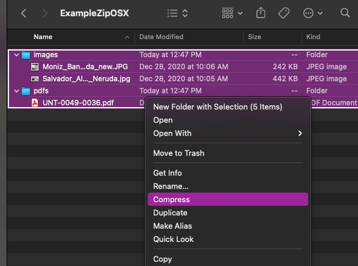

# Ingesting New Digital Objects and Collections using Spreadsheets or Google Sheets

Ingesting Only Digital Objects or Both Digital Objects and Collections uses similar processes, with a few key differences. [Click here](#ingesting-both-new-digital-objects-and-collections-andor-creative-work-series-compound-objects-in-the-same-spreadsheet) to jump to the [Ingesting both Digital Objects and Collections and/or Creative Work Series (Compound) Objects section](#ingesting-both-new-digital-objects-and-collections-andor-creative-work-series-compound-objects-in-the-same-spreadsheet) of this guide page.

## Ingesting _Only_ New Digital Objects

From either the main Content page or the AMI Sets List page, select the 'Start an AMI set' button to begin.

#### Step 1: Plugin Selection

Select the Plugin type you will be using from the dropdown menu.

  - Google Sheets Importer
  - Spreadsheet Importer  (if using local CSV file)

    

_*The `Remote JSON API Importer` and additional remote import source options (for other repository systems) will be covered in separate tutorials following future releases._

#### Step 2: Operation and Spreadsheet Source Selection

Select 'Create New ADOs' as the Operation you would like to perform.

- If using Google Sheets Importer:
    - Enter the ID of your Google Sheet
    - Enter the Cell Range for your Google Sheet

    

- If using Spreadsheet Importer:
    - Under the 'Upload your file' section, select 'Choose File' to upload the CSV you will be using. After the file is finished uploading, you will have the option to 'Remove' and select a different file if needed.

      

#### Step 3: Data Transformation Selections

Select the data transformation approach--how your source data will be transformed into ADO (Archipelago Digital Object) Metadata.

- You will have 3 options for your data transformation approach:
    1. Direct
        - Columns from your spreadsheet source will be cast directly to ADO metadata (JSON), without transformation/further processing (only intended for use with simple data strings or already JSON-encoded snippets/values).
    2. Custom (Expert Mode)
        - Provides very granular custom data transformation and mapping options
        - Needs to be used if importing Digital Objects and Digital Object Collections at the same time/from same spreadsheet source (see separate instructions below).
    3. Template
        - Columns from your spreadsheet source will be cast to ADO metadata (JSON) using a Twig template setup for JSON output.

- You will also need to Select which columns contain filenames, entities or URLS where files can be fetched from. Select what columns correspond to the Digital Object types found in your spreadsheet source.

- Lastly, for this step, you will need to select the destination Fields and Bundles for your New ADOs. If your spreadsheet source only contains Digital Objects, select `Strawberry (Descriptive Metadata source) for Digital Object`

    

#### Step 4: Global ADO Mappings

Select your global ADO mappings.

- Make sure to select the `ismemberof` collection membership relationship predicate column if applicable. For AMI source spreadsheets containing only non-Creative Work Series (Compound) Objects, only `ismemberof` can be mapped properly. To use `ispartof` relationship setup, please refer to the steps outlined in the separate section below.

??? info "Click to read more about Archipelago's default relationship mappings"

        - `ismemberof` and/or `ispartof` (and/or whatever predicate corresponds with the relationship you are mapping)
        - these columns can be used to connect related objects using the object-to-object relationship that matches your needs
        - in default Archipelago configurations, `ismemberof` is used for Collection Membership and `ispartof` is used for Parent-Child Object Relationships (so a Child ADO would reference the Parent ADO in `ispartof`)
        - these columns can hold 3 types of values
            - empty (no value)
            - an integer to connect an object to another object's corresponding row in the same spreadsheet/CSV
              * Ex: Row 2 corresponds to a Digital Object Collection; for a Digital Object corresponding to Row 3, the 'ismemberof' column contains a value of '2'. The Digital Object in Row 3 would be ingested as a member of the Digital Object Collection in Row 2.
            - a UUID to connect with an already ingested object

- By default, the option to automatically assigns UUIDs is selected. Keep 'Automatically assign UUID' checked unless your source data already contains UUIDs in a `node_uuid` column.
- Under the 'Base ADO mappings', select the `label` column for ADO Label. This selection is only used as a fail-safe (in case your AMI JSON Ingest Template does not have any mapping for a column to be mapped to the JSON `label` key, or your source data csv does not contain a `label` if going Direct for data transformation).

    

#### Step 5: ZIP upload

Provide an optional ZIP file containing your assets.

- You may choose to upload a ZIP file containing all or some of the corresponding files specified in your csv/spreadsheet.
- The file upload size restrictions specified in your Archipelago instance will apply here (512MB maximum by default). 
 
     
  
    - Please note, when creating your ZIP file (in particular, within an OSX environment): only select the folders and files needed, not the top/enclosing folder they are in. 
   
??? info "Click to view screenshot of example ZIP file creation in OSX"
	
    

#### Step 6: AMI Set Confirmation

You will now see a message letting you know that 'Your source data was saved and is available as a CSV at `linktotheAMIgenerated.csv`

The message will also let you know that your New AMI Set was created and provide a link to the AMI Set page.

#### Step 7: AMI Set Processing

Your newly created AMI Set will now need to be Processed.

If you clicked on the 'see it here' link in Step 6, you will be brought to the AMI Set page for review. You may also select `Process` from the `Operations` menu for the AMI set from the main `AMI sets` page. From the `Process` page you can review the JSON configuration for your set (determined by your selections in the preceding steps).

??? info "Optional step to review the settings configured in your AMI Set"
   
    You may wish to double check the settings configured in your AMI Set in the Raw Metadata (JSON) on the AMI Set `View` tab before Processing.

    

To Process this set, navigate to the `Process` tab. You will have multiple options related to the Processing outcome for your AMI Set.

- **Skip ADO processing on missing File** : If enabled a referenced missed file or one that can not be processed from the source, remote or local will make AMI skip the affected ROW. Enabled by default for better QA during processing. 
- **Desired ADOS Statuses After Process**
    - The Statuses you have available will reflect the publication workflow/moderation states (such as Draft, Published, Archived/Unpublished) setup in your Archipelago instance, and the permissions associated your user account.
- Please review the note about the _'remaining free space on your Drupal temporary filesystem. Please be aware of that before running a batch with large files'._ If the amount of remaining free space you see does not seem sufficient for your AMI set processing needs, we recommend contacting your system administrator.	
- Enqueuing and File Processing Options
    - **Enqueue but do not process Batch in realtime** : Check this to enqueue but not trigger the interactive Batch processing. Cron or any other mechanism you have enabled will do the actual operation. This queue is shared by all AMI Sets in this repository and will be processed on a First-In First-Out basis.
    - **Force every File attached to an ADO to be processed in its own Queue item** : Warning: This may make your ingest slower. Check this to force every file attached to an ADO to be downloaded and characterized as an independent process. This bypasses the Number of files Global setting that would otherwise trigger this behavior.
    - **Re download and reprocess every file** : Check this to force every file attached to an ADO to be downloaded and characterized again, even if on a previous Batch run that data was already generated for reuse. IMPORTANT: Needed if e.g the URL of a file is the same but the remote source changed, if you have custom code that modifies the backend naming strategy of files.    

- Select `Confirm` to continue. 

You will be returned to `AMI sets` page and see a brief confirmation message regarding the Enqueuing and Processing options you selected.
  
If you chose to 'Confirm" and Process your AMI Set immediately, proceed to Step 9: Processing and ADO Creation.

If the chose to 'Enqueue' your AMI Set and the Queue operations for your Archipelago instance have been configured, you can simply leave your AMI Set in the Queue for Processing on the preconfigured schedule. Common timing for AMI Set Processes schedules are typically setup to run every three to six hours. Contact your Archipelago Administrators for details about your particular Archipelago's Processing schedule.

#### Step 8: Queue Manager Push (may be restricted to Administrator Users only)

If you chose to place your AMI set in the Queue to Process in step 7 and you wish to manually kickstart the Queue Processes, navigate to the Queue Manager found at `/admin/config/system/queue-ui`. (Be sure to select the `Queue Manager` under the System section, not the `Queue Manager for Hydroponic Service` under the Archipelago section).

To Process your AMI Set immediately from the Queue Manager page, select the checkbox next to the 'AMI Digital Object Ingester Queue Worker'. Keep the `Action` menu set to `Batch Process` and click the `Apply to selected items` button.

#### Step 9: Processing and ADO Creation

Your AMI set will now be Processed. You can follow the set's progress through the `Processing queues` loading screen.

After your AMI set is Processed, you will receive confirmation messages letting you know your Digital Objects were successfully created. 

  
From this message, you can click on each ADO title to review the new created Digital Object (or Collection) if you wish. Or, you may proceed to step 10.  

#### Step 10: Review your newly created Digital Objects directly or via AMI Set Report

- Option 1: Return to the main Content page found at `/admin/content` and review your newly created Digital Objects. After ensuring that files and metadata elements were mapped correctly, you may choose to change the Status for your Digital Objects to 'Published'.
- Option 2: Use the **AMI Set Report**
    - From the main `AMI sets` page, select `Report` from the `Operations` menu for the AMI set you wish to review.
    
    
    - This Report will contain information related to the last Processing operation run against your AMI Set.
    - For each Digital Object or Collection row that was Processed, you will see:
        - a `datetime` stamp
        - one of three `level` (INFO, WARNING, or ERRORS) applicability
        - a `message` summarizing the Processing outcome--including a title/label link to the created ADO if successful
        - a `details` summary containing system information related to the operations.

    

    - You can use information found in the Reports tab to identify review your created ADOs one-by-one and identify any errors or issues that may have come up during the Process if needed.  

## Ingesting _Both_ New Digital Objects and Collections and/or Creative Work Series (Compound) Objects in the same spreadsheet

From either the main Content page or the AMI Sets List page, select the 'Start an AMI set' button to begin.

#### Steps 1: Plugin Selection & Step 2: Operation and Spreadsheet Source Selection
 
Follow the same instructions found above for Ingesting New Digital Objects.

#### Step 3: Data Transformation Selections

To import Digital Objects and Digital Object Collections and/or Creative Work Series (Compound) Objects at the same time/from same spreadsheet source, you will need to select the `Custom (Expert Mode)` option for your data transformation approach.

- Custom (Expert Mode)
    - Provides very granular custom data transformation and mapping options

You will then need to 'Select your Custom Data Transformation and Mapping Options' for each of your Digital Object, Collection, and Creative Work Series (Compound) types.

- For Collection and Creative Work Series (Compound) objects:
    - Select either the Direct or Template (and corresponding JSON template) option for your data transformation approach.
    - Select the destination Fields and Bundles for `Strawberry (Descriptive Metadata source) for Digital Object Collection`
        - _Use this same destination for your Creative Work Series (Compound) objects_
    - You may also wish to Select which columns contain filenames, entities or URLS where files can be fetched from. For most Collection objects, you will likely leave unselected or choose `images` if you are uploading a thumbnail image for your Collection.

    

- For **each** non-Creative Work Series (Compound) Digital Object type in your spreadsheet source:
    - You will also need to select either the Direct or Template (and corresponding JSON template) option for your data transformation approach.
    - Then Select the destination Fields and Bundles for `Strawberry (Descriptive Metadata source) for Digital Object`
    - Then select which columns contain filenames, entities or URLS where files can be fetched from. Select what columns correspond to the Digital Object types found in your spreadsheet source.
    - For example, for 'Map' type Digital Objects, you would select the following options (as depicted in this screenshot):

          

#### Step 4: Global ADO Mappings

Select your global ADO mappings.

- Make sure to select the applicable relationship predicate columns (such as `ismemberof` and `ispartof`).

??? info "Click to read more about Archipelago's default relationship mappings"

        - `ismemberof` and/or `ispartof` (and/or whatever predicate corresponds with the relationship you are mapping)
        - these columns can be used to connect related objects using the object-to-object relationship that matches your needs
        - in default Archipelago configurations, `ismemberof` is used for Collection Membership and `ispartof` is used for Parent-Child Object Relationships (so a Child ADO would reference the Parent ADO in `ispartof`)
        - these columns can hold 3 types of values
            - empty (no value)
            - an integer to connect an object to another object's corresponding row in the same spreadsheet/CSV
              * Ex: Row 2 corresponds to a Digital Object Collection; for a Digital Object corresponding to Row 3, the 'ismemberof' column contains a value of '2'. The Digital Object in Row 3 would be ingested as a member of the Digital Object Collection in Row 2.
            - a UUID to connect with an already ingested object

- By default, the option to automatically assigns UUIDs is selected. Keep 'Automatically assign UUID' checked unless your source data already contains UUIDs in a `node_uuid` column.
- Under the 'Base ADO mappings', select the `label` column for ADO Label. This selection is only used as a fail-safe (in case your AMI JSON Ingest Template does not have any mapping for a column to be mapped to the JSON `label` key, or your source data csv does not contain a `label` if going Direct for data transformation).
- In order to make sure that Digital Objects containing the corresponding UUID or spreadsheet row number for any corresponding Collections, make sure `ismemberof` is also selected in the ADO Parent Columns. In order to make sure that Digital Objects containing the corresponding UUID or spreadsheet row number for any corresponding Parent ADOs (Creative Work Series/Compounds), make sure `ispartof` is also selected in the ADO Parent Columns.
- Select the corresponding Columns for the Required ADO mappings.

    

#### Step 5-10:

Follow the same instructions found in Steps 5-10 above. As part of step 10, make sure your Digital Objects were ingested into the corresponding Collections you mapped them to in your spreadsheet source. Please note, you will need to Publish the Digital Objects before the Objects will appear in the Collection's View page (whether accessed as a logged-in Admin user or Anonymous/Public user). Celebrate your next AMI success with another fresh coffee, tea, or cookie!

___

Thank you for reading! Please contact us on our [Archipelago Commons Google Group](https://groups.google.com/forum/#!forum/archipelago-commons) with any questions or feedback.

Return to the [Archipelago Documentation main page](index.md).
