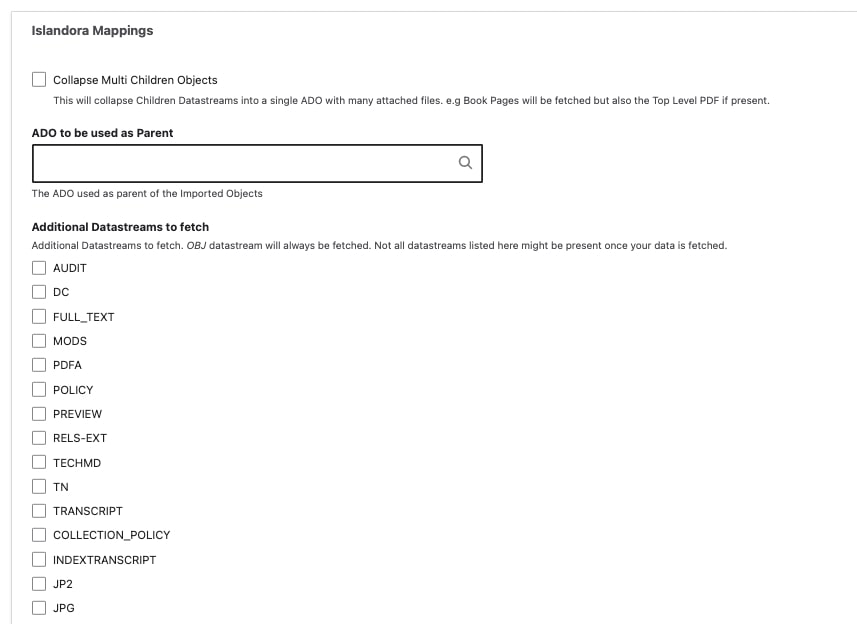
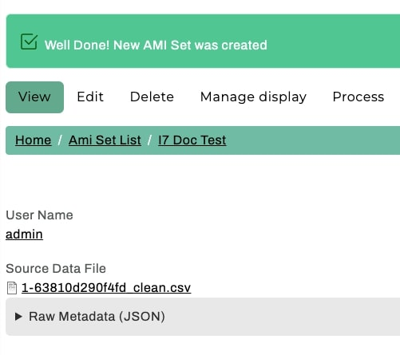

# Using the Islandora 7 Solr Importer

From either the main Content page or the AMI Sets List page, select the 'Start an AMI set' button to begin.

## Step 1: Plugin Selection

Select the Islandora 7 Solr Importer from the dropdown menu.

  

## Step 2, section 1: Solr Server Configuration

You will only have the option to select 'Create New ADOs' as the Operation you would like to perform.

For the Solr Server Configuration section, you will need to provide all of the following information:

- PID of the Islandora Collection Members you want to fetch _(example: islandora:root)_
- Host of your Solr Server _(example: repositorydomain.org)_
- Port _(example: 8080)_
- Path _(example: /)_ 
    - Note: if your Solr can be found at http://myrepo.com:8080/solr, then the path is always a single "/" (as in screenshot depiction below)
- Type of Solr Deployment
    - Either Single Solr Server (most common) or Solr Cloud Ensemble
- Core _(example: islandora)_

You will also need to select the Starting Row you would like to begin fetching results from, and the Number of Rows to fetch. 

The Starting Row is an offset and defaults to 0, which is the most common (and recommended) approach. For the Total Number of Rows to Fetch, setting this to empty or null will automatically (refresh when selecting 'Next' button at bottom of page) prefill with the real Number Rows found by the Solr Query invoked. If you set this number higher than the actual results we will only fetch what can be fetched.

For larger collections, you may wish to create multiple/split AMI ingest sets by selecting a specified number of rows. 

- As an example, for a collection of 1500 objects that you wanted to split into three AMI ingests of 500 objects, you would specify the Starting Row as 0 for the first set and Number of Rows as 500. For the second set, your Starting Row would be Row 501; for the third set, 1001). In this example, the Number of Rows would always be 500.

   

## Step 2, section 2: Islandora Mappings

In this step you will need to make determinations on how you would like to map your Islandora 7 digital objects to your Archipelago repository and whether or not you would like to fetch additional file datastreams, such as those for thumbnail images, transcripts, OCRs/HOCRs, etc.

- *Selecting "Collapse Multi Children Objects" will collapse Children Datastreams into a single ADO with many attached files (single row in the generated AMI set .csv file). Book Pages will be fetched but also the Top Level PDF (if one exists in your Islandora instance).*
 

- In the Required ADO mappings, you will need to specify which Archipelago type you want to map each Islandora Content Model found in your source collection. 
    - For example, for _info:fedora/islandora:sp_large_image_cmodel_ you may want to use _Photograph_.
	
- If you had left "Collapse Multi Children Objects" unselected, you will also need to specify the Islandora Content Model to ADO types mapping for possible Children.

 

- You can also specify an ADO (Object or Collection) to be used as the Parent of Imported Objects. By selecting an existing ADO (Object or Collection) here using the autocomplete/search, the generated AMI set .csv file will contain an 'ismemberof' column containing the UUID of the selected ADO for every row.

- Under "_Additional Datastreams to Fetch_", you can select any number and/or combination of extra file datastreams to retrieve from your harvest. Please note that the I7 Importer will fetch every possible datastream that is present in your source I7 repository, but the additional file datastreams referenced may not be associated with actual files for every digital object.

*Language from form itself:*

*Additional datastreams to fetch. OBJ datastream will always be fetched. Not all datastreams listed here might be present once your data is fetched.*

- Selection of any additonal datastreams will generate a dropdown menu under "_Where extra datastreams should go_." Here you will decide the organization and location of those datastreams by selecting one of the two options
	- Organize by mime type e.g TRANSCRIPT will go into the "texts" column
	- Each in a separate column based on the datastream neame, TRANSCRIPT will go into the "transcripts" column

## Step 3: Data Transformation Selections

Select the data transformation approach--how your source data will be transformed into ADO (Archipelago Digital Object) Metadata. As noted in the list below, **'Custom (Expert Mode)'** is the recommended choice for AMI sets generated using the Islandora 7 Solr Importer plugin.

- You will have 3 options for your data transformation approach:
    1. Direct
        - Columns from your spreadsheet source will be cast directly to ADO metadata (JSON), without transformation/further processing (only intended for use with simple data strings).
    2. Custom (Expert Mode) **Recommended choice for AMI sets generated using the Islandora 7 Solr Importer plugin**
        - Provides very granular custom data transformation and mapping options
        - Needs to be used if importing Digital Objects and Digital Object Collections at the same time/from same spreadsheet source (see separate instructions below).
    3. Template
        - Columns from your spreadsheet source will be cast to ADO metadata (JSON) using a Twig template setup for JSON output.

- You will also need to Select which columns contain filenames, entities or URLS where files can be fetched from. Select what columns correspond to the Digital Object types found in your spreadsheet source. If you fetched additional file datastreams during Step 2, you will see those columns listed here as well (see screenshot below for examples).

- Lastly, for this step, you will need to select the destination Fields and Bundles for your New ADOs. If your spreadsheet source only contains Digital Objects, select `Strawberry (Descriptive Metadata source) for Digital Object`

    - If using Sheet 1 of the Demo AMI Ingest set (found above):
        - Select `Template` and use the AMI Ingest JSON template that corresponds with your metadata elements.
        - Select `images`, `documents`, and `audios` for the file source/fetching.

             

## Step 4: Global ADO Mappings

Select your global ADO mappings.

- Even if empty (no values), select `node_uuid` and any relationship predicate columns (such as `ismemberof`).
- By default, the option to automatically assigns UUIDs is selected. If you have existing UUIds, unselect this option.
- Select the corresponding Columns for the Required ADO mappings.
- If using Sheet 1 of the Demo AMI Ingest set (found above):
    - Select both `ismemberof` and `node_uuid` for ADO Parent columns
    - Keep 'Automatically assign UUID' checked
    - Do not select any column for 'Sequence'
    - Select the `label` column for ADO Label

     

## Step 5: ZIP upload and AMI Set naming

For standard Spreadsheet or Google Sheets AMI ingests, you would use this step to provide an optional ZIP file containing your assets. 

For your Islandora 7 Solr Importer process, the generated AMI set.csv file will contain the necessary URLs to the corresponding Islandora 7 file datastreams for each object as needed. Select next to skip this ZIP upload step and proceed. 

After you provide a title for your AMI set under "_Please Name your AMI set_", select "_Press to Create Set_"

 
## Step 6: AMI Set Confirmation

You will now see a message letting your know your "New AMI Set was created". You will be able to review the generated .csv file directly from this page under Source Data File.

  
While you may immediately select "Process" from this AMI Set Confirmation page to use the Islandora 7 Importer generated .csv file as-is to ingest the ADOs in your AMI set, it is strongly recommended that you review the .csv file first. AMI is configured to trim unecessary (for Archipelago) and de-duplicate redundant Solr source data, but you may wish to pare down the sourced data even further and/or conduct general metadata review and cleanup before migrating your content. You will also likely want to make adjustments to your AMI Ingest JSON Template based on your review, depending on the variation of metadata columns/keys found in your source repostiory. 

## Next Steps 

To proceed with Processing your AMI Set, [click here](AMIviaSpreadsheets.md#step-7-ami-set-processing) to be directed to the main [Ingesting Digital Objects via Spreadsheets](AMIviaSpreadsheets.md).
___

Thank you for reading! Please contact us on our [Archipelago Commons Google Group](https://groups.google.com/forum/#!forum/archipelago-commons) with any questions or feedback.

Return to the [Archipelago Documentation main page](index.md).
