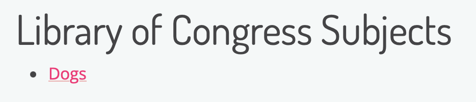

# Advanced Twig Recipe Cards

The Twig Recipe Cards below reference more advanced Metadata transformation, display, or other use cases/needs you may have in your own Archipelago repository. Please review our [Twig Recipe Cards for Common Use Cases](twig_recipe_cards.md) before diving into these more advanced Twig recipe cards.

## Twig Macros

Archipelago's default Object Description Metadata Display (Twig) template includes 4 different helpful Macros that enable you to use a standard approach for outputting different metadata elements in the same way without the repeating all of the same Twig logic over many lines for every metadata element you want to reference--you can instead call a onetime-defined Macro in a single line in your Twig template for different elements.

To use any of the following Twig Macros, you **need to first place a defined Macro at the top of the Twig template you are using for your specific output**, then call the Macro in the template below that as needed for particular Metadata Elements.

When calling the Macro in your Twig template, follow the patterns shown in the "Example Macro Usage for a Metadata Element" below each Main Twig Recipe Card section.

### Default Twig Macro 1 - Simple HTML Output 

**Main Twig Recipe Card for Default Twig Macro #1:**

```twig
 
  {# -- Macro note: if markdown is selected no wrapper will be used -#} 
   
     
<h3>{{html_title}}</h3> 
     
	 
       
         
		  {{ source_data|markdown_2_html }} 
         
          <{{list_wrapper}}>{{ source_data|striptags }}</{{list_wrapper}}> 
         
       
	 
       
          {{ source_datum|markdown_2_html }} 
       
		  <{{list_wrapper}}>{{ source_datum|striptags }}</{{list_wrapper}}> 
       
     
   
 
```

This Macro enables you to define an `html_title` variable to be used for the heading  display of a metadata element defined as `source_datum` (notation of `data.element` when you call the Macro), then checks the metadata element's value for iterability (multiple versus single values), and lastly checks whether the output should be shown using a `list_wrapper` (defined as the `<p>` tag in the Macro itself) or using Markdown syntax. 

If you specify "markdown = true" when you call this Macro, no `list_wrapper` will be used on the display output. The value(s) for the defined element will be passed through the 'markdown_2_html' Twig filter before being displayed. 

If you specify "markdown = "false" when you call this Macro, the value(s) for the defined element will be passed through the '|striptags' Twig filter before being displayed.

**Example Macro Usage for a Metadata Element**

```twig
{{ _self.html_output("Title", data.label) }}
```

This Twig snippet will use "Title" for the heading  display of the `data.label` metadata element.


**Second Example Macro Usage for a different Metadata Element**

```twig
{{ _self.html_output('Description', data.description, '', true) }} 
```

This Twig snippet will use "Description" for the heading  display of the `data.description` metadata element, and will use the 'markdown_2_html' Twig filter against the value(s) contained in element.
  


### Default Twig Macro 2 - Simple HTML Output as List 

**Main Twig Recipe Card for Default Twig Macro #2:**

```twig
 
  {# -- Macro note: if markdown is selected no wrapper will be used -#} 
   
     
<h3>{{html_title}}</h3> 
     
  <ul> 
	 
	   
         
	      <li>{{ source_data|markdown_2_html }}</li> 
         
          <li>{{ source_data }}</li> 
         
	   
	 
       
        <li>{{ source_datum|markdown_2_html }}</li> 
       
		<li>{{ source_datum }}</li> 
       
     
  </ul> 
   
 
```
This Macro enables you to define an `html_title` variable to be used for the heading  display of a metadata element defined as `source_datum` (notation of `data.element` when you call the Macro), then checks the metadata element's value for iterability (multiple versus single values), and lastly checks whether the output should display values with or without using Markdown syntax. 
  
If you specify "markdown = true" when you call this Macro, the value(s) for the defined element will be passed through the 'markdown_2_html' Twig filter before being displayed.

**Example Macro Usage for a Metadata Element**

```twig
{{ _self.html_output_list('Publisher', data.publisher) }} 
```

This Twig snippet will use "Publisher" for the heading  display of the `data.publisher` metadata element.
  
  
  

### Default Twig Macro 3 - HTML Output Search (Non-LoD Elements)

This Macro requires you to set a variable for a `search_facet`. See this guide to learn about [Strawberry Key Name Providers, Solr Field, and Facet Configuration](strawberry_key_name_providers.md). You need to complete the full Strawberry Key Name Provider -> Solr Field -> Facet  configuration for a specified metadata element (JSON Key) before you can effectively use this Macro.

**Main Twig Recipe Card for Default Twig Macro #3:**

```twig  

 
   
     
<h3>{{html_title}}</h3> 
     
  <ul> 
	 
	   
	  <li><a href="/search?search_api_fulltext=&f%5B0%5D={{search_facet}}%3A{{ source_data|url_encode }}" target="_blank" >{{ source_data }}</a></li> 
	   
	   
	  <li><a href="/search?search_api_fulltext=&f%5B0%5D={{search_facet}}%3A{{ source_datum|url_encode }}" target="_blank" >{{ source_datum }}</a></li> 
	   
  </ul> 
   

```

This Macro enables you to define an `html_title` variable to be used for the heading display of a metadata element defined as `source_datum` (notation of `data.element` when you call the Macro), define another variable of `search_facet` to use for the internal search facets URL pattern, then checks the metadata element's value for iterability (multiple versus single values).

**Example Macro Usage for a Metadata Element**

```twig
{{ _self.html_output_search("Local Subjects", data.subjects_local, "descriptive_metadata_subjects") }}
```

This Twig snippet will use "Local Subjects" for the heading  display of the `data.subjects_local` metadata element. 


The search generated will use the defined facet variable of "descriptive_metadata_subjects" in the URL pattern:
'~/search?search_api_fulltext=&f%5B0%5D=descriptive_metadata_subjects%3ADogs'

### Default Twig Macro 4 - HTML Output Search (LoD Elements with Labels and URIs) 

This Macro requires you to set a variable for a `search_facet`. See this guide to learn about [Strawberry Key Name Providers, Solr Field, and Facet Configuration](strawberry_key_name_providers.md). You need to complete the full Strawberry Key Name Provider -> Solr Field -> Facet  configuration for a specified metadata element (JSON Key) before you can effectively use this Macro.

**Main Twig Recipe Card for Default Twig Macro #4:**

```twig
{# Use for LoD elements with URI and label values#} 
 
   
     
<h3>{{html_title}}</h3> 
     
  <ul> 
	   
	  <li><a href="/search?search_api_fulltext=&f%5B0%5D={{search_facet}}%3A{{ source_data.label|url_encode }}" target="_blank" >{{ source_data.label }}</a></li> 
	   
  </ul> 
   
 
```

This Macro enables you to define an `html_title` variable to be used for the heading display of a metadata element defined as `source_datum` (notation of `data.element` when you call the Macro), define another variable of `search_facet` to use for the internal search facets URL pattern, then checks the metadata element's value for iterability (multiple versus single values).

**Example Macro Usage for a Metadata Element**

```twig
{{ _self.html_output_search_lod("Library of Congress Subjects", data.subject_loc, "descriptive_metadata_subjects") }} 
```

This Twig snippet will use "Library of Congress Subjects" for the heading  display of the `data.subject_loc` metadata element--specifically for the `data.subject_loc.label` value(s).



The search generated will use the defined facet variable of "descriptive_metadata_subjects" in the URL pattern:
'~/search?search_api_fulltext=&f%5B0%5D=descriptive_metadata_subjects%3ASuper%20Cool%20Dogs'

## Calling Drupal Views Within Twig Templates

_Recipe coming, check back soon!_
___

Thank you for reading! Please contact us on our [Archipelago Commons Google Group](https://groups.google.com/forum/#!forum/archipelago-commons) with any questions or feedback.

Return to the [Archipelago Documentation main page](index.md).
