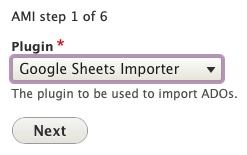

# Archipelago Multi-Importer (AMI)

[Archipelago Multi-Importer (AMI)](https://github.com/esmero/ami) is a module for batch/bulk/mass ingests of Archipelago digital objects (ADOs) and collections. AMI also enables you to perform batch administrative actions, such as updating, patching/revising, or deleting digital objects and collections.

#### *Work-in-Progress Notes*

*Please be aware that the version of AMI shipped with Archipelago 1.0.0-RC2 provides much of the core batch functions useful for getting started working with large amounts of content, but is not the full or final version of this module. This documentation page will be updated with successive AMI and Archipelago releases.*

## AMI Overview and Pre-Release Notes - AMI 0.1.0 (Archipelago - 1.0.0-RC2)

*From the desk of [Diego Pino](https://github.com/DiegoPino)*

AMI provides Tabulated data ingest for ADOs with customizable input plugins. Each Spreadsheet (or Google Spreadsheet) goes through a Configuration Multi Step setup and generates at the end an AMI Set. AMI Sets then can be enqueued or directly ingested, its generated Objects purged and reingested again, its source data (generated and enriched with UUIDS) CSV replaced, improved and uploaded again and ingested.

??? info "Click to read the full AMI 0.1.0 (Archipelago - 1.0.0-RC2) Pre-Release Notes."

    #### Setup Steps
    
    AMI has Ingest, Update and Patch capabilities. AMI has a plugin system to fetch data. The data can come from multiple sources and right now (RC2) CSV/EXCEL or Google Spreadsheets are the ones enabled. Direct from Solr/OAI/API is on the works too for RC3. AMI can read files locally from the server, remotely from URLs or remotely from Private Backend Storage (S3). It does parent/children validation, makes sure that parents are ingested first, cleans broken relationships, allows arbitrary multi relations to be generated in a single ROW (ismemberof, partOf, etc)  pointing to other rows or existing ADOs (via UUIDs) and can process rows directly as JSON or preprocessed via a Metadata Display entity (twig template) capable of producing JSON output. These templates can be configured by “type”, Articles v/s 3DModel can have different ones. Even which columns contain Files can be configured at that level.
    
    #### AMI Set Entity
    
    Ami Sets are special custom entities that hold an Ingest Strategy generated via the previous Setup steps (as JSON with all it's settings), a CSV with data imported from the original source (with UUIDs prepopulated if they were not provided by the user). These AMI sets are simpler and faster than “batch sets” because they do not have a single entry per Object to be ingested. All data lives in a CSV. This means the CSV of an AMI set can be corrected and reuploaded. Users can then Process a Set either putting the to be ingested ADOs in the queue and let Hydroponics Service do the rest or directly via Batch on the UI. ADOs generated by a set can also be purged from there. These sets can also be created manually if needed of any of the chosen settings modified anytime. Which AMI set generated the Ingest is also tracked in a newly created ADO’s JSON and any other extra data (or fixed data e.g common Rights statements, or LoD) can be provided by a Twig Template. Ingest is amazingly fast. We monitored Ingest with Remote URL(islandora Datastreams) files of 15Mbytes average at a speed of 2 seconds per Object (including all post processing) continuously for a set of 100+.
    
    #### Search and Replace
    
    This module also provides a simple search/replace text VBO action (handles JSON as text) and a full blown JSONPATCH VBO action to batch modify ADOs. The last one is extremely powerful permitting multiple operations at the same time with tests. E.g replace a certain value, add another value, remove another value only if a certain test (e.g “type”:”Article” and “date_of_digital”: “2020-09-09”) matches. If any tests fail the whole operation will be canceled for that ADO. An incomplete “Webform” VBO action is present but not fully functional yet. This one allows you to choose a Webform, a certain element inside that Webform and then find and replace using the same Interface you would see while editing/adding a new ADO via the web form workflow. Should be ready by RC3.


## Getting started with AMI

You can access AMI through the `AMI Sets` tab on the main Content page found at `/admin/content` or directly at `/amiset/list`.

  

## Google Sheets API Congifuration

If you plan on using the Google Sheets Importer option, you will need to [Configure the Google Sheets API](googleapi.md).

## Spreadsheet Formatting Overview

There are multiple ways a spreadsheet/CSV file can be structured to work with AMI, depending on the data transformation and mapping you will be using.


??? info "Click to view Basic Requirements and Recommended Options"

    - For most standard AMI ingests, each Row of your spreadsheet/CSV will correspond to a single Digital Object or Collection.
    - Columns in your spreadsheet/CSV can be mapped to different data (files) and metadata elements (label, description, subjects, etc.).
    
    - It is recommended that different types of files are placed into separate columns--"images", "documents", "models", "videos", "audios", "text".
        - Filepaths can point to remote files, to existing files within your docker container, s3 (or other storage type/location that is accessible to Archipelago), and to paths within zip files.
            - Example path for existing file within docker container:
              `/var/www/html/d8content/myAMIimage.jpg`
            - Example s3 path:
              `s3://myAMIuploads/myAMIdocument.pdf`
            - Example remote filepath:
              `https://dogsaregreat.edu/dogs.tiff`
        - **Multiple files (of the same type) can be placed in a single cell, separated by a semicolon ( ; ).
        - For Digital Objects comprised of multiple types of files, such as an Oral History Interview with an audio file and a PDF transcript file, you can place different file types within different corresponding columns for the same Row.
        - It is recommended that filepaths are copied/stored as plain (non hyperlinked) formatted text.
    
    - **Every spreadsheet/CSV file should contain the following Columns:**
        - `type`
            - the Digital Object or Digital Object Collection Type, such as 'Photograph' or 'Collection'
        - `label`
            - the title of the Digital Object or Collection
        - **Soft-requirement* `node_uuid`
            - this can be empty
            - if empty, Archipelago will automatically generate UUIDs
            - can be used with existing UUIDs during migrations
    
    - **Recommended Columns:**
        - Files as defined above
            - "images", "documents", "models", "videos", "audios", "text"
            - .warc/.wacz files should be placed in a column "upload_associated_warcs"
        - `ismemberof` and/or `ispartof` (and/or whatever predicate corresponds with the relationship you are mapping)
            - these columns can be used to connect related objects using the object-to-object relationship that matches your needs
            - these columns can hold 3 types of values
                - empty (no value)
                - an integer to connect an object to another object's corresponding row in the same spreadsheet/CSV
                    - Ex: Row 2 corresponds to a Digital Object Collection; for a Digital Object corresponding to Row 3, the 'ismemberof' column contains a value of '2'. The Digital Object in Row 3 would be ingested as a member of the Digital Object Collection in Row 2.
                - a UUID to connect with an already ingested object
        - Metadata—for all the rich, detailed information associated with your Digital Objects and Collections
            - Every Column header will become a JSON Key and each cell a JSON value for that Key
            - You can use direct JSON snippets such as:
 
              ````json
              [{"uri": "http://id.loc.gov/authorities/subjects/sh95008857","label": "Digital libraries"}]
              ````
 
            - If you have an advanced twig template with the necessary logic, you can place data in cells that can be parsed and structured in various ways (such as multiple values separated by semicolons split accordingly, capitalization of values based on defined patterns, etc.)


### Example Spreadsheet/CSV

This spreadsheet can be used to import a small set of Digital Objects using the same assets part of the [Two-Step Demo content ingest guide](https://github.com/esmero/archipelago-deployment/blob/1.0.0-RC2/docs/democontent.md) (these objects can also be found in the [Archipelago Deployment repository](https://github.com/esmero/archipelago-deployment)).

- <https://docs.google.com/spreadsheets/d/10IAgDZ1_fGVd_2g1GyUYs0SrnkAfvVtTwukEaIEny5Y/edit?usp=sharing>
- To use this spreadsheet, you can either download as a CSV file to use with the Spreadsheet Importer, or make a copy of this using your [configured Google Sheets API account](googleapi.md).

### Example JSON template

This JSON template can be used during the Data Transformation (step 3) of your AMI Import. This particular template corresponds with the metadata elements found in the Default Descriptive Metadata and Default Digital Object Collection webforms shipped with Archipelago 1.0.0-RC2.

??? info "Click to view the example 1.0.0-RC2 AMI JSON template"
    
    To use this template, copy and paste the JSON below directly into a new Metadata Display, found here for a local `http://localhost:8001/metadatadisplay/list` or `http://yoursite.org/metadatadisplay/list`. Select `JSON` as the 'Primary mime type this Twig Template entity will generate as output' for this new Metadata Display.
    
    ```json_encode
      {
          "type": {{ data.type|json_encode|raw }},
          "label": {{ data.label|json_encode|raw }},
          "issue_number": {{ data.issue_number|json_encode|raw }},
          "interviewee": {{ data.interviewee|json_encode|raw }},
          "interviewer": {{ data.interviewer|json_encode|raw }},
          "duration": {{ data.duration|json_encode|raw }},
          "website_url": {{ data.website_url|json_encode|raw }},
          "description": {{ data.description|json_encode|raw }},
          "date_created": {{ data.date_created|json_encode|raw }},
          "creator": {{ data.creator|json_encode|raw }},
          "creator_lod": {{ data.creator_lod|json_encode|raw }},
          "publisher": {{ data.publisher|json_encode|raw }},
          "language": {{ data.language|json_encode|raw }},
          "ismemberof": [],
          "owner": {{ data.owner|json_encode|raw }},
          "local_identifier": {{ data.local_identifier|json_encode|raw }},
          "date_published": {{ data.date_published|json_encode|raw }},
          "rights_statements": {{ data.rights_statements|json_encode|raw }},
          "rights": {{ data.rights|json_encode|raw }},
          "subject_loc": {{ data.subject_loc|json_encode|raw }},
          "subject_lcnaf_personal_names": {{ data.subject_lcnaf_personal_names|json_encode|raw }},
          "subject_lcnaf_corporate_names": {{ data.subject_lcnaf_corporate_names|json_encode|raw }},
          "subject_lcnaf_geographic_names": {{ data.subject_lcnaf_geographic_names|json_encode|raw }},
          "subject_lcgft_terms": {{ data.subject_lcgft_terms|json_encode|raw }},
          "subject_wikidata": {{ data.subject_wikidata|json_encode|raw }},
          "edm_agent": {{ data.edm_agent|json_encode|raw }},
          "term_aat_getty": {{ data.term_aat_getty|json_encode|raw }},
          "geographic_location": {{ data.geographic_location|json_encode|raw }},
          "subjects_local_personal_names": {{ data.subjects_local_personal_names|json_encode|raw }},
          "subjects_local": {{ data.subjects_locals|json_encode|raw }},
          "audios": [],
          "images": [],
          "models": [],
          "videos": [],
          "documents": [],
          "as:generator": {
              "type": "Create",
              "actor": {
                  "url": {{ setURL|json_encode|raw }},
                  "name": "ami",
                  "type": "Service"
              },
              "endTime": "{{"now"|date("c")}}",
              "summary": "Generator",
              "@context": "https:\/\/www.w3.org\/ns\/activitystreams"
          },
          "upload_associated_warcs": []
      }
    ```

## Ingesting New Digital Objects using Spreadsheets or Google Sheets

??? info "Click to view Instructions"
    
    From either the main Content page or the AMI Sets List page, select the 'Start an AMI set' button to begin.
    
    #### Step 1: Plugin Selection
    
    Select the Plugin type you will be using from the dropdown menu.
    - Google Sheets Importer
    - Spreadsheet Importer  (if using local CSV file)
    
      
    
    _*The `Remote JSON API Importer` and additional remote import source options (for other repository systems) will be covered in separate tutorials following future releases._
    
    #### Step 2: Operation and Spreadsheet Source Selection

    Select 'Create New ADOs' as the Operation you would like to perform.
    
    - If using Google Sheets Importer:

        - Enter the ID of your Google Sheet
        - Enter the Cell Range for your Google Sheet
    
        
    
    - If using Spreadsheet Importer:

        - Select 'Choose File' to upload the CSV you will be using.
    
            
    
    #### Step 3: Data Transformation Selections
    Select the data transformation approach--how your source data will be transformed into ADO (Archipelago Digital Object) Metadata.
    
    - You will have 3 options for your data transformation approach:
        1. Direct
            - Columns from your spreadsheet source will be cast directly to ADO metadata (JSON), without transformation/further processing (only intended for use with simple data strings).
        2. Custom (Expert Mode)
            - Provides very granular custom data transformation and mapping options
            - Needs to be used if importing Digital Objects and Digital Object Collections at the same time/from same spreadsheet source (see separate instructions below).
        3. Template
            - Columns from your spreadsheet source will be cast to ADO metadata (JSON) using a Twig template setup for JSON output.
    
    - You will also need to Select which columns contain filenames, entities or URLS where files can be fetched from. Select what columns correspond to the Digital Object types found in your spreadsheet source.
    
    - Lastly, for this step, you will need to select the destination Fields and Bundles for your New ADOs. If your spreadsheet source only contains Digital Objects, select `Strawberry (Descriptive Metadata source) for Digital Object`
    
        - If using Sheet 1 of the Demo AMI Ingest set (found above):

            - Select `Template` and use the AMI Ingest JSON template that corresponds with your metadata elements.
            - Select `images`, `documents`, and `audios` for the file source/fetching.
    
              
    
    #### Step 4: Global ADO Mappings

    Select your global ADO mappings.

    - Even if empty (no values), select `node_uuid` and any relationship predicate columns (such as `ismemberof`).
    - By default, the option to automatically assigns UUIDs is selected. If you have existing UUIds, unselect this option.
    - Select the corresponding Columns for the Required ADO mappings.
    - If using Sheet 1 of the Demo AMI Ingest set (found above):

        - Select both `ismemberof` and `node_uuid` for ADO Parent columns
        - Keep 'Automatically assign UUID' checked
        - Do not select any column for 'Sequence'
        - Select the `label` column for ADO Label
    
          
    
    #### Step 5: ZIP upload
    
    Provide an optional ZIP file containing your assets.
    - You may choose to upload a ZIP file containing all or some of the corresponding files specified in your csv/spreadsheet.
    - The file upload size restrictions specified in your Archipelago instance will apply here (512MB maximum by default). 
    
       
    
    - Please note, when creating your ZIP file (in particular, within an OSX environment): only select the folders and files needed, not the top/enclosing folder they are in. 
   
??? info "Click to view screenshot of example ZIP file creation in OSX"
	
    
	
    #### Step 6: AMI Set Confirmation
    
    You will now see a message letting you know that 'Your source data was saved and is available as a CSV at `linktotheAMIgenerated.csv`
    
    The message will also let you know that your New AMI Set was created and provide a link to the AMI Set page.
    
      
    
    #### Step 7: AMI Set Processing
    
    Your newly created AMI Set will now need to be Processed.
    
    If you clicked on the 'see it here' link in Step 6, you will be brought to the AMI Set page for review. From this page you can review the JSON configuration for your set (determined by your selections in the preceeding steps).
    
      
    
    To Process this set, navigate to the `Process` tab. You will have two options related to the Processing outcome for your AMI Set. 
    - Option 1: Select the "Desired ADOS Statuses After Process" for both Digital Objects (and Digital Object Collections, if also part of your ingest).
        - The Statuses you have available will reflect the publication workflow/moderation states (such as Draft, Published, Archived/Unpublished) setup in your Archipelago instance, and the permissions associated your user account.	
    - Option 2: You may choose to check the option to 'Enqueue but do not process Batch' to place the AMI set in the Queue to Process. *For the AMI version shipped with Archipelago 1.0.0-RC2, the option to 'Enqueue' for scheduled/future Processing should only be used if the Queue operations for your Archipelago instance are configured. Please return to this page for updated Enqueueing instructions that will accompany future releases.*
    - Select `Confirm` to continue. 
    	
      
    
    You may also select `Process` from the `Operations` menu for the AMI set from the main `AMI sets` page.
    
      
      
    If you chose to 'Confirm" and Process your AMI Set immediately, proceed to Step 9: Processing and ADO Creation.   
    
    #### Step 8: Queue Manager (if not Processing immediately)
    
    If you chose to place your AMI set in the Queue to Process in step 7, you may need to navigate to the Queue Manager found at `/admin/config/system/queue-ui`. (Be sure to select the `Queue Manager` under the System section, not the `Queue Manager for Hydroponic Service` under the Archipelago section). If the Queue operations for your Archipelago instance have been configured, you can simply leave your AMI Set in the Queue for Processing on the preconfigured schedule.
    
      
    
    To Process your AMI Set immediately from the Queue Manager page, select the checkbox next to the 'AMI Digital Object Ingester Queue Worker'. Keep the `Action` menu set to `Batch Process` and click the `Apply to selected items` button.
    
      
    
    #### Step 9: Processing and ADO Creation
    
    Your AMI set will now be Processed. You can follow the set's progress through the `Processing queues` loading screen.
    
      
    
    After your AMI set is Processed, you will receive confirmation messages letting you know your Digital Objects were successfully created. 
    
      
      
    From this message, you can click on each ADO title to review the new created Digital Object (or Collection) if you wish. Or, you may proceed to step 10.  
    
    #### Step 10: Review your newly created Digital Objects
    
    Return to the main Content page found at `/admin/content` and review your newly created Digital Objects. After ensuring that files and metadata elements were mapped correctly, you may choose to change the Status for your Digital Objects to 'Published'. Celebrate your AMI success with a fresh coffee, tea, or cookie!


## Ingesting New Digital Objects and Collections using Spreadsheets or Google Sheets

??? info "Click to view Instructions"

    From either the main Content page or the AMI Sets List page, select the 'Start an AMI set' button to begin.
    
    #### Steps 1: Plugin Selection & Step 2: Operation and Spreadsheet Source Selection
    Follow the same instructions found above for Ingesting New Digital Objects.
    
    #### Step 3: Data Transformation Selections
    To import Digital Objects and Digital Object Collections at the same time/from same spreadsheet source, you will need to select the `Custom (Expert Mode)` option for your data transformation approach.
    - Custom (Expert Mode)
        - Provides very granular custom data transformation and mapping options
    
    You will then need to 'Select your Custom Data Transformation and Mapping Options' for each of your Digital Object types.
    
    - For Collection objects:
        - Select either the Direct or Template (and corresponding JSON template) option for your data transformation approach.
        - Select the destination Fields and Bundles for `Strawberry (Descriptive Metadata source) for Digital Object Collection`
        - You may also wish to Select which columns contain filenames, entities or URLS where files can be fetched from. For most Collection objects, you will either leave unselected or choose `images` if you are uploading a thumbnail image for your Collection.
    
    
    
    - For **each** Digital Object type in your spreadsheet source:

        - You will also need to select either the Direct or Template (and corresponding JSON template) option for your data transformation approach.
        - Then select which columns contain filenames, entities or URLS where files can be fetched from. Select what columns correspond to the Digital Object types found in your spreadsheet source.
        - Then Select the destination Fields and Bundles for `Strawberry (Descriptive Metadata source) for Digital Object`
        - For example, for Book type Digital Objects, you would select the following options (as depicted in this screenshot):
    
          
    
    - If using Sheet 2 of the Demo AMI Ingest set (found above):
        - Follow the instructions for mapping the Digital Object Collection (found in row 2), using the Template Data transformation approach with the AMI 1.0.0-RC1 JSON Template. Also select the destination Fields and Bundles for `Strawberry (Descriptive Metadata source) for Digital Object Collection`. Leave the file source fetching unselected.
        - For the Book, Photograph, and Conversation (Oral History) Digital Object types, choose the same the Template Data transformation approach with the AMI 1.0.0-RC1 JSON Template.
        - For Book object types, select `images` and `documents` for file source fetching.
        - For Photograph object types, select `images` for file source fetching.
        - For Conversation (Oral History) object types, select `images`, `documents`, and `audio` for file source fetching.
    
    #### Step 4: Global ADO Mappings
    
    Select your global ADO mappings.

    - Even if empty (no values), select `node_uuid`.
    - In order to make sure that Digital Objects containing the corresponding UUID or spreadsheet row number for any corresponding Collections, make sure `ismemberof` is also selected in the ADO Parent Columns.
    - By default, the option to automatically assigns UUIDs is selected. If you have existing UUIds, unselect this option.
    - Select the corresponding Columns for the Required ADO mappings.
    - If using Sheet 2 of the Demo AMI Ingest set (found above):

        - Select both `ismemberof` and `node_uuid` for ADO Parent columns
        - Keep 'Automatically assign UUID' checked
        - Do not select any column for 'Sequence'
        - Select the `label` column for ADO Label
    
          
    
    #### Step 5-10:
    
    Follow the same instructions found in Steps 5-10 above. As part of step 10, make sure your Digital Objects were ingested into the corresponding Collections you mapped them to in your spreadsheet source. Please note, you will need to Publish the Digital Objects before the Objects will appear in the Collection's View page (whether accessed as a logged-in Admin user or Anonymous/Public user). Celebrate your next AMI success with another fresh coffee, tea, or cookie!

---

Thank you for reading! Please contact us on our [Archipelago Commons Google Group](https://groups.google.com/forum/#!forum/archipelago-commons) with any questions or feedback.

Return to the [Archipelago Documentation main page](index.md).
