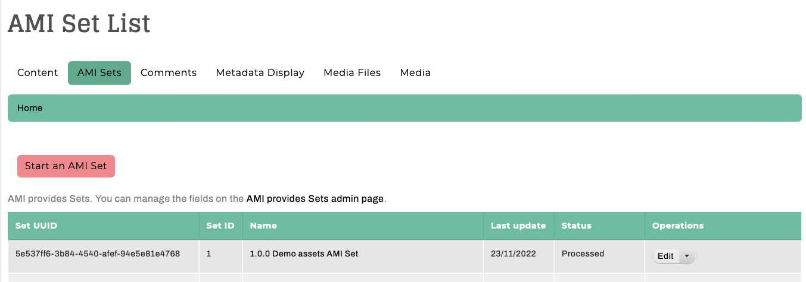

# Archipelago Multi-Importer (AMI)

[Archipelago Multi-Importer (AMI)](https://github.com/esmero/ami) is a module for batch/bulk/mass ingests of Archipelago digital objects (ADOs) and collections. AMI also enables you to perform batch administrative actions, such as updating, patching/revising, or deleting digital objects and collections. AMI's Solr Importer plugin can be used to create AMI ingests and migrating content from existing Solr-sourcable digital repositories (such as Islandora 7).

## AMI Overview and Under-the-Hood Explanations

*From the desk of [Diego Pino](https://github.com/DiegoPino)*

AMI provides Tabulated data ingest for ADOs with customizable input plugins. Each Spreadsheet (or Google Spreadsheet) goes through a Configuration Multi-step setup and generates at the end an AMI Set. AMI Sets then can be enqueued or directly ingested, its generated Objects purged and reingested again, its source data (generated and enriched with UUIDS) CSV replaced, improved and uploaded again and ingested.

### Learn More about Metadata in Archipelago and AMI

Please review the [Metadata in Archipelago overview](metadatainarchipelago.md) to learn about Archipelago's unique approach to metadata and how this applies in the context of AMI set adminstration.

??? info "Click to read the full AMI 0.4.0 (Archipelago - 1.0.0) Pre-Release Notes."

    #### Setup Steps
    
    AMI has Ingest, Update and Patch capabilities. AMI has a plugin system to fetch data. The data can come from multiple sources and right now CSV/EXCEL or Google Spreadsheets are the ones enabled. It does parent/children validation, makes sure that parents are ingested first, cleans broken relationships, allows arbitrary multi relations to be generated in a single ROW (ismemberof, partOf, etc)  pointing to other rows or existing ADOs (via UUIDs) and can process rows directly as JSON or preprocessed via a Metadata Display entity (twig template) capable of producing JSON output. These templates can be configured by “type”, Articles v/s 3DModel can have different ones. Even which columns contain Files can be configured at that level.
    
    #### AMI Set Entity
    
    Ami Sets are special custom entities that hold an Ingest Strategy generated via the previous Setup steps (as JSON with all it's settings), a CSV with data imported from the original source (with UUIDs prepopulated if they were not provided by the user). These AMI sets are simpler and faster than “batch sets” because they do not have a single entry per Object to be ingested. All data lives in a CSV. This means the CSV of an AMI set can be corrected and reuploaded. Users can then Process a Set either putting the to be ingested ADOs in the queue and let Hydroponics Service do the rest or directly via Batch on the UI. ADOs generated by a set can also be purged from there. These sets can also be created manually if needed of any of the chosen settings modified anytime. Which AMI set generated the Ingest is also tracked in a newly created ADO’s JSON and any other extra data (or fixed data e.g common Rights statements, or LoD) can be provided by a Twig Template. Ingest is amazingly fast. We monitored Ingest with Remote URL(islandora Datastreams) files of 15Mbytes average at a speed of 2 seconds per Object (including all post processing) continuously for a set of 100+.
    
    #### Search and Replace
    
    This module also provides a simple search/replace text VBO action (handles JSON as text) and a full blown JSONPATCH VBO action to batch modify ADOs. The last one is extremely powerful permitting multiple operations at the same time with tests. E.g replace a certain value, add another value, remove another value only if a certain test (e.g “type”:”Article” and “date_of_digital”: “2020-09-09”) matches. If any tests fail the whole operation will be canceled for that ADO. An incomplete “Webform” VBO action is present but not fully functional yet. This one allows you to choose a Webform, a certain element inside that Webform and then find and replace using the same Interface you would see while editing/adding a new ADO via the web form workflow.

## Getting started with AMI

You can access AMI through the `AMI Sets` tab on the main Content page found at `/admin/content` or directly at `/amiset/list`.



## Google Sheets API Configuration

If you plan on using the Google Sheets Importer option, you will need to [Configure the Google Sheets API](googleapi.md).

## Example Spreadsheet/CSV

Please refer to or use a fresh/new copy of the [Demo Archipelago Digital Objects (ADOs) spreadsheet](https://github.com/esmero/archipelago-deployment/blob/1.0.0/d8content/ami_set_entity_01.csv) to import a small set of Digital Objects, using the same assets part of the [One-Step Demo content ingest guide](archipelago-deployment-democontent.md).

## Example JSON template

This JSON template can be used during the Data Transformation (step 3) of your AMI Import. This particular template corresponds with the metadata elements found in the Default Descriptive Metadata and Default Digital Object Collection webforms shipped with Archipelago 1.0.0.

??? info "Click to view the example 1.0.0 AMI JSON template"
    
    To use this template, copy and paste the JSON below directly into a new Metadata Display, found here for a local `http://localhost:8001/metadatadisplay/list` or `http://yoursite.org/metadatadisplay/list`. Select `JSON` as the 'Primary mime type this Twig Template entity will generate as output' for this new Metadata Display.
    
    ```json_encode
      {
          "type": {{ data.type|json_encode|raw }},
          "label": {{ data.label|json_encode|raw }},
          "issue_number": {{ data.issue_number|json_encode|raw }},
          "interviewee": {{ data.interviewee|json_encode|raw }},
          "interviewer": {{ data.interviewer|json_encode|raw }},
          "duration": {{ data.duration|json_encode|raw }},
          "website_url": {{ data.website_url|json_encode|raw }},
          "description": {{ data.description|json_encode|raw }},
          "date_created": {{ data.date_created|json_encode|raw }},
          "date_created_edtf": {{ data.date_created_edtf|json_encode|raw }},
          "date_created_free": {{ data.date_created_free|json_encode|raw }},
          "creator": {{ data.creator|json_encode|raw }},
          "creator_lod": {{ data.creator_lod|json_encode|raw }},
          "publisher": {{ data.publisher|json_encode|raw }},
          "language": {{ data.language|json_encode|raw }},
          "ismemberof": [],
          "ispartof": [],
          "sequence_id": {{ data.sequence_id|json_encode|raw }},  
          "owner": {{ data.owner|json_encode|raw }},
          "local_identifier": {{ data.local_identifier|json_encode|raw }},
          "related_item_host_title_info_title": {{ data.related_item_host_title_info_title|json_encode|raw }},
          "related_item_host_display_label": {{ data.related_item_host_display_label|json_encode|raw }},
          "related_item_host_type_of_resource": {{ data.related_item_host_type_of_resource|json_encode|raw }},
          "related_item_host_local_identifier": {{ data.related_item_host_local_identifier|json_encode|raw }},
          "related_item_note": {{ data.related_item_note|json_encode|raw }},
          "related_item_host_location_url": {{ data.related_item_host_location_url|json_encode|raw }},
          "note": {{ data.note|json_encode|raw }},
          "physical_description_note_condition": {{ data.physical_description_note_condition|json_encode|raw }},
          "note_publishinginfo": {{ data.note_publishinginfo|json_encode|raw }},
          "physical_location": {{ data.physical_location|json_encode|raw }},
          "physical_description_extent": {{ data.physical_description_extent|json_encode|raw }},
          "date_published": {{ data.date_published|json_encode|raw }},
          "date_embargo_lift": {{ data.date_embargo_lift|json_encode|raw }},
          "rights_statements": {{ data.rights_statements|json_encode|raw }},
          "rights": {{ data.rights|json_encode|raw }},
          "subject_loc": {{ data.subject_loc|json_encode|raw }},
          "subject_lcnaf_personal_names": {{ data.subject_lcnaf_personal_names|json_encode|raw }},
          "subject_lcnaf_corporate_names": {{ data.subject_lcnaf_corporate_names|json_encode|raw }},
          "subject_lcnaf_geographic_names": {{ data.subject_lcnaf_geographic_names|json_encode|raw }},
          "subject_lcgft_terms": {{ data.subject_lcgft_terms|json_encode|raw }},
          "subject_wikidata": {{ data.subject_wikidata|json_encode|raw }},
          "edm_agent": {{ data.edm_agent|json_encode|raw }},
          "term_aat_getty": {{ data.term_aat_getty|json_encode|raw }},
          "viaf": {{ data.viaf|json_encode|raw }},
          "pubmed_mesh": {{ data.pubmed_mesh|json_encode|raw }},
          "europeana_concepts": {{ data.europeana_concepts|json_encode|raw }},
          "europeana_agents": {{ data.europeana_agents|json_encode|raw }},
              "europeana_places": {{ data.europeana_places|json_encode|raw }},
          "geographic_location": {{ data.geographic_location|json_encode|raw }},
          "subjects_local_personal_names": {{ data.subjects_local_personal_names|json_encode|raw }},
          "subjects_local": {{ data.subjects_locals|json_encode|raw }},
          "audios": [],
          "images": [],
          "models": [],
          "videos": [],
          "documents": [],
          "as:generator": {
              "type": "Create",
              "actor": {
                  "url": {{ setURL|json_encode|raw }},
                  "name": "ami",
                  "type": "Service"
              },
              "endTime": "{{"now"|date("c")}}",
              "summary": "Generator",
              "@context": "https:\/\/www.w3.org\/ns\/activitystreams"
          },
          "upload_associated_warcs": []
      }
    ```

___

Thank you for reading! Please contact us on our [Archipelago Commons Google Group](https://groups.google.com/forum/#!forum/archipelago-commons) with any questions or feedback.

Return to the [Archipelago Documentation main page](index.md).
