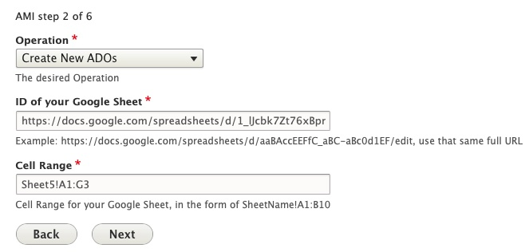
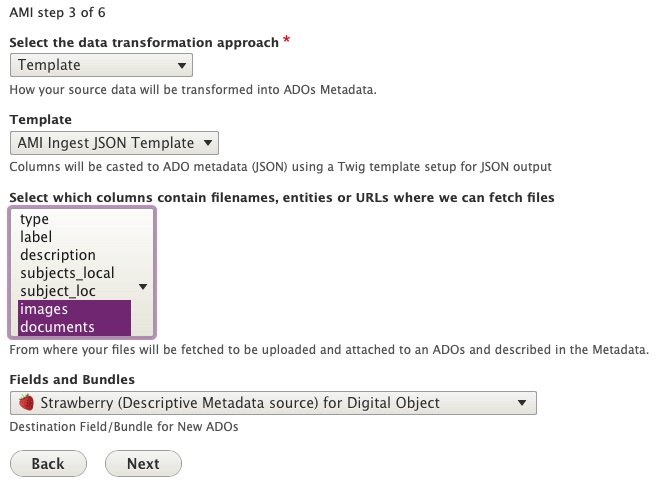
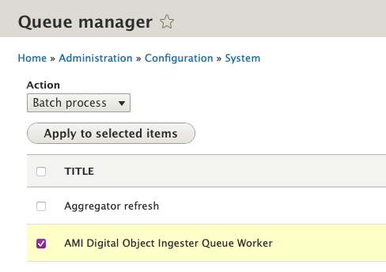

# Ingesting New Digital Objects using Spreadsheets or Google Sheets

From either the main Content page or the AMI Sets List page, select the 'Start an AMI set' button to begin.

#### Step 1: Plugin Selection

Select the Plugin type you will be using from the dropdown menu.
- Google Sheets Importer
- Spreadsheet Importer  (if using local CSV file)

  

_*The `Remote JSON API Importer` and additional remote import source options (for other repository systems) will be covered in separate tutorials following future releases._

#### Step 2: Operation and Spreadsheet Source Selection

Select 'Create New ADOs' as the Operation you would like to perform.

- If using Google Sheets Importer:

    - Enter the ID of your Google Sheet
    - Enter the Cell Range for your Google Sheet

    

- If using Spreadsheet Importer:

    - Select 'Choose File' to upload the CSV you will be using.

        

#### Step 3: Data Transformation Selections
Select the data transformation approach--how your source data will be transformed into ADO (Archipelago Digital Object) Metadata.

- You will have 3 options for your data transformation approach:
    1. Direct
        - Columns from your spreadsheet source will be cast directly to ADO metadata (JSON), without transformation/further processing (only intended for use with simple data strings).
    2. Custom (Expert Mode)
        - Provides very granular custom data transformation and mapping options
        - Needs to be used if importing Digital Objects and Digital Object Collections at the same time/from same spreadsheet source (see separate instructions below).
    3. Template
        - Columns from your spreadsheet source will be cast to ADO metadata (JSON) using a Twig template setup for JSON output.

- You will also need to Select which columns contain filenames, entities or URLS where files can be fetched from. Select what columns correspond to the Digital Object types found in your spreadsheet source.

- Lastly, for this step, you will need to select the destination Fields and Bundles for your New ADOs. If your spreadsheet source only contains Digital Objects, select `Strawberry (Descriptive Metadata source) for Digital Object`

    - If using Sheet 1 of the Demo AMI Ingest set (found above):

        - Select `Template` and use the AMI Ingest JSON template that corresponds with your metadata elements.
        - Select `images`, `documents`, and `audios` for the file source/fetching.

          

#### Step 4: Global ADO Mappings

Select your global ADO mappings.

- Even if empty (no values), select `node_uuid` and any relationship predicate columns (such as `ismemberof`).
- By default, the option to automatically assigns UUIDs is selected. If you have existing UUIds, unselect this option.
- Select the corresponding Columns for the Required ADO mappings.
- If using Sheet 1 of the Demo AMI Ingest set (found above):

    - Select both `ismemberof` and `node_uuid` for ADO Parent columns
    - Keep 'Automatically assign UUID' checked
    - Do not select any column for 'Sequence'
    - Select the `label` column for ADO Label

      

#### Step 5: ZIP upload

Provide an optional ZIP file containing your assets.
- You may choose to upload a ZIP file containing all or some of the corresponding files specified in your csv/spreadsheet.
- The file upload size restrictions specified in your Archipelago instance will apply here (512MB maximum by default). 

   

- Please note, when creating your ZIP file (in particular, within an OSX environment): only select the folders and files needed, not the top/enclosing folder they are in. 

info "Click to view screenshot of example ZIP file creation in OSX"
    

    
#### Step 6: AMI Set Confirmation

You will now see a message letting you know that 'Your source data was saved and is available as a CSV at `linktotheAMIgenerated.csv`

The message will also let you know that your New AMI Set was created and provide a link to the AMI Set page.

  

#### Step 7: AMI Set Processing

Your newly created AMI Set will now need to be Processed.

If you clicked on the 'see it here' link in Step 6, you will be brought to the AMI Set page for review. From this page you can review the JSON configuration for your set (determined by your selections in the preceeding steps).

  

To Process this set, navigate to the `Process` tab. You will have two options related to the Processing outcome for your AMI Set. 
- Option 1: Select the "Desired ADOS Statuses After Process" for both Digital Objects (and Digital Object Collections, if also part of your ingest).
    - The Statuses you have available will reflect the publication workflow/moderation states (such as Draft, Published, Archived/Unpublished) setup in your Archipelago instance, and the permissions associated your user account.	
- Option 2: You may choose to check the option to 'Enqueue but do not process Batch' to place the AMI set in the Queue to Process. *For the AMI version shipped with Archipelago 1.0.0-RC2, the option to 'Enqueue' for scheduled/future Processing should only be used if the Queue operations for your Archipelago instance are configured. Please return to this page for updated Enqueueing instructions that will accompany future releases.*
- Select `Confirm` to continue. 
	
  

You may also select `Process` from the `Operations` menu for the AMI set from the main `AMI sets` page.

  
  
If you chose to 'Confirm" and Process your AMI Set immediately, proceed to Step 9: Processing and ADO Creation.   

#### Step 8: Queue Manager (if not Processing immediately)

If you chose to place your AMI set in the Queue to Process in step 7, you may need to navigate to the Queue Manager found at `/admin/config/system/queue-ui`. (Be sure to select the `Queue Manager` under the System section, not the `Queue Manager for Hydroponic Service` under the Archipelago section). If the Queue operations for your Archipelago instance have been configured, you can simply leave your AMI Set in the Queue for Processing on the preconfigured schedule.

  

To Process your AMI Set immediately from the Queue Manager page, select the checkbox next to the 'AMI Digital Object Ingester Queue Worker'. Keep the `Action` menu set to `Batch Process` and click the `Apply to selected items` button.

  

#### Step 9: Processing and ADO Creation

Your AMI set will now be Processed. You can follow the set's progress through the `Processing queues` loading screen.

  

After your AMI set is Processed, you will receive confirmation messages letting you know your Digital Objects were successfully created. 

  
  
From this message, you can click on each ADO title to review the new created Digital Object (or Collection) if you wish. Or, you may proceed to step 10.  

#### Step 10: Review your newly created Digital Objects

Return to the main Content page found at `/admin/content` and review your newly created Digital Objects. After ensuring that files and metadata elements were mapped correctly, you may choose to change the Status for your Digital Objects to 'Published'. Celebrate your AMI success with a fresh coffee, tea, or cookie!

---

Thank you for reading! Please contact us on our [Archipelago Commons Google Group](https://groups.google.com/forum/#!forum/archipelago-commons) with any questions or feedback.

Return to the [Archipelago Documentation main page](index.md).
