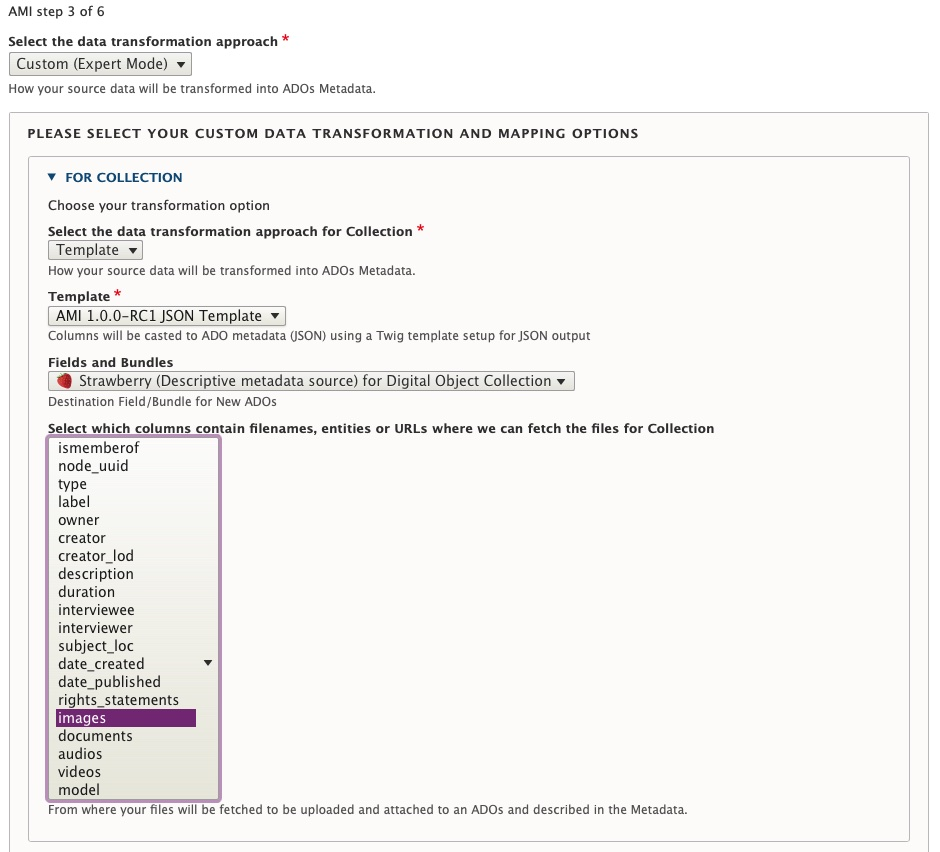

# Ingesting New Digital Objects and Collections using Spreadsheets or Google Sheets

From either the main Content page or the AMI Sets List page, select the 'Start an AMI set' button to begin.

#### Steps 1: Plugin Selection & Step 2: Operation and Spreadsheet Source Selection
Follow the same instructions found above for Ingesting New Digital Objects.

#### Step 3: Data Transformation Selections
To import Digital Objects and Digital Object Collections at the same time/from same spreadsheet source, you will need to select the `Custom (Expert Mode)` option for your data transformation approach.
- Custom (Expert Mode)
    - Provides very granular custom data transformation and mapping options

You will then need to 'Select your Custom Data Transformation and Mapping Options' for each of your Digital Object types.

- For Collection objects:
    - Select either the Direct or Template (and corresponding JSON template) option for your data transformation approach.
    - Select the destination Fields and Bundles for `Strawberry (Descriptive Metadata source) for Digital Object Collection`
    - You may also wish to Select which columns contain filenames, entities or URLS where files can be fetched from. For most Collection objects, you will either leave unselected or choose `images` if you are uploading a thumbnail image for your Collection.

- For **each** Digital Object type in your spreadsheet source:

    - You will also need to select either the Direct or Template (and corresponding JSON template) option for your data transformation approach.
    - Then select which columns contain filenames, entities or URLS where files can be fetched from. Select what columns correspond to the Digital Object types found in your spreadsheet source.
    - Then Select the destination Fields and Bundles for `Strawberry (Descriptive Metadata source) for Digital Object`
    - For example, for Book type Digital Objects, you would select the following options (as depicted in this screenshot):

      

- If using Sheet 2 of the Demo AMI Ingest set (found above):
    - Follow the instructions for mapping the Digital Object Collection (found in row 2), using the Template Data transformation approach with the AMI 1.0.0-RC1 JSON Template. Also select the destination Fields and Bundles for `Strawberry (Descriptive Metadata source) for Digital Object Collection`. Leave the file source fetching unselected.
    - For the Book, Photograph, and Conversation (Oral History) Digital Object types, choose the same the Template Data transformation approach with the AMI 1.0.0-RC1 JSON Template.
    - For Book object types, select `images` and `documents` for file source fetching.
    - For Photograph object types, select `images` for file source fetching.
    - For Conversation (Oral History) object types, select `images`, `documents`, and `audio` for file source fetching.

#### Step 4: Global ADO Mappings

Select your global ADO mappings.

- Even if empty (no values), select `node_uuid`.
- In order to make sure that Digital Objects containing the corresponding UUID or spreadsheet row number for any corresponding Collections, make sure `ismemberof` is also selected in the ADO Parent Columns.
- By default, the option to automatically assigns UUIDs is selected. If you have existing UUIds, unselect this option.
- Select the corresponding Columns for the Required ADO mappings.
- If using Sheet 2 of the Demo AMI Ingest set (found above):

    - Select both `ismemberof` and `node_uuid` for ADO Parent columns
    - Keep 'Automatically assign UUID' checked
    - Do not select any column for 'Sequence'
    - Select the `label` column for ADO Label

      

#### Step 5-10:

Follow the same instructions found in Steps 5-10 above. As part of step 10, make sure your Digital Objects were ingested into the corresponding Collections you mapped them to in your spreadsheet source. Please note, you will need to Publish the Digital Objects before the Objects will appear in the Collection's View page (whether accessed as a logged-in Admin user or Anonymous/Public user). Celebrate your next AMI success with another fresh coffee, tea, or cookie!

---

Thank you for reading! Please contact us on our [Archipelago Commons Google Group](https://groups.google.com/forum/#!forum/archipelago-commons) with any questions or feedback.

Return to the [Archipelago Documentation main page](index.md).
