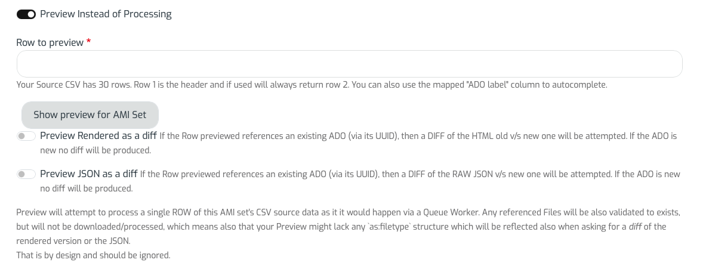
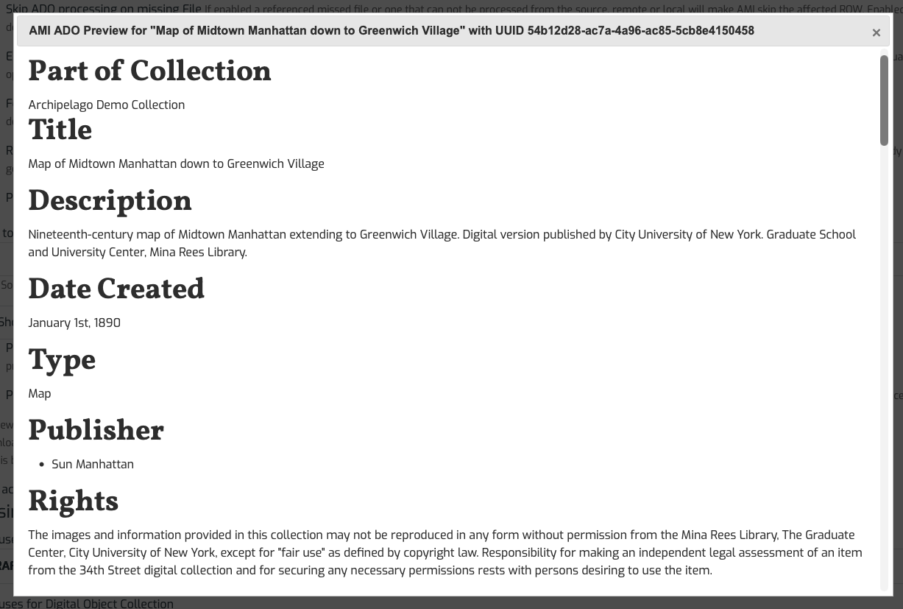
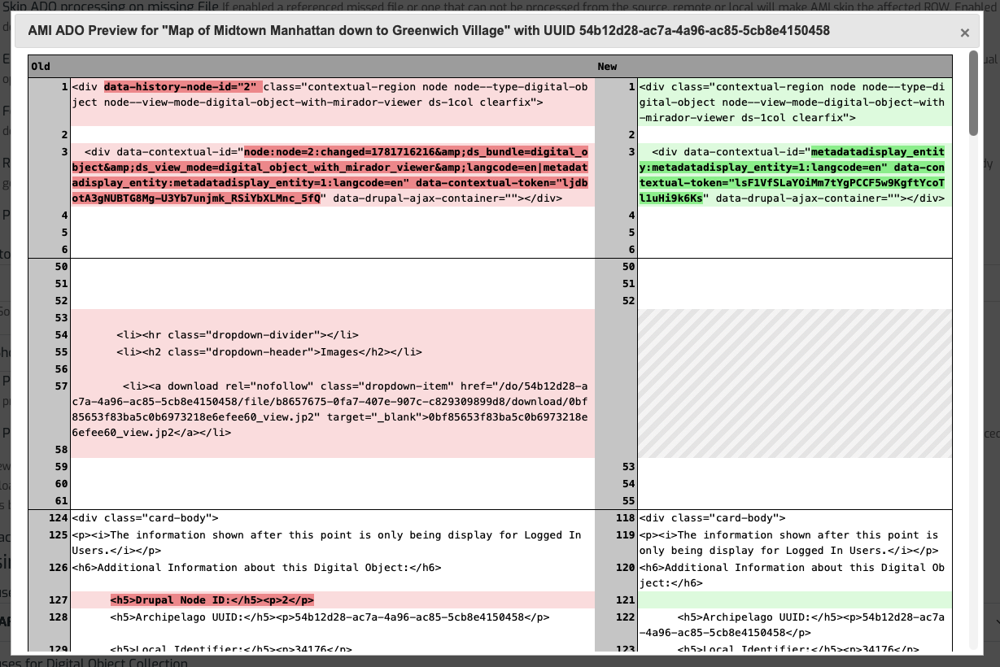
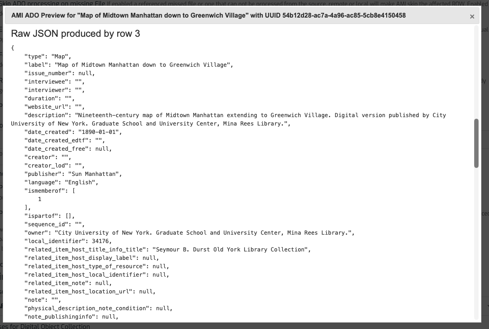

# Using AMI's Preview Function

Beginning with Archpelago 1.7.0, you have the option to "Preview instead of Process" your AMI Set.

After you have [created an AMI set](AMIviaSpreadsheets.md#step-7-ami-set-processing), navigate to the 'Process' tab.

First, select the toggle option for 'Preview Instead of Processing'.

You then have 3 options for previewing your AMI Set, row by row for the corresponding digital objects and collections found in your Source CSV.

For all options selected, you will see need to select a specific 'Row to preview'. 

Below the 'Row to preview' box, you will see first a summary of the number of rows in your Source CSV, followed by a note that states: 'Row 1 is the header and if used will always return row 2. You can also use the mapped "ADO label' column to autocomplete.'

During any of the selected options, Preview will attempt to process a single ROW of the selected AMI set's CSV source data as it it would happen via a Queue Worker. Any referenced Files will be also validated to exist, but will not be downloaded/processed, which means also that your Preview might lack any as:filetype structure which will be reflected also when asking for a diff of the rendered version or the JSON. That is by design and should be ignored.

### Option 1: Processed HTML Display

Using the simplest preview option, you be able to see the processed HTML Display for the metadata that will be ingested for your selected Preview ADO. As noted above, will not see your media files rendered out and you will not see the file info reflected in the Raw JSON. That is not an error and does not mean associated files will not display after full processing + ingest is completed.

### Option 2: Preview Rendered as a diff

If the Row previewed references an existing ADO (via its UUID), then a DIFF of the HTML old v/s new one will be attempted. If the ADO is new no diff will be produced.

### Option 3: Preview JSON as a diff

If the Row previewed references an existing ADO (via its UUID), then a DIFF of the RAW JSON v/s new one will be attempted. If the ADO is new no diff will be produced.

___

Thank you for reading! Please contact us on our [Archipelago Commons Google Group](https://groups.google.com/forum/#!forum/archipelago-commons) with any questions or feedback.

Return to the [Archipelago Documentation main page](index.md).

