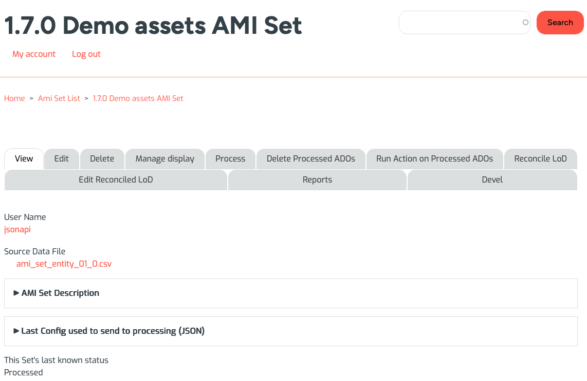
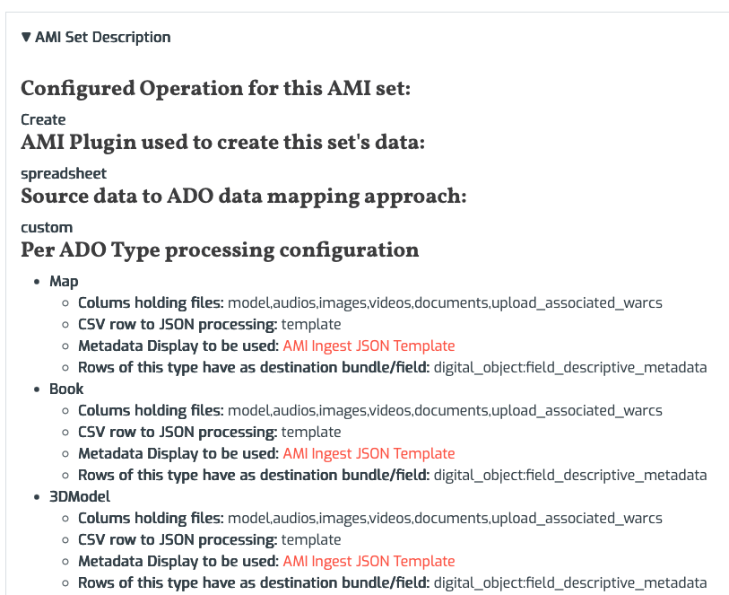
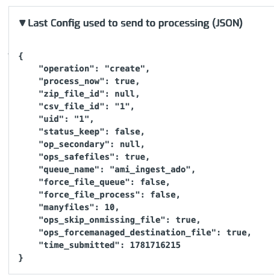

# Reviewing AMI Set Configuration and Status

You can use an AMI Set's main overview page to review important information about your AMI Set's configuration and last-known status related to processing operations.

To navigate to an AMI Set, either first select the AMI set link from the [main AMI Set List page](ami_index.md#getting-started-with-ami), or switch to the 'View' tab when jumping from another tab (such as the 'Process' tab) for your AMI set.

Every AMI Set page will include:

* User Name of the person (or jsonapi user) associated with creating the AMI Set
* Source Data File link for the associated CSV file used for the AMI Set digital objects and collections
* If you provided a Zip File for media files during your configuration setup, a link to the uploaded Zip File.
* If you ran [AMI's Linked Data Reconciliation](ami_lod_rec.md), the Processed Data CSV containing the terms and any mapped values associated with the LoD process outcomes.
* AMI Set Description dropdown
* Last Config used to send to processing (JSON) dropdown
* 'This Set's last known status' and corresponding processing operation note

### AMI Set Description

Expanding the AMI Set Description dropdown will show you:

* Configured Operation for this AMI set
* AMI Plugin used to create this set's data
* Source data to ADO data mapping approach
* Per ADO Type processing configuration (unless the 'Direct' processing approach was used)

### Last Config used

Expanding the Last Config used to send to processing (JSON) dropdown will show you a JSON version of the associated system file ids, operations, and statuses associated with your selected AMI Set.

___

Thank you for reading! Please contact us on our [Archipelago Commons Google Group](https://groups.google.com/forum/#!forum/archipelago-commons) with any questions or feedback.

Return to the [Archipelago Documentation main page](index.md).

