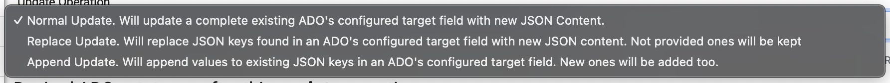

# Using AMI's Update Operations

Archipelago Multi Importer (AMI)'s Update Operations can be used to Update, Replace, or Append metadata values or files for existing Digital Objects and Collections found in your Archipelago. You can prepare and use AMI Update Sets in different ways using one of three functional operations, depending on your update needs. This guide will provide a general overview of the three main functions and how each operation may be useful.

## Important Notes: Preliminary / Pre-requisites

You need to have existing Digital Objects or Collections (ADOs) in your Archipelago to work with. You should have a prepared AMI Update Set CSV that contains at least the following columns/headers:

- **node_uuid**
    - required
    - should contain the values for any existing ADOs you wish to update
    - needs to be a 1:1 match; AMI Update functionality cannot be used to update/change node_uuid values
- **label**
    - required
    - contains the corresponding label (title) for your existing ADOs
    - can contain modifications for the label (title) values
- **type**
    - optional, only required if using the Custom (Expert Mode) approach for your AMI set configuration or targeting changes for 'type' mappings for your ADOs
    - contains the corresponding type values for your existing ADOs
    - can contain modifications for the type values  
    - related to this, AMI Update functionality cannot be used to update/change the underlying Drupal bundle mappings for already-ingested objects. In other words, you cannot use an AMI Update Set to change a Child Object with a 'Page' type originally ingested as a Digital Object -> to a Parent Object with a 'Book' type mapped to the Digital Object Collection/Compound bundle. For these changes, you will need to delete and re-ingest your ADOs, or use an external (not provided in default Archipelagos) Drupal module for bundle/Drupal Content Type changes.
- **additional metadata elements you wish to Update, Replace, or Append values for, such as "subjects"**
    - optional (but likely pertains to the reason you are Updating your ADOs)
    - follow recommendations and practices described in more below detail
- **files**
    - optional
    - on the final 'Process' tab of your AMI Update Set Configuration, if the "Do not touch existing files" option is checked, then existing files will be left untouched. It is recommended to always keep this option checked if you are targeting only Metadata updates.

You should be familiar with the basic mechanics of AMI Set Configuration noted in [Steps 1-6](AMIviaSpreadsheets.md#step-1-plugin-selection).

!!! note "Best Practices"

    For all AMI Update operations, it is strongly recommended to both:
    
    1. Before Updating, use the **'Export Archipelago Digital Objects to CSV content item'** Action available on the main `Content` page and the `Find and Replace` page menus to generate a CSV of your non-modified objects. If something unintended occurs with your Update execution, you could use this CSV of your non-modified objects to restore your objects (or just a field or two) as needed.
    
    2. Create a **small test batch CSV** referencing one to two/three ADOs to test the execution of your desired Update actions on before running your larger Update Sets. There is no 'Undo' or 'Revert Changes' button that can be used for an AMI Update Set. You do have the option to 'Revert Revisions' on an object-by-object basis, but that is not ideal for reverting changes that were executing across large batches of ADOs. See the ['Checking Your Changes'](find_and_replace/#checking-your-changes) documentation section for more information about reviewing and potentially reverting Revisions.

## Data Transformation Options for AMI Update Sets

As with regular/Create New AMI Sets, you will have to select your preferred Data Tranformation configuration during Step 3 : of your AMI Update Set Configuration.

- Direct
    - Columns from your spreadsheet source will be cast directly to ADO metadata (JSON), without transformation/further processing (only intended for use with simple data strings or already JSON-encoded snippets/values).
    - This is likely the most common Data Transformation configuration you will use for **simple** AMI Update Replace and Append Sets.
- Custom (Expert Mode)
    - Provides very granular custom data transformation and mapping options
    - You will likely only use this Data Transformation configuration for more complex AMI Update Sets when you want to differentiate between Data Transformation setups for Digital Objects and Digital Object Collections/Compound Objects/Creative Work Series (such as passing Digital Objects through 'Template' tranformation, and Collections/Compounds through 'Direct' transformation).
- Template
    - Columns from your spreadsheet source will be cast to ADO metadata (JSON) using a Twig template setup for JSON output.
    - This is likely the most common Data Transformation configuration you will use for more **complex** AMI Update Sets. This is the setup you would need to use if you want to use an AMI Update Set with [AMI's LoD Reconciliation](ami_lod_rec.md) to update existing ADOs subject metadata with enriched LoD.

!!! warning "Caution with using Templates for Data Transformation"

    If you are planning to use the 'Template' or 'Custom (Export Mode)' data transformation approach for your AMI Update Set configuration, you will need to have prepared your corresponding AMI Ingest Template to account for the specific Update actions you have planned. 
    
    It is important to keep in mind that all of the metadata elements for your existing ADOs metadata may not necessarily be present in your AMI Update Set Source CSV. For example, you may have only prepared your AMI Update Set Source CSV to contain a limited number of headers/columns, such as only those required (node_uuid, label) and one or two metadata elements you wish to update (such as "subjects"). If you choose to pass your AMI Update Set through a Twig template, the output after Processing your AMI Update Set may overwrite your existing data if you do not have all of the necessary logic/checks in place to preserve the existing metadata if desired.
   
    In other words, imagine your twig template contains this statement:
    ```shell
      "subjects": {{ data.subjects|json_encode|raw }}, 
    ```  
    
    Independently of IF your CSV contains "subjects" as a header/column, the Twig template will still output an empty "subjects", which, when using the "Replace" mode will wipe out any existing "subjects" in your ADO.
    
    During any update operation (independently of the functional operation chosen) and IF you are using/passing your CSV through a template, AMI will provide an extra Context key for you to reference in your Twig Template. You can always reference 'dataOriginal.subjects' for example -- all dataOriginal.xx keys will contain the values of the existing metadata for your ADOs. This allows you to make "smart" templates that check IF a certain key/values exists, compare the unmodified (and to be modified) ADO(s) with the new data passed, then generate the desired output. 

## Update Set Processing Options

Beginning from [Step 7, Processing](AMIviaSpreadsheets.md#step-7-ami-set-processing) of your AMI Set Configuration, select the Update operation that best corresponds to your targeted Update scenario.




### 1. Normal Update Operation 

The **Normal** Update Operation 'will update a complete existing ADO's configured target field with new JSON Content.' This will replace everything in an ADO with new processed data. 

- The Normal update operation is powerful and can overwrite your whole JSON object record if not paired with a template that has all the extra checks/logic needed to preserve existing data if desired (see note of 'Caution with Templates for Data Transformation' above). 
- It is also recommended to only use the Normal Update approach if you need to re-process most of the metadata fields for ADOs.

### 2. Replace Update Operation

The **Replace** Update Operation Replace 'will replace JSON keys found in an ADO's configured target field with new JSON content. Not provided ones (fields/JSON keys) will be kept.'

- If the processed data contains a JSON key that is already in the ADO's metadata to be updated, the values in the AMI Update Set CSV will be used, replacing completely the values found in that key in the existing ADO.
- The Replace update operation paired with the 'Direct' data transformation is likely the update operation you will use.

#### Common use case scenario for Replace updates:

- You notice a missing or incorrectly processed field in your original AMI Set/ADOs.
- You create an AMI set that contains only the 'node_uuid', 'label', and one column for the missing field and values.
    - If the values are _singular_, you do not need to JSON-encode the values in the CSV
    - If the values are _multiple_, you need to JSON-encode them, formatted as: ["value1","value2"]
- You select the **Direct** data transformation approach on the AMI configuration.
- You select the **Replace** update operation and keep 'Do not touch existing files' checked.
- With this setup, the new field and values are added to the existing JSON for the impacted ADOs.

### 3. Append Update Operation

The **Append** update operation 'will append values to existing JSON keys in an ADO's configured target field. New ones (fields/JSON keys) will be added too.' 

- If the processed data contains a key that is already in the ADO’s metadata to be updated, attempts will be made to match the "source" type (array, complex object) to add to it. If you have 2 values in a key, and your original/existing data contains a single value, the result will have 3 values (and then it will try to deduplicate too). If the Source data did not contain a key present in the processed data, then it will be added.
- The Append operation can be very useful, but it should be used with caution if targeting single values versus arrays. AMI will not permit malformed JSON data to be generated. **But** you need to consider if your Append update tranforms a previously single-value key into a multiple-value array, how this change may impact any references made in you display or other templates, Views throughout your Archipelago. 
    - For example, if your Object Description Display template is not setup to check for iterable (multiple value/array) values for a given element, then the multiple values for an updated ADO may not output as expected.

## Other Process Setup Options

For the other AMI Set Process options and steps, please refer to the information found from [Steps 7-10 in this complementary documentation for Create New ADOs AMI Sets](AMIviaSpreadsheets.md#step-7-ami-set-processing). See the ['Checking Your Changes'](find_and_replace/#checking-your-changes) documentation section for more information about reviewing and potentially reverting Revisions.

___

Thank you for reading! Please contact us on our [Archipelago Commons Google Group](https://groups.google.com/forum/#!forum/archipelago-commons) with any questions or feedback.

Return to the [Archipelago Documentation main page](index.md).