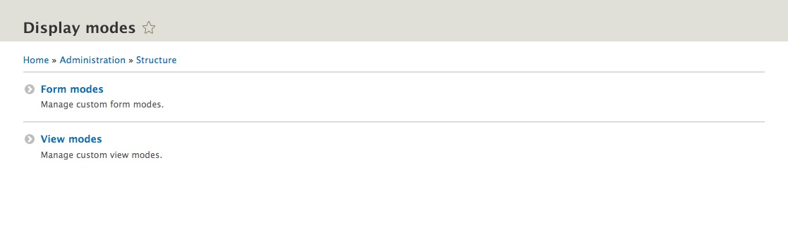
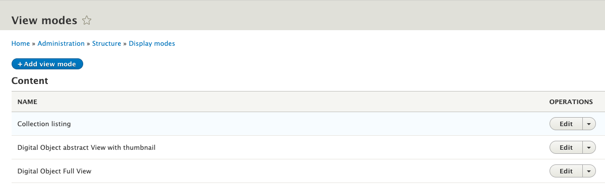
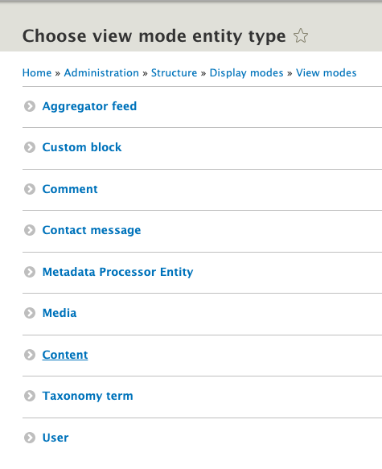
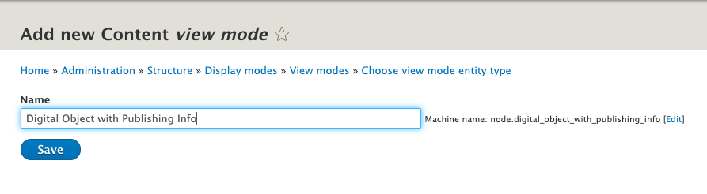
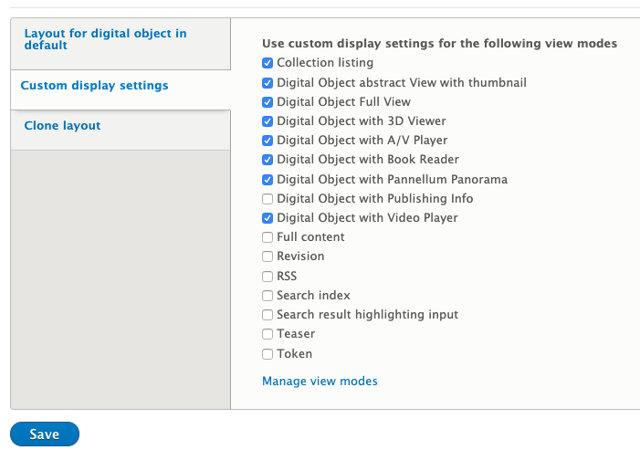
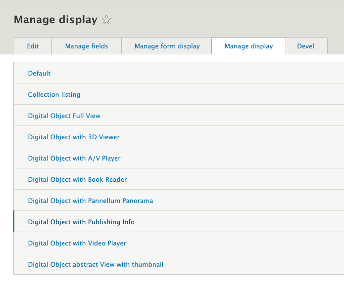
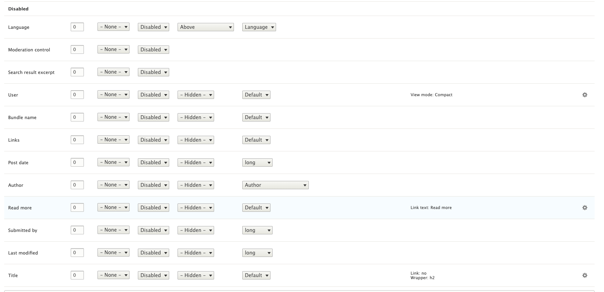
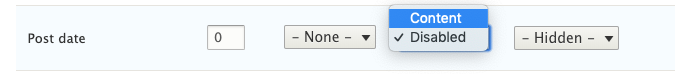
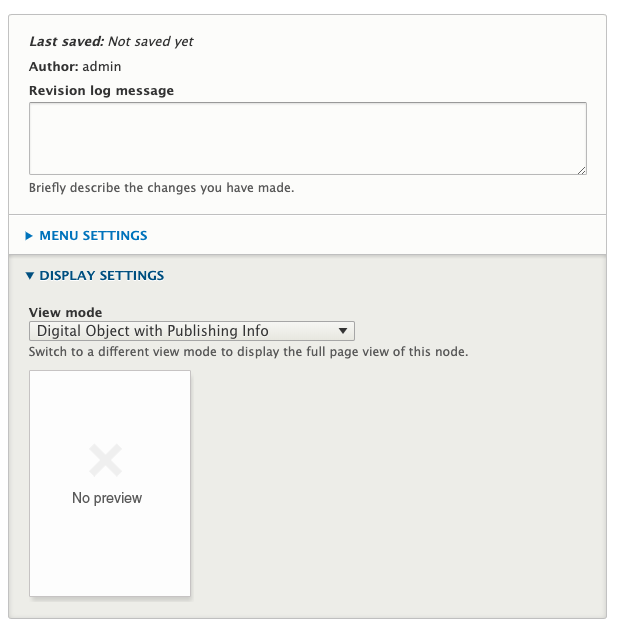
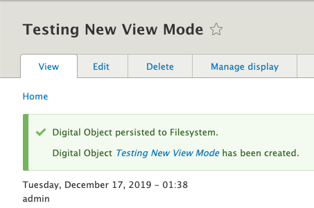

# Creating Display/View Modes for Archipelago Digital Objects

We recommend checking out our [primer on Display Modes](primerdisplaymodes.md) for a broader overview on Display/View Modes for Archipelago Digital Objects (ADOs).

## Adding a new View Mode

Why would you want to create a new View Mode? Maybe there is a new type of media you are attaching to ADOs that you want to display using the proper player or tool. Or maybe you want to simplify the ADO display, removing fields from the display page. In this example let's create a new View Mode for ADOs that adds some fields to the display to show the Author and Published date of the object.

1. Navigate to `yoursite/admin/structure/display-modes`

    

2. Select View modes, and click the "Add View mode" at the top of the page.

    

3. Select Content as your entity type.

    

4. Enter the name of your new View Mode and save. Ours is "Digital Object with Publishing Information"

    

5. Now let's enable this View mode. Go to `yoursite/admin/structure/types/manage/digital_object` and click the "Manage Display" tab.

6. Scroll to the bottom of the page and expand the "Custom Display Settings" area. You will see our newly created View Mode. Enable it and hit save.

    

7. Now scroll back to the page top. You will see "Digital Object with Publishing Information" in the list of View Modes, so go ahead and select it.

    

8. Scroll down until you see the "Disabled" section. This section contains fields that are available to the ADO content type, but are not enabled in this display mode. Let's enable Author and Post date by changing the "Region" column dropdown from "Disabled" to "Content". (To learn more about Regions in Drupal, see here). Basically, this ensures that this field has a home in the page layout. Hit save.

    

    

9. Now, if you want ADOs to use this View Mode for display, there is one last step. You need to select "Digital Object with Publishing Info" as the view mode Display Settings when adding new content. This area is located on the right side of the page. See below:

    

10. Now, when we view the individual ADO, these new fields have been added to the display.
    
    

All done! This was quite a simple example, but now you are aware of how to customize your own ADO display. It can only get more complex and exciting from here.

Let's recap. We created a new View Mode. We enabled this View Mode in Manage Display > Custom Display Settings for Digital Objects. We enabled new fields (in this case, just for instruction, the Author and Post date fields) to make our new View Mode unique, and learned about Disabled fields in the process. We selected our new View Mode in the Display Settings area (slightly confusing wording because yes, this is a View Mode, subset of Display Mode) during ADO creation. For more on creating new digital objects, see [this guide](firstobject.md)).

___

Thank you for reading! Please contact us on our [Archipelago Commons Google Group](https://groups.google.com/forum/#!forum/archipelago-commons) with any questions or feedback.

Return to the [Archipelago Documentation main page](index.md).
