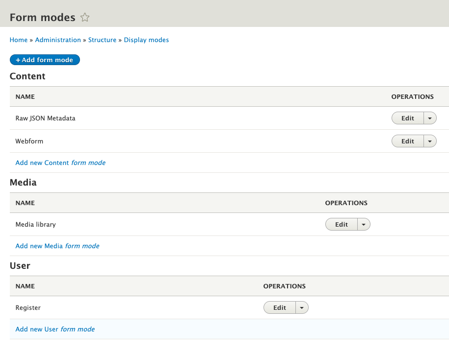
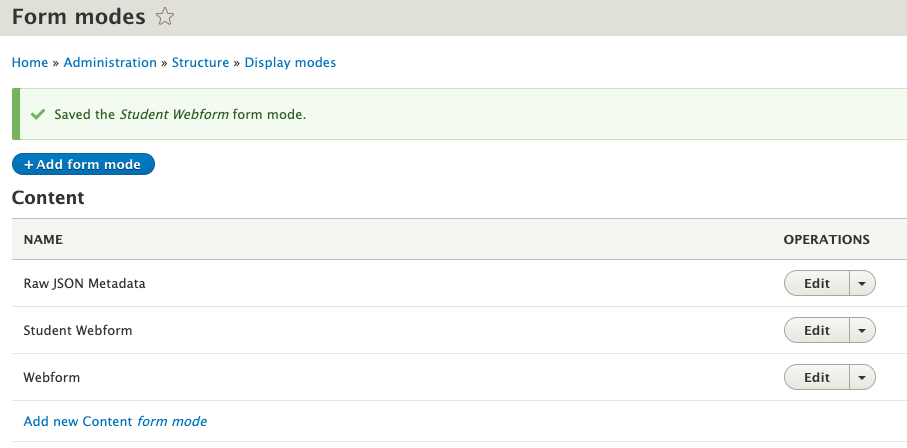
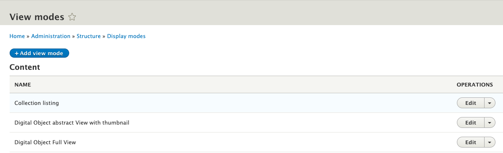

# Creating Display Modes for Archipelago Digital Objects

We recommend checking out our [primer on Display Modes](webformsasinput.md) for a broader overview on Form Modes and View Modes for Archipelago Digital Objects (ADOs).

But how do you create and enable these Display Modes in the first place? Let's find out.

## Adding a new Form Mode

Why would you want to create a new form mode? One common reason is to create different data entry experiences for users with different roles. Let's create an example form mode called "Student Webform" --  we can imagine a deployment where Students need a simplified form for ADO creation. We are going to create a form mode, enable it for Digital Objects, and give it some custom settings that differentiate it from existing form modes.

1. Navigate to `yoursite/admin/structure/display-modes`
    

2. Click on Form modes. This image shows the basic Form Modes shipped with Archipelago
    

3. Click the "Add Form mode" button at the top of the page. Then select the "Content" entity type from the list. In this example, we ultimately want the form mode to be applied to Archipelago Digital Objects, which is a Content entity type.
    

4. Enter the name of your Form Mode and hit save. Here we are entering "Student Webform".
    

5. Great. Now you will see your new Form mode in the list! Let's put it to use.
    

6. Head to `yoursite/admin/structure/types/manage/digital_object` and click the "Manage Form Display" tab. As mentioned above, in this example we want to add a new Form Mode for ADOs, so we are dealing with the Digital Object content type. Scroll to the bottom of this page and look for the "Custom Display Settings" area, which is collapsed by default. Expand it, and you should see this.
    

7. Enable "Student Webform" and hit save! Now scroll back up the page. You'll see it enabled like so.
    

8. Now select our new "Student Webform" tab. From here, you have many options and can configure input fields as you see fit! To finish out our specific example though, let's finally add our Student Webform to the display. Click on the settings gear icon next to the Descriptive Metadata field.
    

    You'll see that the default webform named "Descriptive Metadata" is entered. To add custom content to this Field Widget, start typing in the autocomplete. This example assumes you've created a webform called `Student Webform` in `yoursite/admin/structure/webform`. For info on how to create a new Webform with proper settings, see our [Webforms as input guide](webformsasinput.md).

9. After you've selected your "Student Webform" in the Field Widget setting, hit Update, and then Save at the bottom of the page.

All done! So let's recap. We created a new form mode. We added this form mode to the Manage Form Display > Custom Display Settings options for Digital Objects. And finally we configured the Field Widget for Descriptive Metadata in our new Form Mode to use a new Webform. This last step is arbitrary to this example. We could have enabled or disabled fields, or changed other field widget settings depending on our needs. But configuring different Webforms as Field Widgets for Descriptive Metadata is a common use case in Archipelago.
___

Thanks for reading this far! But there is more. We might want to display, in addition to ingest, our ADOs in custom ways. The process for creating new View Modes (the other type of Display Mode) is quite similar to creating new Form Modes, but let's walk through it with another example case.

## Adding a new View Mode

Why would you want to create a new View Mode? Maybe there is a new type of media you are attaching to ADOs that you want to display using the proper player or tool. Or maybe you want to simplify the ADO display, removing fields from the display page. In this example let's create a new View Mode for ADOs that adds some fields to the display to show the Author and Published date of the object.

1. Navigate to `yoursite/admin/structure/display-modes`
    

2. Select View modes, and click the "Add View mode" at the top of the page.
    

3. Select Content as your entity type.
    

4. Enter the name of your new View Mode and save. Ours is "Digital Object with Publishing Information"
    

5. Now let's enable this View mode. Go to `yoursite/admin/structure/types/manage/digital_object` and click the "Manage Display" tab.

6. Scroll to the bottom of the page and expand the "Custom Display Settings" area. You will see our newly created View Mode. Enable it and hit save.
    

7. Now scroll back to the page top. You will see "Digital Object with Publishing Information" in the list of View Modes, so go ahead and select it.
    

8. Scroll down until you see the "Disabled" section. This section contains fields that are available to the ADO content type, but are not enabled in this display mode. Let's enable Author and Post date by changing the "Region" column dropdown from "Disabled" to "Content". (To learn more about Regions in Drupal, see here). Basically, this ensures that this field has a home in the page layout. Hit save.
    

    

9. Now, if you want ADOs to use this View Mode for display, there is one last step. You need to select "Digital Object with Publishing Info" as the view mode Display Settings when adding new content. This area is located on the right side of the page. See below:
    

10. Now, when we view the individual ADO, these new fields have been added to the display.
    
    

All done! This was quite a simple example, but now you are aware of how to customize your own ADO display. It can only get more complex and exciting from here.

Let's recap. We created a new View Mode. We enabled this View Mode in Manage Display > Custom Display Settings for Digital Objects. We enabled new fields (in this case, just for instruction, the Author and Post date fields) to make our new View Mode unique, and learned about Disabled fields in the process. We selected our new View Mode in the Display Settings area (slightly confusing wording because yes, this is a View Mode, subset of Display Mode) during ADO creation (for more on creating new objects, see [this guide](firstobject.md)).

___

Thank you for reading! Please contact us on our [Archipelago Commons Google Group](https://groups.google.com/forum/#!forum/archipelago-commons) with any questions or feedback.

Return to the [Archipelago Documentation main page](index.md).
