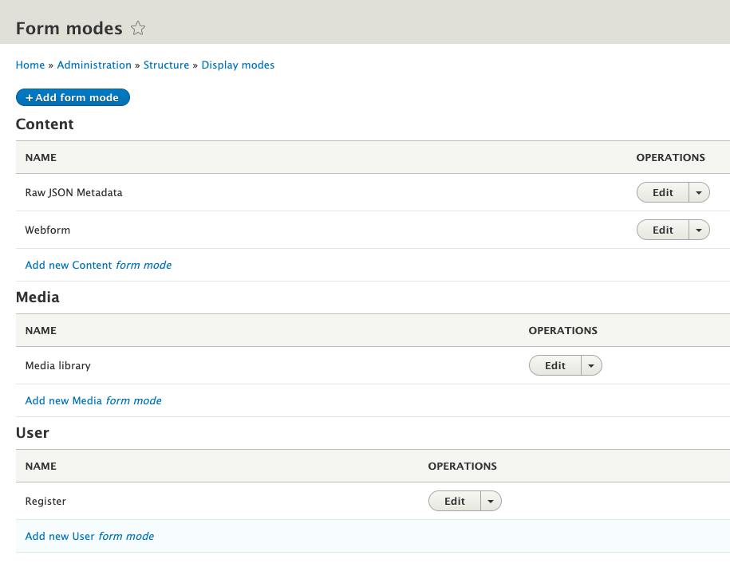
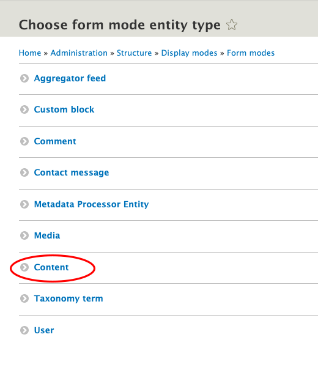
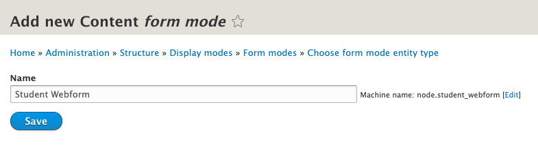
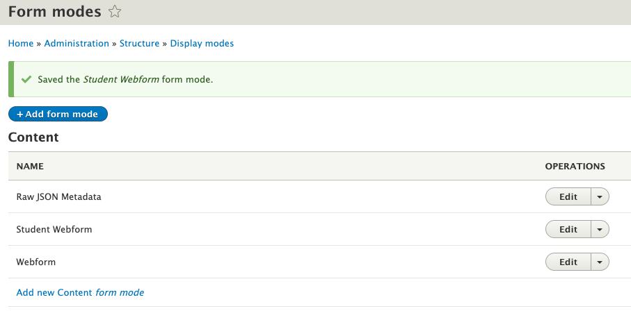
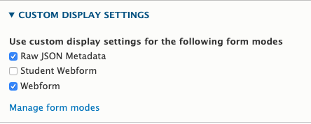
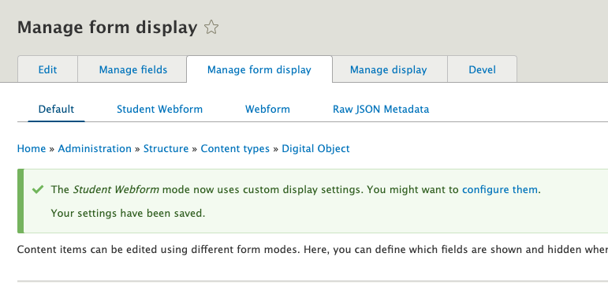
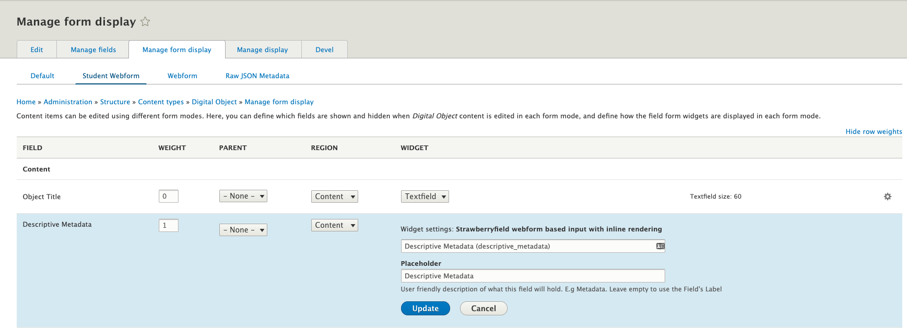

# Creating Form Modes for Archipelago Digital Objects

We recommend checking out our related [How to Create a Webform as an Input Method for Archipelago Digital Objects (ADO) guide](webformsasinput.md) for a broader overview on Form Modes for Archipelago Digital Objects (ADOs).

## Adding a new Form Mode

Why would you want to create a new form mode? One common reason is to create different data entry experiences for users with different roles. Let's create an example form mode called "Student Webform" --  we can imagine a deployment where Students need a simplified form for ADO creation. We are going to create a form mode, enable it for Digital Objects, and give it some custom settings that differentiate it from existing form modes.

1. Navigate to `yoursite/admin/structure/display-modes`

    

2. Click on Form modes. This image shows the basic Form Modes shipped with Archipelago

    

3. Click the "Add Form mode" button at the top of the page. Then select the "Content" entity type from the list. In this example, we ultimately want the form mode to be applied to Archipelago Digital Objects, which is a Content entity type.

    

4. Enter the name of your Form Mode and hit save. Here we are entering "Student Webform".

    

5. Great. Now you will see your new Form mode in the list! Let's put it to use.

    

6. Head to `yoursite/admin/structure/types/manage/digital_object` and click the "Manage Form Display" tab. As mentioned above, in this example we want to add a new Form Mode for ADOs, so we are dealing with the Digital Object content type. Scroll to the bottom of this page and look for the "Custom Display Settings" area, which is collapsed by default. Expand it, and you should see this.

    

7. Enable "Student Webform" and hit save! Now scroll back up the page. You'll see it enabled like so.

    

8. Now select our new "Student Webform" tab. From here, you have many options and can configure input fields as you see fit! To finish out our specific example though, let's finally add our Student Webform to the display. Click on the settings gear icon next to the Descriptive Metadata field.

    

    You'll see that the default webform named "Descriptive Metadata" is entered. To add custom content to this Field Widget, start typing in the autocomplete. This example assumes you've created a webform called `Student Webform` in `yoursite/admin/structure/webform`. For info on how to create a new Webform with proper settings, see our [Webforms as input guide](webformsasinput.md).

9. After you've selected your "Student Webform" in the Field Widget setting, hit Update, and then Save at the bottom of the page.

All done! So let's recap. We created a new Form Mode. We added this Form mMde to the Manage Form Display > Custom Display Settings options for Digital Objects. And finally we configured the Field Widget for Descriptive Metadata in our new Form Mode to use a new Webform. This last step is arbitrary to this example. We could have enabled or disabled fields, or changed other field widget settings depending on our needs. But configuring different Webforms as Field Widgets for Descriptive Metadata is a common use case in Archipelago.

___

Thank you for reading! Please contact us on our [Archipelago Commons Google Group](https://groups.google.com/forum/#!forum/archipelago-commons) with any questions or feedback.

Return to the [Archipelago Documentation main page](index.md).
