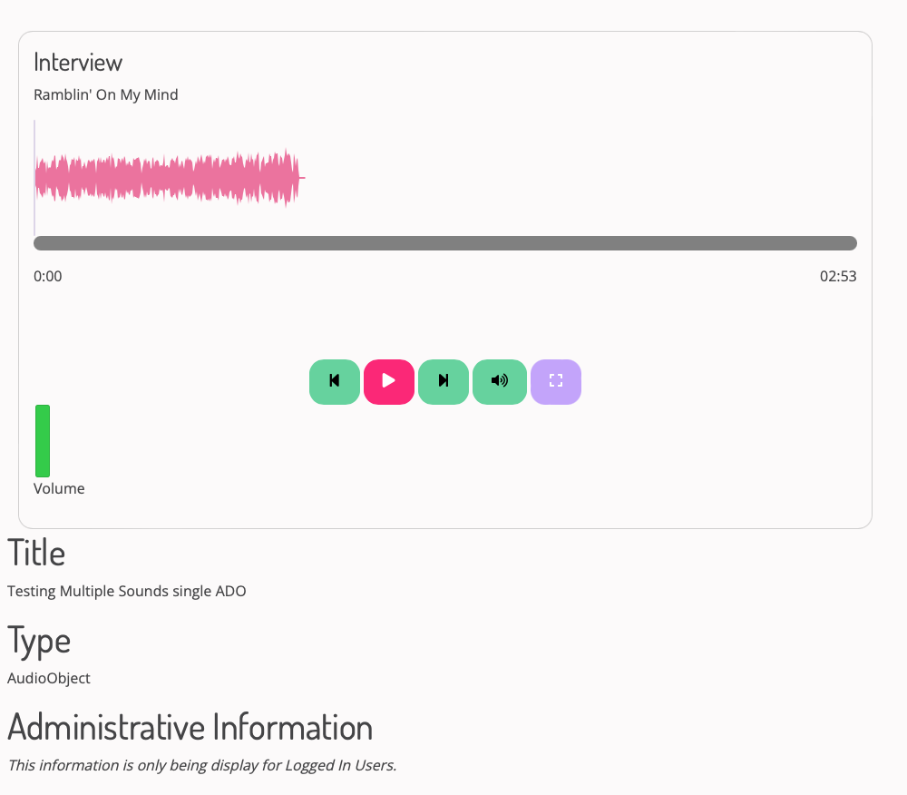

# Customizable A/V Formatters Configuration

Archipelago's 1.6.0+ release (December 2025) features new customizable Audio and Video Formatters (anything built by an admin user via plain HTML/templates) interfaces, including Wavesurfer (wave form interactive visualization) integration.

This documentation page will be updated in the upcoming weeks to provide detailed information related to both A/V Formatters. 

Please see our '[Primer on Display Modes](primerdisplaymodes.md)' and '[Strawberryfield Formatters](strawberryfield-formatters.md)' guides for more information about Display Modes and Formatters.

### Sneak Peak Screenshot

## Audio Formatter

## Video Formatter

___

Thank you for reading! Please contact us on our [Archipelago Commons Google Group](https://groups.google.com/forum/#!forum/archipelago-commons) with any questions or feedback.

Return to the [Archipelago Documentation main page](index.md).
