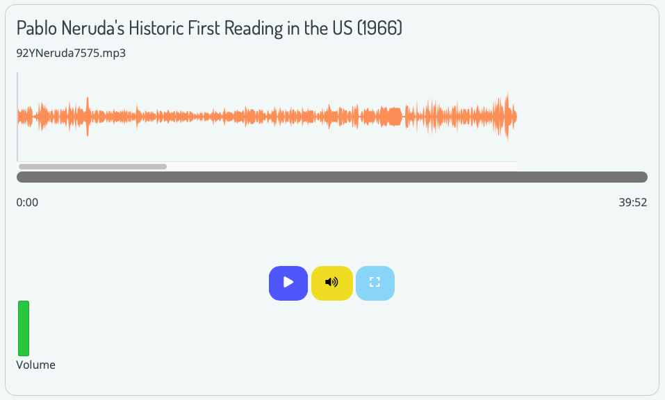
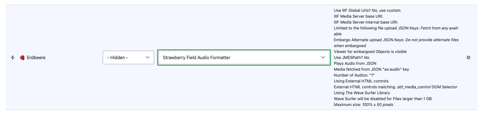
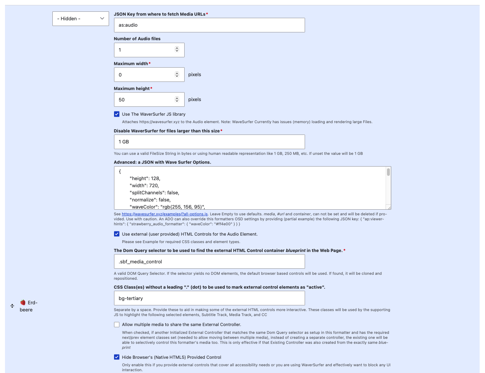

# Customizable A/V Formatters Configuration

Archipelago's 1.6.0+ release (December 2025) features new customizable Audio and Video Formatters (anything built by an admin user via plain HTML/templates) interfaces, including [Wavesurfer](https://wavesurfer.xyz) (wave form interactive visualization) integration.

This documentation page will be updated in the upcoming weeks to provide detailed information related to both A/V Formatters. 

Please also see our '[Primer on Display Modes](primerdisplaymodes.md)' and '[Strawberryfield Formatters](strawberryfield-formatters.md)' guides for more information about Display Modes and Formatters.

## Audio Formatter Example

You can find the main custom Audio Formatter settings configuration form at:
- `admin/structure/types/manage/digital_object/display/digital_object_with_a_v_player`
- Through the `Manage` menu > `Structure` > Content types > Digital Object > Manage display > Select 'Digital Object with Audio Player'

Select the small settings cogwheel to the right of the `Erdbeere` field + `Strawberry Field Audio Formatter` to review the custom Audio Formatter settings.

The customizable Audio Formatter features several optional ways to adjust the audio player display for digital objects using this formatter. 

The `Advanced: a JSON with Wave Surfer Options` section contains preconfigured JSON settings for a default example setup. 

Please see [https://wavesurfer.xyz/examples/?all-options.js](https://wavesurfer.xyz/examples/?all-options.js) for more potential options. You can also leave this section empty to use default wavesurfer settings (recommend to test and review first). 

Please also note: _media_, _#url_ and _container_ cannot be set and will be deleted if provided. Use with caution. 

An ADO can also override this formatters OSD settings by providing (partial example) the following JSON key: `{ "ap:viewer-hints": {"strawberry_audio_formatter": ("waveColor": "#ff4e00" }}}`

## Video Formatter Example

A custom video formatter example will be provided and documented soon. Please check back for related updates in early 2026.

___

Thank you for reading! Please contact us on our [Archipelago Commons Google Group](https://groups.google.com/forum/#!forum/archipelago-commons) with any questions or feedback.

Return to the [Archipelago Documentation main page](index.md).
