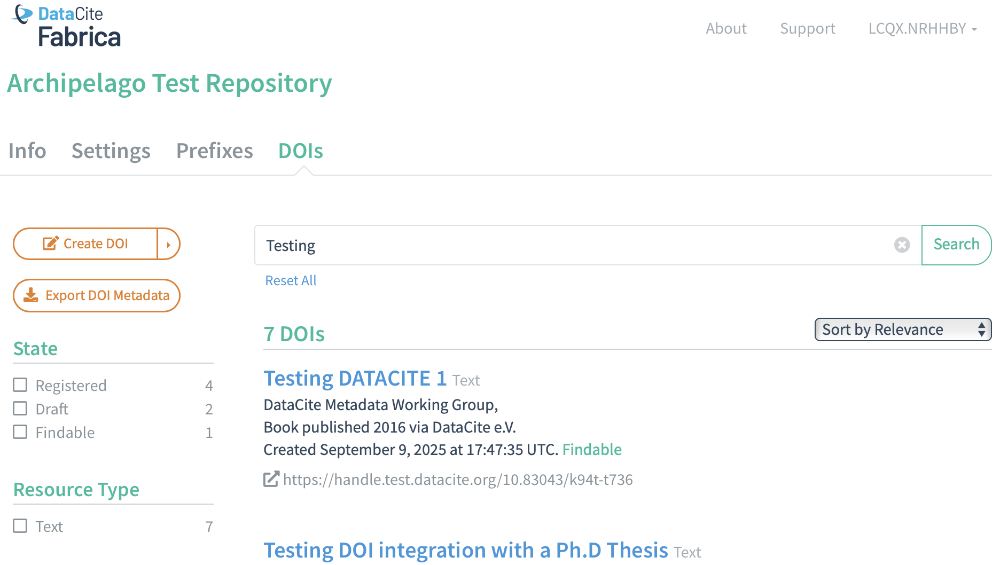

# DataCite Integration

Archipelago's 1.6.0+ release (December 2025) features DataCite Integration, including UI interfaces, DataCite Schema V4 compliance, stable reporting, and test and production environment. Archipelago's DataCite functionality is integrated into the Fragaria Module and RAW JSON workflows.

??? note "DataCite Fabrica Account Required"

    To use Archipelago's DataCity Integration, your institution will need to have established DataCite Fabrica account credentials. Archipelago will not provide test account credentials for you to use. 
    
    You can find more information about establshing a DataCite Fabrica account at: https://doi.datacite.org.

### Prerequisite - Fragaria enabled

Your Archipelago instance needs to first have the Fragaria module enabled. For default Archipelago local deployments, you will need to follow the steps outlined in the [Fragaria documentation guide here](fragaria.md#engable-fragaria-for-local-deployments).

## Configuration Form

You can find the DataCite DOI Integration Settings Configuration Form:

- Through the `Manage` menu > `Configuration` > `Archipelago` > `DataCite Services`
- Directly at `/admin/config/archipelago/fragaria/DataCite` 

Please note that your account credentials will be not show the saved password after your initial configuration form save.

## Corresponding Metadata Display Templates

1. The default Archipelago 1.6.0+ release includes a custom Twig template with DataCite V4 mappings for default Archipelago instances. This default template includes [all required DataCite elements](https://datacite-metadata-schema.readthedocs.io/en/4.5/properties/overview/#mandatory-properties), plus a few optional elements.
      * For default Archipelago instances, you can find this template at ~`/metadatadisplay/22`.
      * You can also find a copy of this template in the Archipelago Deployment Github repository [here](https://github.com/esmero/archipelago-deployment/blob/1.6.0/d8content/metadatadisplays/DataCite%20V4%20Default%20Template%20for%201.6.0%2B-4003250e-a596-4c29-a7e3-d55ff1009d44.twig.html).
2. The default Archipelago 1.6.0+ release includes updates in the AMI Ingest JSON template to facilitate DOI related actions in AMI Sets using the doi_datacite_action key (see more details below)
      * For default Archipelago instances, you can find this template at ~`/metadatadisplay/11`.
      * Also available in the Archipelago Deployment Github repository [here](https://github.com/esmero/archipelago-deployment/blob/1.6.0/d8content/metadatadisplays/AMI%20Ingest%20JSON%20Template-8595827e-b17d-42bc-bc46-a746bdd05417.twig.html).
      
## doi_datacite_action Key

For AMI Set Ingests and Updates, you can use the specialty `doi_DataCite_action` key in your AMI Set CSV and specify one of the following listed operations.

First, add a column to your AMI Set CSV named exactly `doi_DataCite_action`. Then apply one of the following operational values in your corresponding CSV row below the `doi_DataCite_action` column:

- literally nothing (empty), or a `0`, or `null`: if used to update existing Objects, any previous DOIs will stay put. Has no effect/no minting will happen, no change to existing DOIs will happen for that row
- `draft` (written as a word in the cell): if no previous DOI was minted (new ingest/updated Object without DOI), a new Draft DOI will be minted
- `register` (written as a word in the cell): if no previous DOI was minted (new ingest/updated Object without DOI), a new registered DOI will be minted and cannot be longer deleted; if a previous DOI exists, it can transition from its current state to "registered" (draft to registered if the ADO ), (findable to registered only if the ADO ends unpublished after the operation)
- `publish` (written as a word in the cell). I no previous DOI was minted (new ingest/updated Object without DOI), a new Findable DOI will be minted, can not be longer deleted
- `delete` (written as a word in the cell). I a previous DOI was minted and its current state is draft, it will be deleted.

Any wrong combination of the different DataCite states and Published/Unpublished ADO states will be handled automatically by the default DataCite Twig template logic and Archipelago's built-in cross-referencing of the [DataCite states permissions](https://support.datacite.org/docs/doi-states). However, it is still important to be mindful of how DataCite's DOI states work and what transitions between states are permitted.
​
## DataCite Reporting

### DataCite Fabrica Review 

You can check the status of DOIs created or updated within Archipelago by reviewing your repositories DOIs in the DataCite Fabrica environment.

First, use your Datacite account credentials to login to DataCite Fabrica at either:  [https://doi.test.datacite.org/sign-in](https://doi.test.datacite.org/sign-in) (if using a test DataCite account) or [https://doi.datacite.org/sign-in](https://doi.datacite.org/sign-in) (is using a production DataCite account).

Next, navigate to the `DOIs` tab and review the different DOIs that were created or updated within your Archipelago environment.

### LocalArchipelago Reporting

Archipelago's DateCite Reporting integration is currently still under construction. This documentation page will be updated in the upcoming weeks to provide more detailed information related to this functionality area when it has been made available.

___

Thank you for reading! Please contact us on our [Archipelago Commons Google Group](https://groups.google.com/forum/#!forum/archipelago-commons) with any questions or feedback.

Return to the [Archipelago Documentation main page](index.md).
