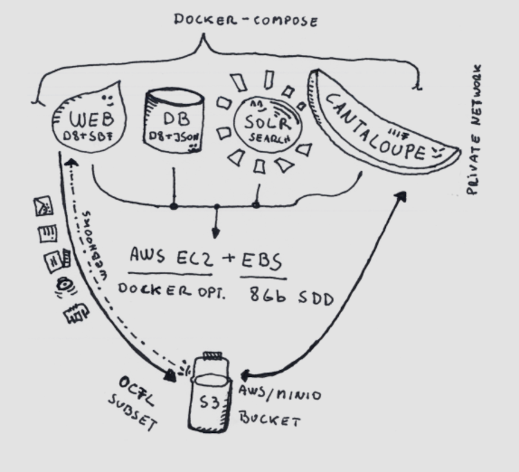

# Archipelago Software Services

At the core of the Archipelago philosophy is our commitment to both simplicity and flexibility.

### Under the hood, Archipelago is:
 - [Drupal (CMS)](https://www.drupal.org/)
 - [Solr (Search)](https://lucene.apache.org/solr/)
 - [Cantaloupe (Image Server)](https://cantaloupe-project.github.io/)
 - [S3 Storage (Mini.io or any other S3 flavor)](https://min.io/)

Installation is entirely [Dockerized](https://www.docker.com) and scripted with [easy-to-follow directions](https://github.com/esmero/archipelago-deployment/blob/1.0.0-RC1/README.md).

_Information related to non-Dockerized installation and configruation can be found here: [Traditional Installations](docs/traditional-install.md)_

### Strawberryfield Modules at the heart of every Archipelago:
  - [Strawberryfield](https://github.com/esmero/strawberryfield)
  - [Strawberryfield Formatters](https://github.com/esmero/format_strawberryfield)
  - [Webform Strawberryfield](https://github.com/esmero/webform_strawberryfield)
  - In-development Modules _(*Additional information for these modules will be made available following initial public releases.)_
    - [Strawberry Runners](https://github.com/esmero/strawberry_runners)
    - [Archipelago Multi-Importer (AMI)](https://github.com/esmero/ami)

Documentation related to the Strawberryfield modules can be found here: [Strawberryfields Forever](docs/Strawberryfields.md)

### Archipelago also extends these powerful tools:
  - [Drupal Webform Module](https://www.drupal.org/project/webform)
  - [International Image Interoperability Framework (IIIF)](https://iiif.io/)
  - [Internet Archive BookReader](https://github.com/internetarchive/bookreader)
  - [Mirador](https://projectmirador.org)
  - [Pannellum](https://github.com/mpetroff/pannellum)
  - [Replayweb.page Webarchive Player](https://github.com/webrecorder/replayweb.page)
  - [Solr OCR Highlighting](https://github.com/dbmdz/solr-ocrhighlighting)
  - Twig Templating [In Symfony](https://twig.symfony.com) / [In Drupal](https://www.drupal.org/docs/theming-drupal/twig-in-drupal)

---

Thank you for reading! Please contact us on our [Archipelago Commons Google Group](https://groups.google.com/forum/#!forum/archipelago-commons) with any questions or feedback.

Return to the [Archipelago Documentation main page](../README.md).
