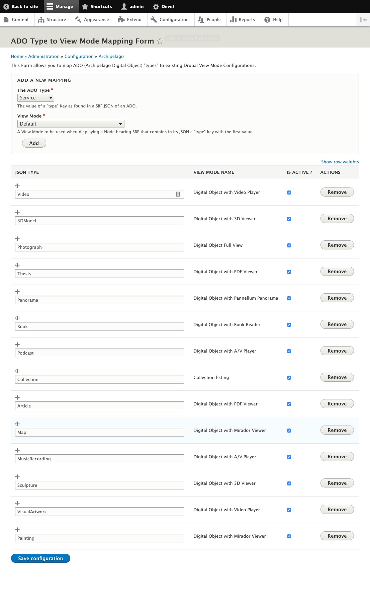
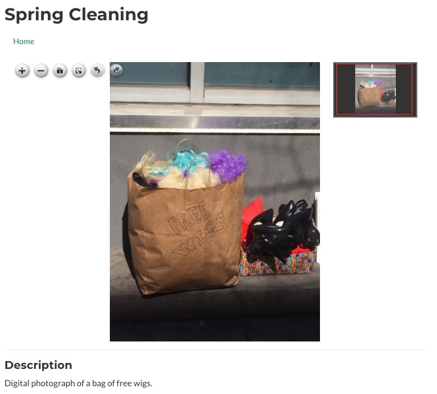
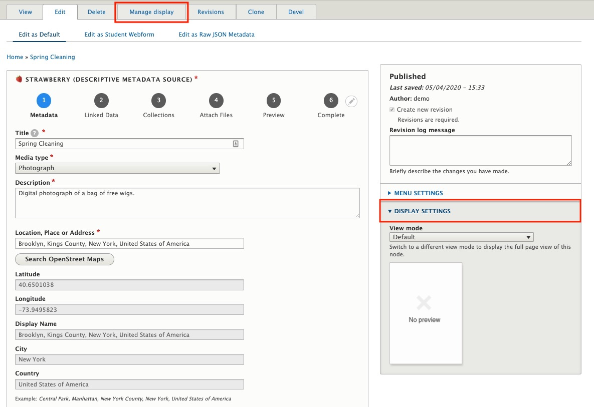
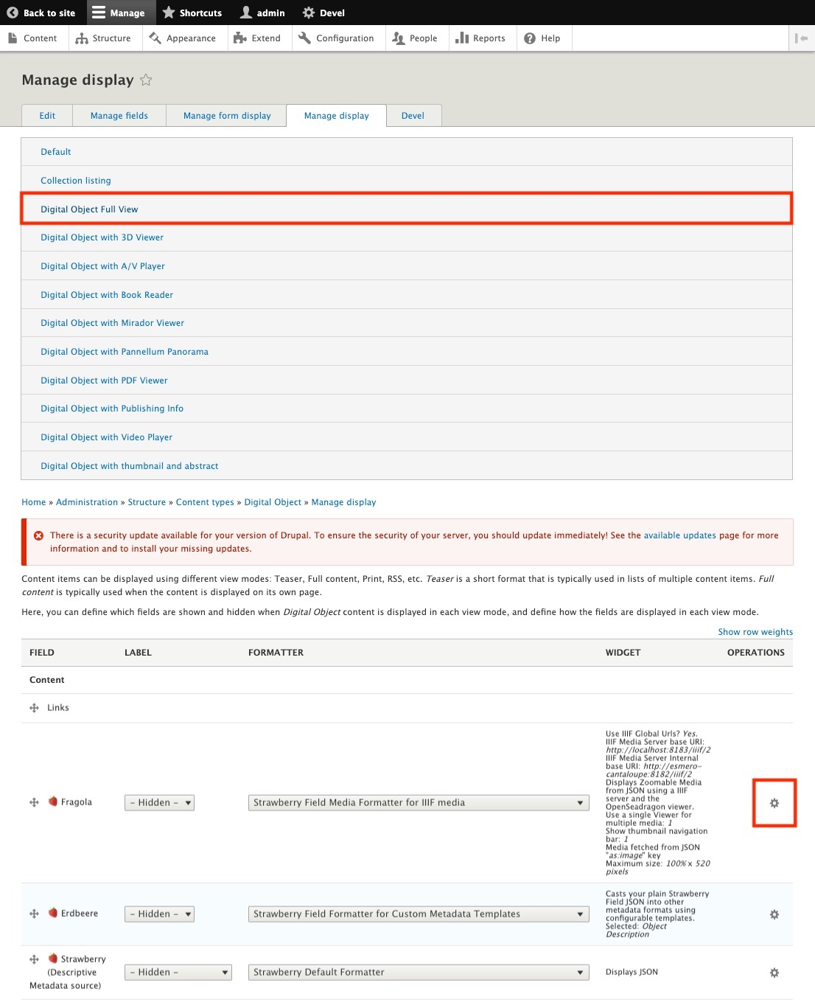
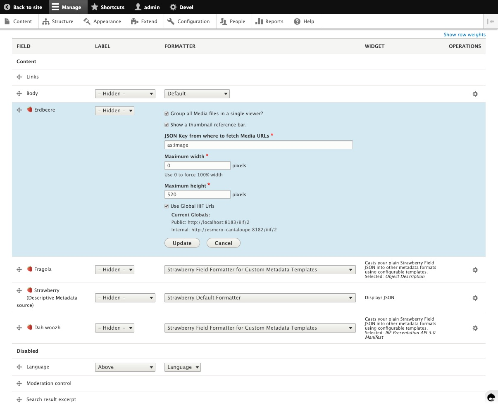

# View Modes: Digital Object Full View

`View modes` tell Archipelago Digital Objects (ADOs) how to be displayed to the world. This documentation will give a brief overview of the View mode `Digital Object Full View` and how it can be used when creating or editing ADOs.

## Digital Object Full View
The `Digital Object Full View` is the default `View mode` used for the Media type `Photograph` and any other Media type that is not already configured to a View mode*. `Digital Object Full View` has the ability to zoom in, zoom out, full screen, rotate and display multiple images associated with an ADO.

* Configuring ADO Types to View modes 

The **ADO Type to View mode Mapping** page can be accessed at */admin/config/archipelago/viewmode_mapping*.
This page will allow users to configure which `View mode` is used by default via the JSON key `type`.

## Manage display
In the Webform there is a section titled `DISPLAY SETTINGS` where users will be able to edit which `View mode` is being used for the object. To edit the `View mode`, go to the `Manage display` tab at the top of the Webform.

First select `Digital Object Full View`, then click on the gear icon under the `OPERATIONS` column to configure the corresponding Strawberryfield. In this case, `🍓Fragola` is the field with the formatter we need for editing this View mode.

Inside the Stawberryfield there is the ability to group all media files in a single viewer, select the JSON Key from where to fetch the Media URLs, set the maximum height of the viewer, etc. After any editing, be sure to always click `Update` inside the field and then `Save` at the bottom of the `Manage display` page to persist all changes.

