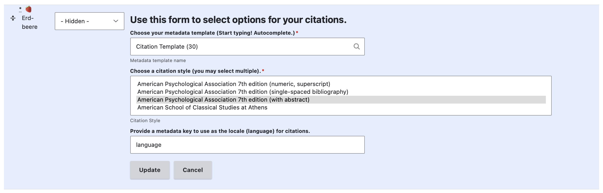
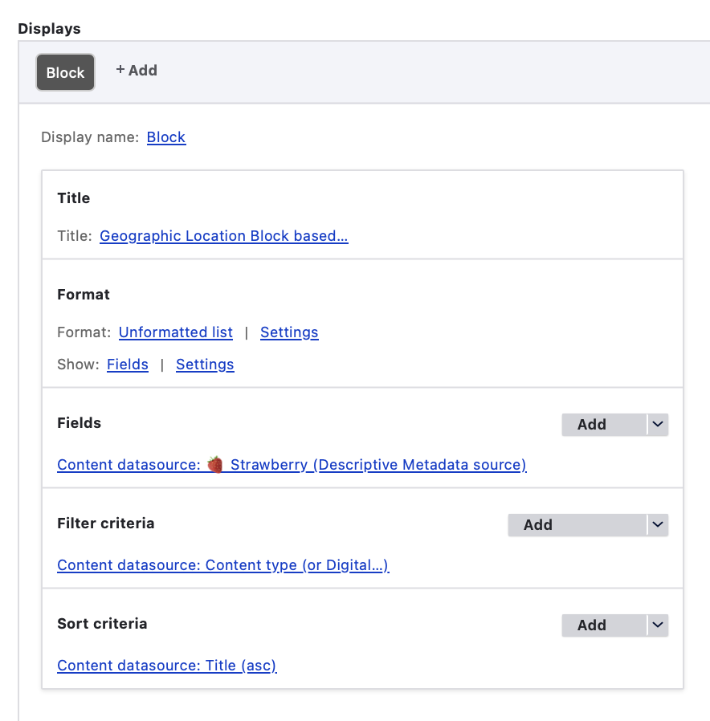
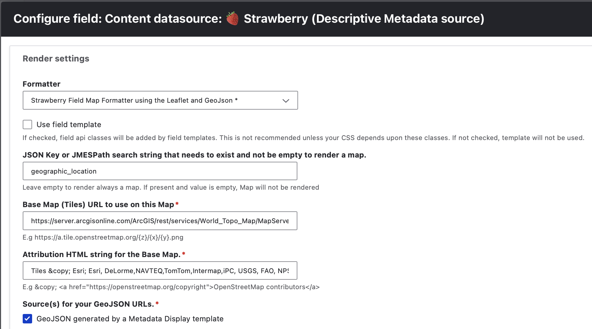

# Direct Media or JSON Object Data Formatters

Formatters that process media files or JSON object data directly for display outputs.

- Strawberry Field Audio Formatter
- Strawberry Field Simple Citation Formatter
- Strawberry Field Map Formatter using the Leaflet and GeoJson*
- Strawberry Field Formatter for Custom Metadata Templates
- Strawberry Field Video Formatter
- Strawberry Warc Formatter using replay.web embedded player
- Strawberry Default Formatter
- Strawberry Field Pretty Formatter

!!! note "Recommended prerequisite documentation"

    Please also see our '[Primer on Display Modes](primerdisplaymodes.md)' and '[Strawberryfield Formatters](strawberryfield-formatters.md)' guides for more information about Display Modes and Formatters.

## Strawberry Field Audio Formatter

See [Customizable A/V Formatters Configuration documentation here](custom_av_formatter.md) 

## Strawberry Field Simple Citation Formatter

This `Strawberry Field Simple Citation Formatter` can be used to display citation information for your Archipelago Digital Objects. 

There is not an example use of this formatter in default Archipelago deployments. You can find the option for this formatter listed in the Formatters dropdown list for any pre-configured display mode + formatter setup. 

For this formatter, you will have the option to specify a metadata display template to use, select one or multiple citation styles, and provide a metadata key to use as the locale (language) for citations.

## Strawberry Field Map Formatter using the Leaflet and GeoJson*

This formatter displays a map using the [Leaflet](https://github.com/Leaflet/Leaflet) and [GeoJSON](https://geojson.org) sources.

In default Archipelago deployments, an example of this formatter can be found within the settings for the `Geographic Location Block Solr` View.
- `/admin/structure/views/view/geographic_location_block_solr`
- Through the `Manage` menu > `Structure` > Views > Geographic Location Block Solr

To review the default settings configured for this formatter, click on 
"Content datasource: ..." in the 'Fields' section of the Geographic Location Block Solr` View configuration form.

Under 'Render settings', you can review the default configurations for this View's usage of the Strawberry Field Map Formatter using the Leaflet and GeoJson.

??? info "Default configurations used"

    - JSON Key or JMESPath search string that needs to exist and not be empty to render a map: 'geographic_location'
    - Base Map (Tiles) URL to use on this Map: 'https://server.arcgisonline.com/ArcGIS/rest/services/World_Topo_Map/MapServer/tile/{z}/{y}/{x}'
    - Attribution HTML string for the Base Map: 'Tiles &copy; Esri; Esri, DeLorme,NAVTEQ,TomTom,Intermap,iPC, USGS, FAO, NPS, NRCAN, GeoBase, Kadaster NL'
    - Source(s) for your GeoJSON URLs: checked box for 'GeoJSON generated by a Metadata Display template'
    - No checked options for the 'Optional: Source(s) for IIIF Manifest that will provide Georeferenced W3C Annotations for Overlays'
    - Select which Source will be handled as the primary one: set to 'metadataexposeentity'
    - No selection for 'Select which Overlay IIIF Source will be handled as the primary one'
    - Select which Exposed Metadata Endpoint will generate the GeoJSON: 'GeoJSON'
    - Max width is set to 0 to force 100% width; Max height is set to 480 pixels.
    - Initial zoom is set to 15; minimum zoom is set to 2; max zoom is set to 20.
    - Custom base URL info is set to reflect the Archipelago Deployment image server setup as needed.
    - Option is checked to 'Hide the Viewer in the presence of an Embargo'
    - All other optional settings are left empty/not configured.

## Strawberry Field Formatter for Custom Metadata Templates

## Strawberry Field Video Formatter

## Strawberry Warc Formatter using replay.web embedded player

## Strawberry Default Formatter

## Strawberry Field Pretty Formatter

___

Thank you for reading! Please contact us on our [Archipelago Commons Google Group](https://groups.google.com/forum/#!forum/archipelago-commons) with any questions or feedback.

Return to the [Archipelago Documentation main page](index.md).
