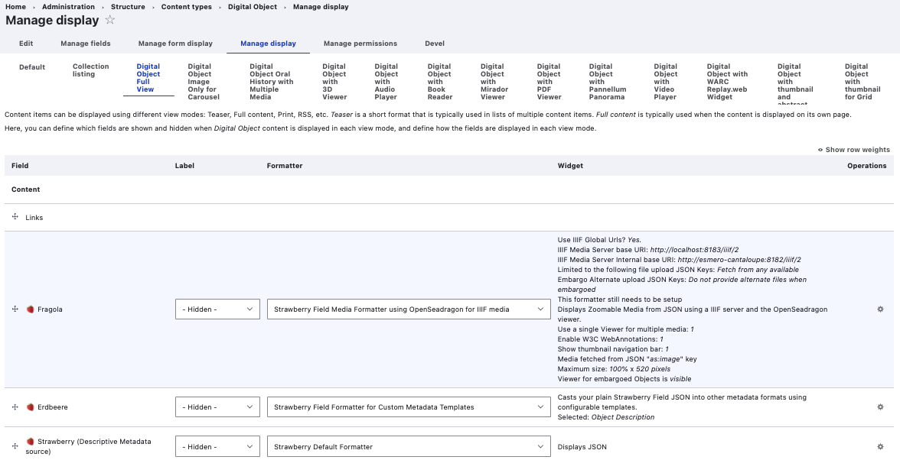
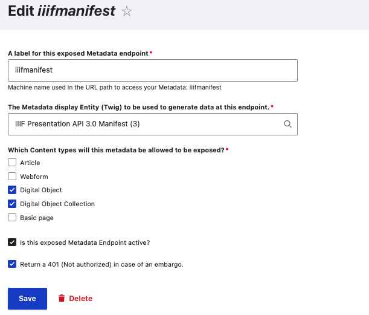
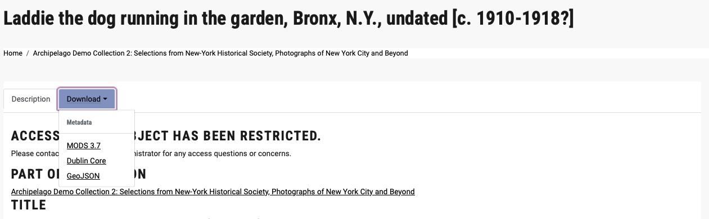

# Embargo & Access Restrictions in Archipelago

Archipelago features two primary different Metadata Based Embargo / Access Restriction options for limiting access to materials when needed.

You can find the main Metadata Based Embargo settings configuration form at:

- `admin/config/archipelago/metadatabased_Embargo`
- Through the `Configuration` menu > `Archipelago` > `Metadata based Embargo settings`


This form allows you to enable/disable Embargo functionality enforced at the Formatter level and configure on which JSON Key/values those will act.

For either (or both) Embargo options, you will to select the checkbox for 'Is Embargo checking and enforcing globally active?'

!!! note "Important Note: Your Metadata Keys and Values Matter"

    Please also keep in mind that the Embargo Options noted below need to draw the necessary related metadata values as defined in specific keys. You cannot specify to use either Embargo by Date or Embargo Bypass by IP without also defining the values in your Digital Object/Collection metadata.

## Option 1: Embargo by Date

The first Embargo option you have is to define a "JSON key present in your metadata that contains an Embargo lift date that will be used to Embargo Metadata and Media."

- Archipelago recommended default key is 'date_embargo_lift'

Functional mechanism for your specified key: 

- value for future date in the 'date_embargo_lift' key (or what key you define)
- set at the individual digital object level

??? info  question "Example of JSON Metadata key and values for 'date_embargo_lift"

    ```json
    {
        "date_embargo_lift": "2044-08-23"
    }
    ```        

Functional results for objects with future dates in the 'date_embargo_lift' key: 

- File media viewer does not display until the date set in the 'date_embargo_lift' key in the Digital Object's JSON metadata has passed.
- Metadata record displays as usual.

## Option 2: Embargo Bypass by IP

The second Embargo option you have is to define a "JSON key present in your metadata that contains an allowed to bypass Embargo through a visitor IP or IP range that will be used to Embargo Metadata and Media".

Functional mechanism for your specified key: 

- value for individual IP address or IP ranges set in the 'embargo_ip_bypass' key (or what key you define)
- set at the individual digital object level

??? info  question "Example of JSON Metadata key and values for 'embargo_ip_bypass"

    ```json
    {
        "embargo_ip_bypass": "[
        "123.123.123.123",
        "456.789.0.0\/11",
        "222.33.444.0\/56"
        ],
    }
    ```

Functional results for objects with future dates in the 'embargo_ip_bypass' key: 

- File media viewer does not display for individuals accessing the Digital Object from IP addresses not listed in the 'embargo_ip_bypass' key in 
- Metadata record displays as usual.
- No caching for any objects with values for this 'embargo_ip_bypass' key

## Additional Configurations Needed: Display Mode Formatters and Twig Templates

In order to enforce the Embargo options noted above, you have multiple options for configuration. You can use a singular or combination of the options described below, depending on your use cases and desired Embargo application. It is recommended that you at least apply the necessary Display Mode Formatter Configuration Options. You may also optionally wish to apply Twig Template changes noted further below.

### Display Mode Formatter Configuration Options

First, to better understand this functionality area, please first familiarize yourself with Archipelago's [Primer on Display Modes](webformsasinput.md) and [Strawberryfield Formatters](strawberryfield-formatters.md).

For every Display Mode you have configured for your Digital Objects and Digital Object Collection (Compounds/Creative Work Series), you can configure Embargo settings within the corresponding Strawberryfield Formatter.

#### Step 1. Navigate to Display Suite's Manage Display Tab

- For Digital Objects, found at `/admin/structure/types/manage/digital_object/display`
- For Digital Object Collections (Compounds/Creative Work Series), found at `/admin/structure/types/manage/digital_object_collection/display`

#### Step 2. Edit the StrawberryField Formatter Settings

- For every Display Mode potentially impacted by Embargo restrictions, select the corresponding StrawberryField Formatter used to render/display the Media Files and Viewer.



#### Step 3. Setup your Embargo Configurations

Within the selected StrawberryField Formatter, navigate to the bottom section of the form where you can setup your desired Embargo options.


- Option to 'Hide the Viewer in the presence of an Embargo'. This is the simplest option for configuring an Embargo restriction. If you leave this option unchecked, acting on an Embargo will be delegated to the IIIF Manifest driving the viewer.

- Option will be to specify 'When Embargo is used or applied, alternate JSON Key(s) where the files to be used by this formatter where uploaded/store in your JSON.' 
    - Please be careful about providing the same keys used for users that can by pass an Embargo. You can add multiple ones (keys) separated by comma. Some viewers use multiple file types, such as audio files and text-based subtitle files, and in that case please add all of the corresponding file type keys. In case of multiple keys for the same type (e.g. "audios1", "audios2"), the key names will be also used for grouping. Leave empty to not provide any alternate Embargo option at all.
    - This means you can add conditional logic to your IIIF Manifest (Twig Template) to do things such as "return an empty manifest and skip the images", or provide alternative images in case of an Embargo.

- Option to 'Use Global IIIF Urls'. This is enabled by default.

Depending on which Display Mode and particular StrawberryField Formatter you are editing, you may see additional options related to the IIIF Manifest.


- If the particular viewer you are editing is setup to use an Exposed Metadata Endpoint, you can also simplify the response and use the option at the end--'Return 401 in case of an Embargo', removing your need of delegating the decision to twig logic. Archipelago will resolve the Embargo and if the user can't see it, will return an access denied (401 code).
- You can find the 'Exposed Metadata using Twig Configuration entities' at `/admin/config/archipelago/metadataexpose`.



- If you decide **not** to code the your response to an Embargo on the IIIF manifest, you should at least enable the Formatter setting noted above to Hide the Viewer in the presence of an Embargo'.

### Twig Template Configuration Option

Please first familiarize yourself with [Twig Templates and Archipelago](metadatatwigs.md) and [Working With Twig in Archipelago](workingtwigs.md).

To apply either (or both) of the examples noted below, begin by navigating to the Metadata Display List in your Archipelago.

- Found at `/metadatadisplay/list` or `Content > Metadata Displays`

You will most likely only need to apply Embargo-related conditional logic to the primary 'Object Description' template, depending on the particular [Metadata Display Usage](metdata_display_usage.md) setup in your Archipelago.

#### Object Description Template Example 1

In your selected Metadata Display Twig Template, such as the primary Object Description, navigate to the section of the template where the main metadata field display output begins. Add the following conditional statement before the output of other elements:

```twig
  
    <h3>Access to this Object has been restricted.</h3>
    <p>Please contact the Repository Administrator for any access questions or concerns.<p>
  
```

Example output when applied within the default Archipelago Object Description Output --and paired with the Formatter Embargo Configuration noted above:


#### Object Description Template Example 2

The following example conditional logic is already provided in the default Archipelago Object Description template. To apply within your particular Object Description (or other) template, navigate to the section of the template where the file download section begins. Add the following conditional statement before the output of file download section:

```twig
{# -- Embargo option -- #} 
 

 
   {# also restrict if Embargoed #} 
    
 
```

Example output when applied within the default Archipelago Object Description Output --and paired with the Formatter Embargo Configuration noted above (the Download menu tab does not show the media file downloand link):



## Final Considerations

There is a specialized Permission found at `admin/people/permissions` under the Strawberry Metadata and Media Field Formatters section, which allows you to specify that certain User Roles can 'See Embargoed object metadata and assets'. Please note, this Permission is not ACL. Enforced Embargo configured JSON keys will not act on Formatters if a user has this enabled. If an Object is Embargoed this permission will allow any role with this assigned to bypass it.

___

Thank you for reading! Please contact us on our [Archipelago Commons Google Group](https://groups.google.com/forum/#!forum/archipelago-commons) with any questions or feedback.

Return to the [Archipelago Documentation main page](index.md).
