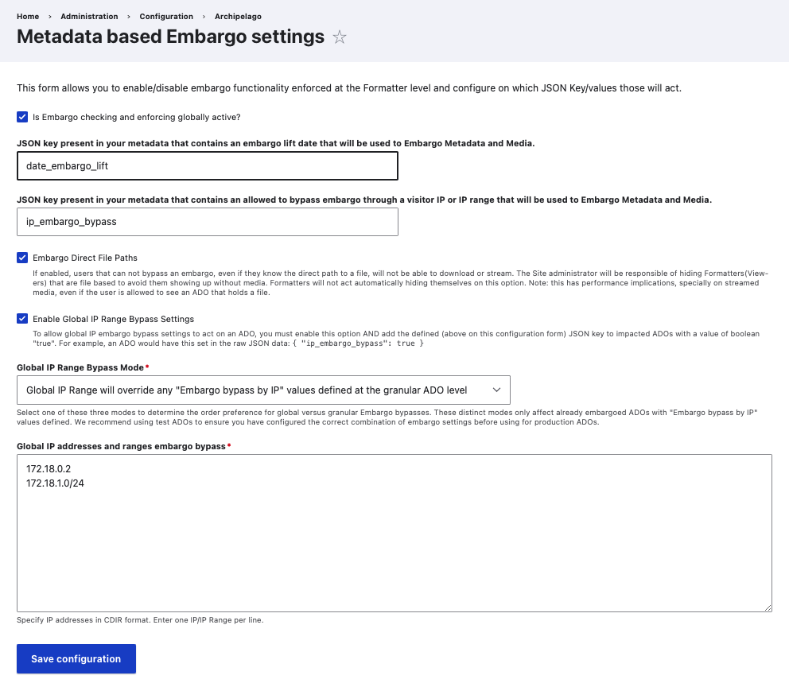
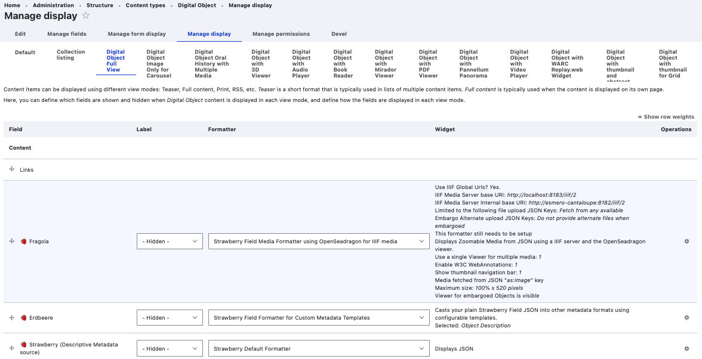
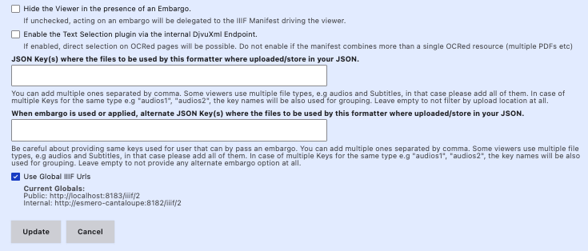
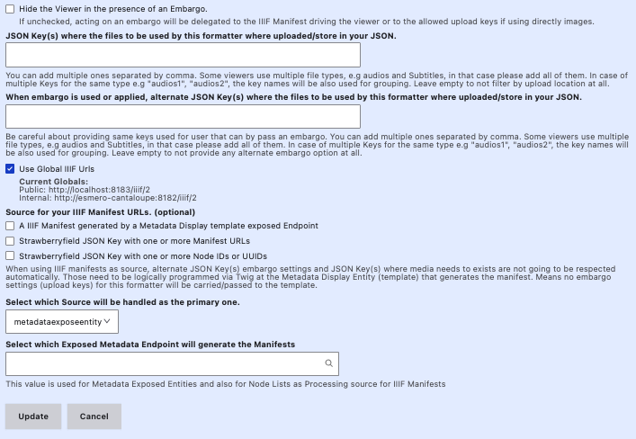
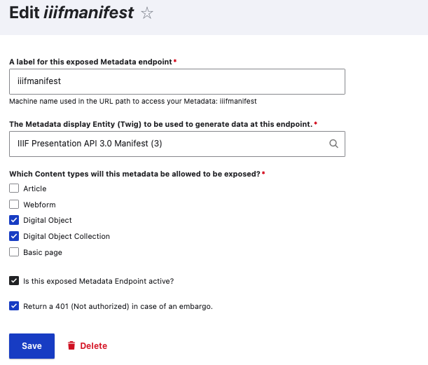
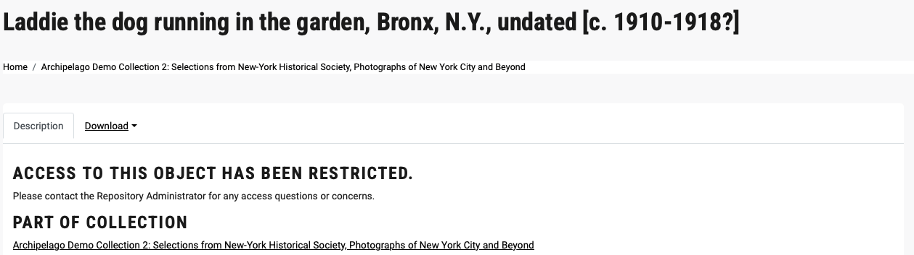
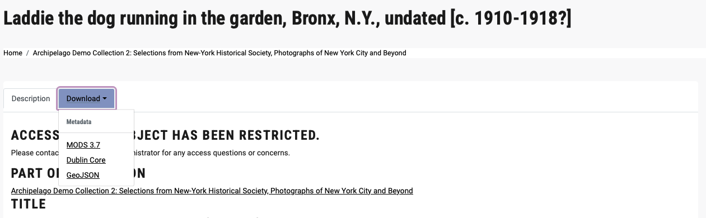
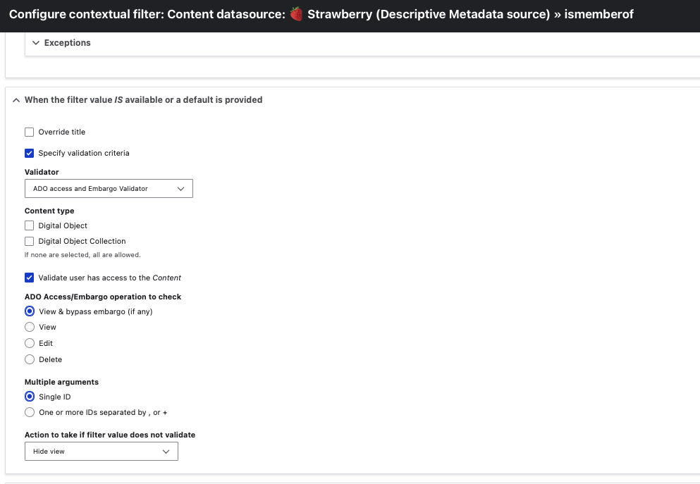
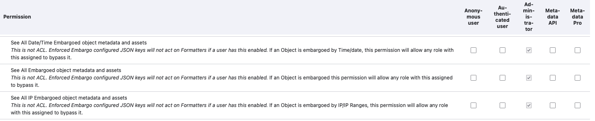

# Embargo & Access Restrictions in Archipelago

Archipelago features three primary Metadata Based Embargo / Access Restriction options for limiting access to materials when needed.

You can find the main Metadata Based Embargo settings configuration form at:

- `admin/config/archipelago/metadatabased_Embargo`
- Through the `Configuration` menu > `Archipelago` > `Metadata based Embargo settings`



This form allows you to enable/disable Embargo functionality enforced at the Formatter level and configure on which JSON Key/values those will act.

For any singular or multiple Embargo options, you will need to enable by first selecting the checkbox for 'Is Embargo checking and enforcing globally active?'

You will also want to review the [Additional Configurations Needed](embargo.md#but-wait-there's-more-additional-configurations-needed) section of this guide, and pair your primary Embargo/Access Restriction settings with the more granular options found for Display Modes, Twig Templates, Views, and User Permissions.

!!! note "Important Note: Your Metadata Keys and Values Matter"

    Please also keep in mind that the Embargo Options noted below need to draw the necessary related metadata values as defined in specific keys. You cannot specify to use either Embargo by Date or Embargo Bypass by IP without also defining the values in your Digital Object/Collection metadata.

### Option 1: Embargo by Date

The first Embargo option you have is to define a "JSON key present in your metadata that contains an Embargo lift date that will be used to Embargo Metadata and Media."

- Archipelago recommended default key is 'date_embargo_lift'

Functional mechanism for your specified key: 

- value for future date in the 'date_embargo_lift' key (or what key you define)
- set at the individual digital object level

??? info  question "Example of JSON Metadata key and values for 'date_embargo_lift"

    ```json
    {
        "date_embargo_lift": "2044-08-23"
    }
    ```        

Functional results for objects with future dates in the 'date_embargo_lift' key: 

- File media viewer does not display until the date set in the 'date_embargo_lift' key in the Digital Object's JSON metadata has passed.
- Metadata record displays as usual.

### Option 2: Embargo Bypass by IP

The second Embargo option you have is to define a "JSON key present in your metadata that contains an allowed to bypass Embargo through a visitor IP or IP range that will be used to Embargo Metadata and Media".

Functional mechanism for your specified key: 

- value for individual IP address or IP ranges set in the 'embargo_ip_bypass' key (or what key you define)
- set at the individual digital object level

??? info  question "Example of JSON Metadata key and values for 'embargo_ip_bypass"

    ```json
    {
        "embargo_ip_bypass": "[
        "123.123.123.123",
        "456.789.0.0\/11",
        "222.33.444.0\/56"
        ],
    }
    ```

Functional results for objects with IP range/s specified in the 'embargo_ip_bypass' key: 

- File media viewer does not display for individuals accessing the Digital Object from IP addresses not listed in the 'embargo_ip_bypass' key in 
- Metadata record displays as usual.
- No caching for any objects with values for this 'embargo_ip_bypass' key

### Option 3: Global IP Range Bypass Mode

The third Embargo option you have is to define a 'Global IP Range Bypass Mode' to select one of three modes to determine the order preference for global versus granular Embargo bypasses. These distinct modes only affect already embargoed ADOs with "Embargo bypass by IP" values defined. 

The three Global IP Range Bypass Modes are:

- Global IP Range will override any "Embargo bypass by IP" values defined at the granular ADO level 
- Global IP Range will be added to "Embargo bypass by IP" values defined at the granular ADO level
- Global IP Range will be ignored when an ADO holds "Embargo bypass by IP" values at the granular level

After selecting your desired Mode, you will need to enter the Global IP addresses and ranges for the embargo bypass. You will need to specify IP addresses in CDIR format, and enter one IP/IP Range per line in the available form box.

The default ranges provided for the Archipelago Local Deployment demonstrate an example of an internal IP address and range. These should be considered for reference only, and not used in production/live Archipelago instances.

### Bonus Option: Embargo Direct File Paths

An additional bonus option, to add onto one of the three primary Embargo options, is the ability to 'Embargo Direct File Paths'. If this additional option is enabled, users that cannot bypass an embargo, even if they know the direct path to a file, will not be able to download or stream. The Site administrator will be responsible of hiding Formatters (Viewers) that are file-based to avoid them showing up without media. Formatters will not act automatically hiding themselves on this option. Note: this has performance implications, specially on streamed media, even if the user is allowed to see an ADO that holds a file.

## But Wait There's More! Additional Configurations Needed

In order to enforce the Embargo options noted above, you have multiple options for configuration. You can use a singular or combination of the options described below, depending on your use cases and desired Embargo application. It is recommended that you at least apply the necessary Display Mode Formatter Configuration Options. You may also optionally wish to apply Twig Template changes noted further below.

### Display Mode Formatter Configuration Options

First, to better understand this functionality area, please first familiarize yourself with Archipelago's [Primer on Display Modes](webformsasinput.md) and [Strawberryfield Formatters](strawberryfield-formatters.md).

For every Display Mode you have configured for your Digital Objects and Digital Object Collection (Compounds/Creative Work Series), you can configure Embargo settings within the corresponding Strawberryfield Formatter.

#### Step 1. Navigate to Display Suite's Manage Display Tab

- For Digital Objects, found at `/admin/structure/types/manage/digital_object/display`
- For Digital Object Collections (Compounds/Creative Work Series), found at `/admin/structure/types/manage/digital_object_collection/display`

#### Step 2. Edit the StrawberryField Formatter Settings

- For every Display Mode potentially impacted by Embargo restrictions, select the corresponding StrawberryField Formatter used to render/display the Media Files and Viewer.



#### Step 3. Setup your Embargo Configurations

Within the selected StrawberryField Formatter, navigate to the bottom section of the form where you can setup your desired Embargo options.



- Option to 'Hide the Viewer in the presence of an Embargo'. This is the simplest option for configuring an Embargo restriction. If you leave this option unchecked, acting on an Embargo will be delegated to the IIIF Manifest driving the viewer.

- Option will be to specify 'When Embargo is used or applied, alternate JSON Key(s) where the files to be used by this formatter where uploaded/store in your JSON.' 
    - Please be careful about providing the same keys used for users that can by pass an Embargo. You can add multiple ones (keys) separated by comma. Some viewers use multiple file types, such as audio files and text-based subtitle files, and in that case please add all of the corresponding file type keys. In case of multiple keys for the same type (e.g. "audios1", "audios2"), the key names will be also used for grouping. Leave empty to not provide any alternate Embargo option at all.
    - This means you can add conditional logic to your IIIF Manifest (Twig Template) to do things such as "return an empty manifest and skip the images", or provide alternative images in case of an Embargo.

- Option to 'Use Global IIIF Urls'. This is enabled by default.

Depending on which Display Mode and particular StrawberryField Formatter you are editing, you may see additional options related to the IIIF Manifest.



- If the particular viewer you are editing is setup to use an Exposed Metadata Endpoint, you can also simplify the response and use the option at the end--'Return 401 in case of an Embargo', removing your need of delegating the decision to twig logic. Archipelago will resolve the Embargo and if the user can't see it, will return an access denied (401 code).
- You can find the 'Exposed Metadata using Twig Configuration entities' at `/admin/config/archipelago/metadataexpose`.



- If you decide **not** to code the your response to an Embargo on the IIIF manifest, you should at least enable the Formatter setting noted above to Hide the Viewer in the presence of an Embargo'.

### Twig Template Configuration Option

Please first familiarize yourself with [Twig Templates and Archipelago](metadatatwigs.md) and [Working With Twig in Archipelago](workingtwigs.md).

To apply either (or both) of the examples noted below, begin by navigating to the Metadata Display List in your Archipelago.

- Found at `/metadatadisplay/list` or `Content > Metadata Displays`

You will most likely only need to apply Embargo-related conditional logic to the primary 'Object Description' template, depending on the particular [Metadata Display Usage](metadata_display_usage.md) setup in your Archipelago.

#### Object Description Template Example 1

In your selected Metadata Display Twig Template, such as the primary Object Description, navigate to the section of the template where the main metadata field display output begins. Add the following conditional statement before the output of other elements:

```twig
  
    <h3>Access to this Object has been restricted.</h3>
    <p>Please contact the Repository Administrator for any access questions or concerns.<p>
  
```

Example output when applied within the default Archipelago Object Description Output --and paired with the Formatter Embargo Configuration noted above:



#### Object Description Template Example 2

The following example conditional logic is already provided in the default Archipelago Object Description template. To apply within your particular Object Description (or other) template, navigate to the section of the template where the file download section begins. Add the following conditional statement before the output of file download section:

```twig
{# -- Embargo option -- #} 
 

 
   {# also restrict if Embargoed #} 
    
 
```

Example output when applied within the default Archipelago Object Description Output --and paired with the Formatter Embargo Configuration noted above (the Download menu tab does not show the media file downloand link):



### Views Based Options for Contextual Filters

For even more granularity, you can enable additional access/embargo checks within a Contextual Filter for a View. 

For example, in the Collection block View (found at `/admin/structure/views/view/collection_membership` in default Archipelago instances), you could:

- Choose to enable a Validator for 'ADO access and Embargo Validator'
- Then also specify the additional checks to 'Validate user has access to the *Content*'
- And select the ADO Access/Embargo operation to check as 'View & bypass embargo (if any)'
- Select that a 'Single ID' for the 'Multiple arguments' parameter
- Then select 'Hide View' for the 'Action to take if filter value does not validate'



Applying the changes described above would prevent the list of collection children from being shown if the Parent Collection itself was embargoed.

### Role Based Permissions Options

There is a specialized set of permissions found at `admin/people/permissions` under the Strawberry Metadata and Media Field Formatters section, which allows you to specify that certain User Roles can 'See Embargoed object metadata and assets'. Please note, this Permission is not ACL. Enforced Embargo configured JSON keys will not act on Formatters if a user has this enabled. If an Object is Embargoed this permission will allow any role with this assigned to bypass it.

Archipelago 1.5.0 instituted the following custom User Role Permissions related to embargo/access restrictions:

- See All Date/Time Embargoed object metadata and assets: This is not ACL. Enforced Embargo configured JSON keys will not act on Formatters if a user has this enabled. If an Object is embargoed by Time/date, this permission will allow any role with this assigned to bypass it.
- See All Embargoed object metadata and assets: This is not ACL. Enforced Embargo configured JSON keys will not act on Formatters if a user has this enabled. If an Object is embargoed this permission will allow any role with this assigned to bypass it.
- See All IP Embargoed object metadata and assets: This is not ACL. Enforced Embargo configured JSON keys will not act on Formatters if a user has this enabled. If an Object is embargoed by IP/IP Ranges, this permission will allow any role with this assigned to bypass it.



## Final Considerations

For all of the Embargo and Access configurations and settings available, it is always recommended to first test your configurations using demo/test ADOs to ensure you have configured the correct combination of embargo settings before using any of these modes for production ADOs.

___

Thank you for reading! Please contact us on our [Archipelago Commons Google Group](https://groups.google.com/forum/#!forum/archipelago-commons) with any questions or feedback.

Return to the [Archipelago Documentation main page](index.md).
