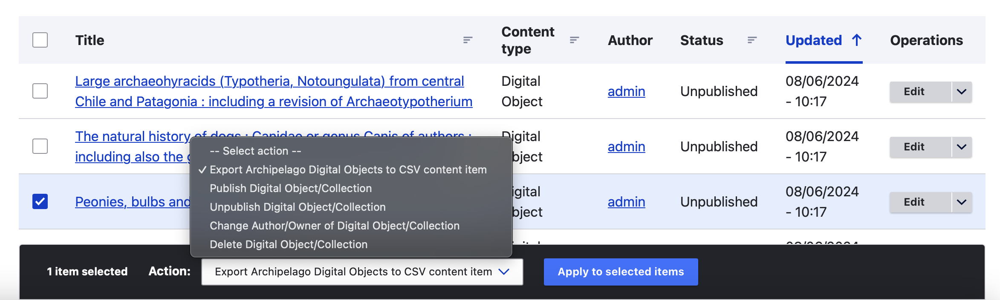

# Export ADOs to CSV Action

Archipelago has a specialty Action, labeled `Export Archipelago Digital Objects to CSV content item`, which enables you to generate a CSV file for a selected group of Archipelago Digital Objects (ADOs). 

## Where to Find

In default Archipelago deployments, this speciality action is found at the Action menus for the main Content page:

- Accessed through the `Content` menu item
- Directly at `/admin/content`

And the [Advanced Batch Find and Replace](find_and_replace.md) view:

- Accessed through the `Tools` menu > `Advanced Batch Find and Replace` 
- Directly at `/search-and-replace`

## Export ADOs to CSV Configuration Options

After selecting a group of ADOs through either the 'Content' or 'Find and Replace' pages, you will have the following options available for using this speciality Action.

1. **Expand related ADOs to UUIDs**: when enabled, all related ADOs (ismemberof, etc) are going to be expanded to their UUIDs. This allows changes to parentship to be made on the CSV.
2. **Do not export Media/Files**: when enabled, file references and their associated technical Metadata (as:filetype JSON keys, e.g as:image) will be skipped. This allows pure Descriptive Metadata to be exported to CSV.
3. **Convert Media to Portable Absolute URLs**: when enabled, all File references will be converted to absolute URLs and their associated technical Metadata (as:filetype JSON keys, e.g as:image) will be skipped. This allows CSVs to be used to ingest new ADOs in other repositories.
4. **Attach CSV to a new AMI Set**: when checked, a new AMI set with the exported data will be created and configured for "Updating" existing ADOs.
5. If attaching to a new AMI Set, you will have the option to **Please Give your AMI Set a name**: If empty, Archipelago will create a (quite) generic one for you (defaults to 'CSV Export/Import AMI Set').

Select `Apply` when you are ready to move forward to the next step of using this action.

## Executing the Action and Downloading the CSV

After selecting your Export ADOs to CSV Configuration Options, you will be directed to a page showing a summary preview of the 'Items selected' (display list of ADOs may be truncated depending on the amount of items), and then will need to select `Execute Action` to proceed.

Generating the CSV (and possibly a corresponding AMI Set, if you selected that option) will be processed in real time. This may take a few seconds to a few minutes, depending on the amount of items you selected to include. You will see a progress bar generate while the Action is running.

When the Action is finished, you will see a temporary Status Message stating: "Your source data was saved and is available as CSV at", followed by a link to the CSV file generated. Be sure to click on the CSV link and download before navigating away from this temporary Status message.

If you selected the option to attach to `Attach CSV to a new AMI Set`, you will also see a status message stating: "Well Done! New AMI Set was created and you can see it here" (and 'see it here' will be linked to the corresponding AMI Set). You will be able to access the AMI Set from the `AMI Sets` tab on the main Content page found at `/admin/content` or directly at `/amiset/list`.

## Recommendations

This specialty Action can be quite useful for generating CSVs to use for reviewing select batches of materials found in your repository, but it is not intended to be used to generate an output of all of your Archipelago repository's digital objects and collections. Depending on the size of your repository, generating a CSV for all of your assets may exceed the timeout processing limits and also result in a CSV file that is unable to be opened by standard spreadsheet software such as Google Sheets or MS Excel.

We would recommend using the [Find and Replace view](find_and_replace.md) to narrow down your selected ADOs more easily using the Facets available. We would also recommend keeping your selected batches to an amount of objects you can reasonably assess and review using your normal spreadsheet review workflows and software.

___

Thank you for reading! Please contact us on our [Archipelago Commons Google Group](https://groups.google.com/forum/#!forum/archipelago-commons) with any questions or feedback.

Return to the [Archipelago Documentation main page](index.md).
