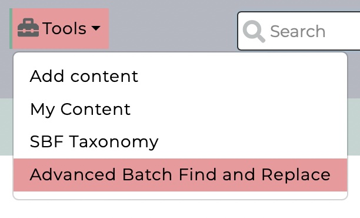
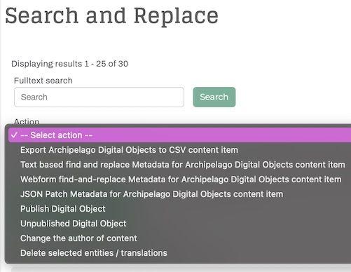

# Advanced Batch Find and Replace

Archipelago's Advanced Batch Find and Replace functionality provides different ways for you to efficiently Find/Search and Replace metadata values found in the raw JSON of your Digital Objects and Collections. Advanced Batch Find and Replace makes use of customized Actions that extend [Drupal's VBO module](https://www.drupal.org/project/views_bulk_operations) to enable these powerful batch metadata replacement actions in your Archipelago environment. 

## Where to Find

In default Archipelagos, you can find Advanced Batch Find and Replace:
 - Through the `Tools` menu > `Advanced Batch Find and Replace` 
 - Directly at `/search-and-replace` 

       

??? info "Site Administrator Note"

    - The View driving this can be found at `/admin/structure/views/view/solr_search_content_with_find_and_replace`. The default Facets referenced above can be found at `/admin/structure/block/list/archipelago_subtheme` in the `Sidebar Second` section. Please proceed with caution if making any changes to the default configurations for this View or the Facets referenced on this View Page.     

## Main Page Overview

From the main page (display title 'Search and Replace'), you will see:
 - A 'Fulltext Search' box
 - Dropdown list of Actions available
 - A listing of all the Digital Objects and Collections found in your Archipelago repository
    - Option to 'Select/deselect all results in this view (all pages)' via toggle switch
    - Option beside each individual Object/Collection to select one-at-a-time via toggle switch
    - Exapandable 'Raw Metadata (JSON)' section beneath each each individual Object/Collection containing the full Raw JSON metadata record for reference.
 - Expandable section to show all the items Selected in this view (will be 0 items to start).
    - *Note: individual selections made on different page results will be preserved in the overall Selected items available for preview here.
        

You will also see a listing of a few different default Facets configured to help guide your selection of potential Digital Objects/Collections:
 - Object Type
    - the Archipelago Digital Object/Collection Type
    - JSON key: `type`
 - JSON keys in your metadata
    - all of the potential JSON keys that are present in your repository
 - Ingest Method Service URL
    - The URL of the Digital Object/Collection Webforms and AMI Sets present in your repository that were used to create Digital Objects/Collections.

## Available Actions

!!! note "Important Note & Workflow Recommendation"

    The Actions available through Archipelago's Advanced Batch Find and Replace can potentially have repository-wide effects. It is strongly recommended that you proceed with caution when executing any of the available Actions. 
    
    The Workflow Recommendation is to always first select the option to '☑️ only simulate and debug affected JSON' --> Then double check that the total effected changes shown reflect your intended amount of changes (Note: the total will always be multipled by a factor of 2, as the Actions count a first step of checking against your data, then the second step of applying the change.) --> Then once you have confirmed the simulated results match your intentend amount of changes, proceed with executing the Action you first simulated.

The default options available through the Action dropdown menu include:
 - *Export Archipelago Digital Objects to CSV content item
 - Text based find and replace Metadata for Archipelago Digital Objects content item
 - Webform find-and-replace Metadata for Archipelago Digital Objects content item
 - JSON Patch Metadata for Archipelago Digital Objects content item
 - *Publish Digital Object
 - *Unpublish Digital Object
 - *Change the author of content
 - *Delete selected entities/translations

_* denotes Action options that are also shared with the Main `Content` Page Action Menu_

## Find and Replace Specific Actions

Please see the following separate pages listed below for detailed information related to each of the three 'Find and Replace' specific actions.

- [Text Based Find and Replace](find_and_replace_action_text.md)
- [Webform Find and Replace](find_and_replace_action_webform.md)
- [JSON Patch Find and Replace](find_and_replace_action_json_patch.md)

## Checking Your Changes

After applying any of the above Find and Replace Actions, you can review the specific changes that were made within the Revision history of the impacted Digital Objects and Collections. 
 - Through the Find and Replace results listing or the main Content page, navigate to the Digital Object/Collection
 - Open the 'Revision' tab
 - The details for the specific Action executed will be visible

___

Thank you for reading! Please contact us on our [Archipelago Commons Google Group](https://groups.google.com/forum/#!forum/archipelago-commons) with any questions or feedback.

Return to the [Archipelago Documentation main page](index.md).

