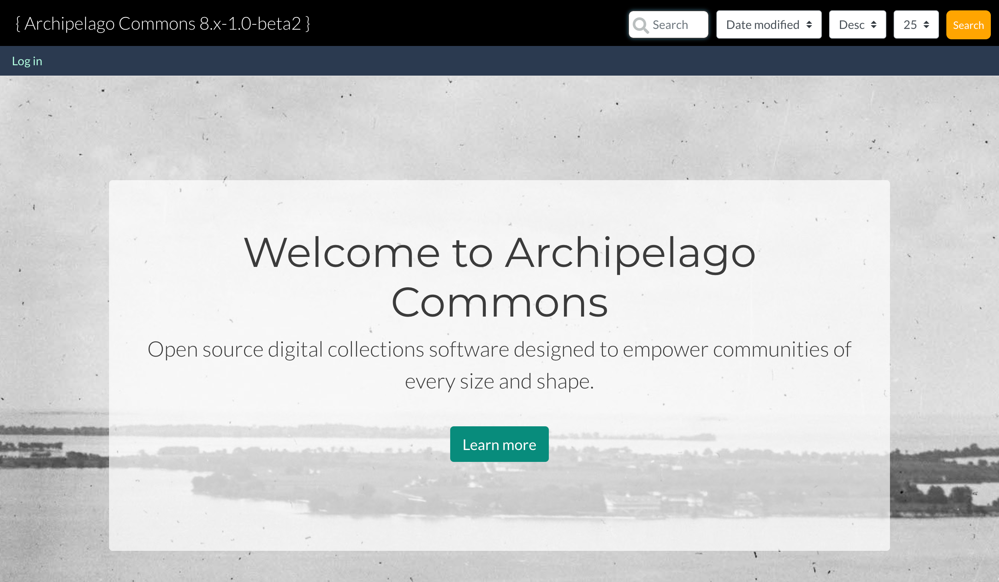
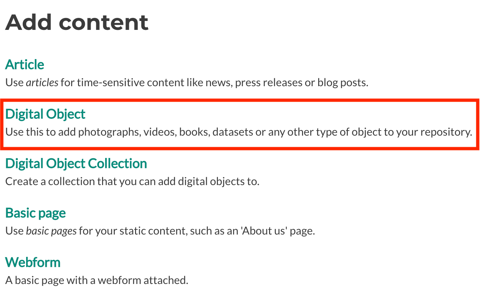
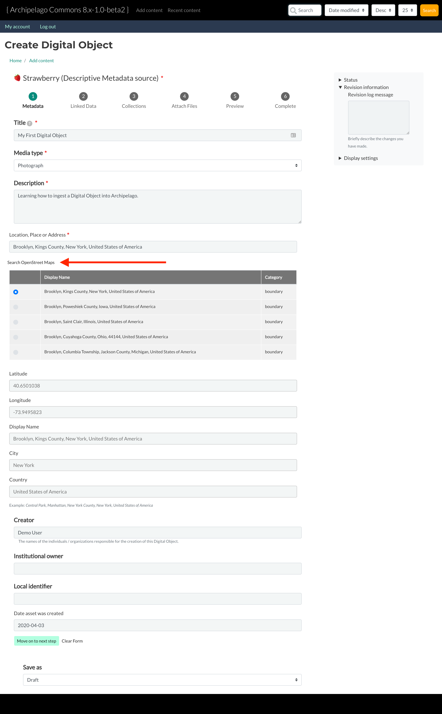
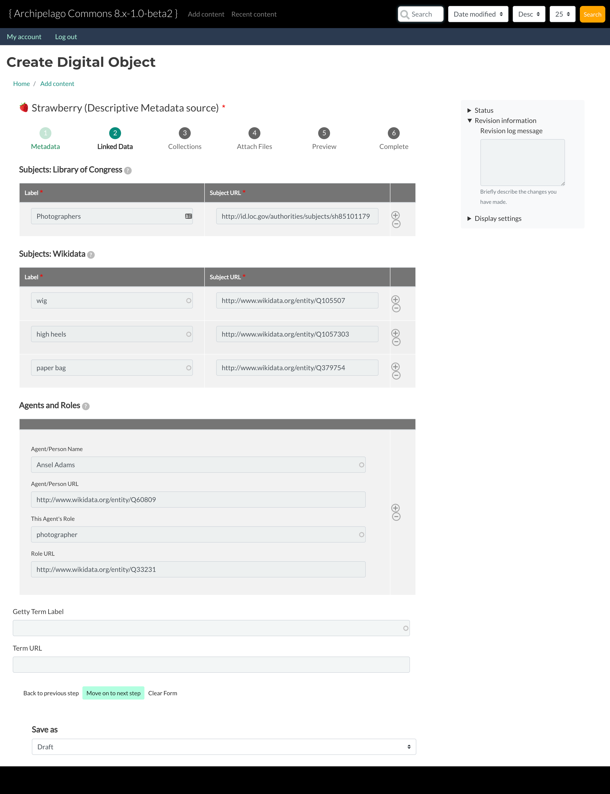
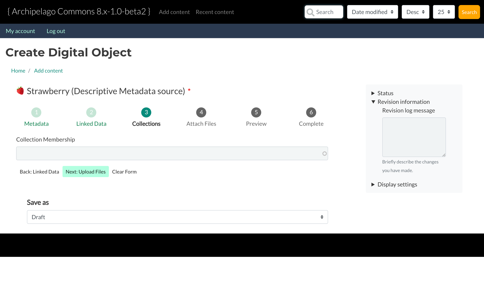
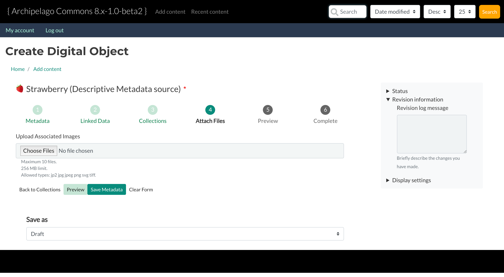
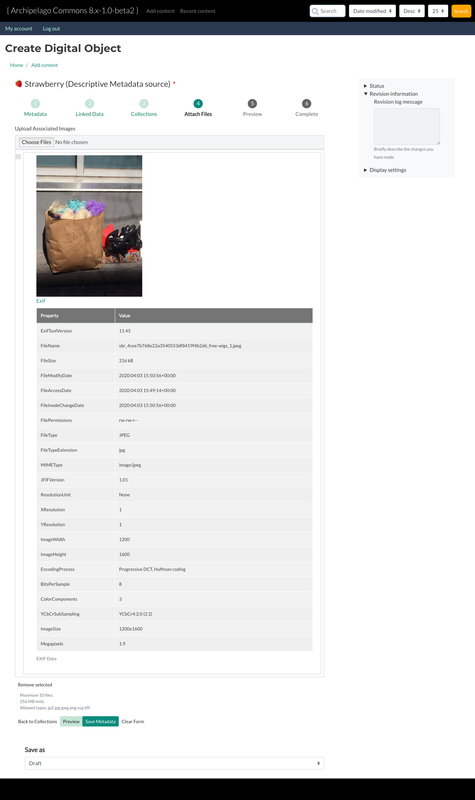
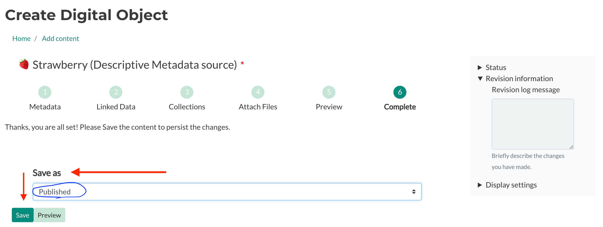
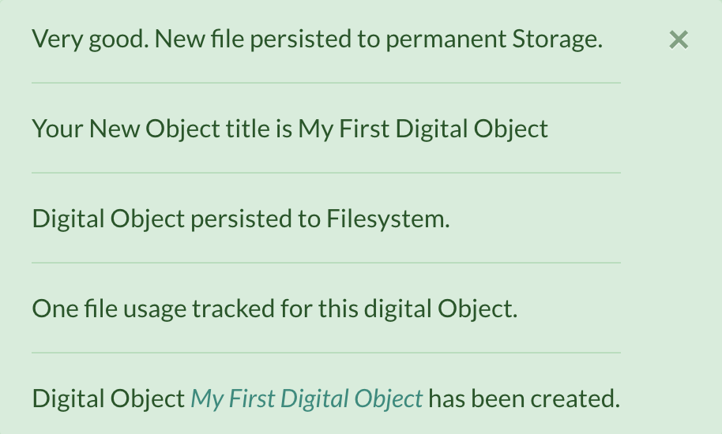
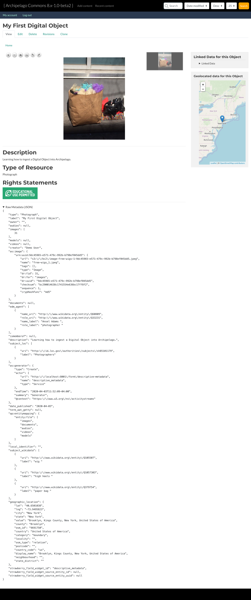

# Your First Digital Object

You followed every [Deployment step](https://github.com/esmero/archipelago-deployment/blob/8.x-1.0-beta1/README.md) and you have now a local ``Archipelago`` instance. Great!

So what now? It is time to give your new Repository a try and we feel the best way is to start by ingest a simple Digital Object.

Note: This guide will assume Archipelago is running on `http://localhost:8001`, so if you wizardly deployed everthing in a different location, please replace all `URIs` with your own setup while following this guide.

## Requirements
 - Running Archipelago (http://localhost:8001)
 - 20 minutes of your time.
 - Open Mind.

## Welcome!

Start by opening `http://locahost:8001` in your favourite Web Browser.

Your Demo deployment will have a fancy Home page with some banners and a small explanation of what Archipelago is and can do. Feel free to read through that now or later.

Click on `Log in` and use your `demo` credentials from them deployment guide.

- User: demo
- pass: demo

(or whatever password you decided was easy for you to remember during the deployment phase)

Press the `Log in` button.

Great, welcome `demo` user! This users has limited credentials and uses the same global Theme as any anonymous user would. Still, `demo` can create content, so let's use those super powers and give that a try.

You will see a new `Menu item` on the top, black, navigation bar named `Add Content`. Click it!

### Brief Background

As you already know Archipelago is build on `Drupal 8/9`, a very extensible `CMS`. In practice that means you have (at least) the same functionality any Drupal deployment has and that is also true for Content Managment.

Drupal ships by default with a very flexible `Content Entity Type` named `Node`. `Nodes` are used for creating Articles and simple Pages but also in Archipelago as `Digital Objects`.
Drupal has a pretty tight integration with `Nodes` and that means you get a lot of fun and useful functionality by default by using them.

Want to know more about Entities?

An `Article` and a `Digital Object` are both of type `Nodes`, but each one represents a different `Content Type`. `Content Types` are also named `Bundles`.
An individual Content, like "Black and White photograph of a kind Dog" is named a `Content Entity` or more specific in this case a `Node`.

What have `Article` and `Digital Object` Content types in common and what puts the apart?

- Each Content Type or Bundle has a set of `Base Fields` and also user configurable set of `Fields` attached (or bundled together).
  - E.g `Article` has a title, a Body and the option to add an image.
  - `Digital Object` has a title but also a special, very flexible one named `Strawberry Field` (more about that later).
- Fields are where you put your data into and also where your data comes from when you expose it to the world.
  - `Nodes`, as any other Content entity have Base Fields (which means you can't remove or configure them) that are used all over the place. Good examples are the `title` and also the owner, named `uid` (you!).
  - Other Fields, specific to a Content Type, can be added and configured per Bundle.
  - A `Field Widget` is used to input data into a Field.
  - Each field can have a `Field Formatter` that allows you to setup how it is displayed to the World.
  - A set of `Field Formatters` (the way you want to show your content formatted to the world) is named a `Display Mode`. You can have many, create new ones and remove them, but only use one at the time.
  - A set of `Field Widgets` (the way you want to Create and Edit a `Node`) is named a `Form Mode`. You can also have many, create new ones but only use one at the time.

- Each Content Type can have different Permissions (using the build in `User Roles` system).
- Each Content Type can have one or more `Display Modes`. In Practice this means `Display Modes` are attached to `Content Types`.
  - Each display modes can have its own Permissions
- Each Content Type can have one or more `Form Modes`. In Practice this means `Form Modes` are attached to `Content Types`.
  - Each `Form Mode` can have its own Permissions.

There is of course a lot more to Nodes, Content Types, Formatters, Widgets and in general [Content Entities](https://www.drupal.org/docs/user_guide/en/planning-data-types.html) but this is a good start to understand what will happen next.

# Adding Content
Below you see all the `Content Types` defined by default in Archipelago. Let's click on `Digital Object` to get your first Digital Object Node.

### My Metadata

What you see below is a `Form Mode` in action, with the Title field exposed as a simple text input (`Field Widget`), a Multi Step Web Form that will ingest metadata into a field of type Strawberry Field (where all the magic happens) attached to that field using a `Webform Field Widget`, an editorial/advanced Block on the right side and a Workflow/state drop down (`Save as`) at the bottom.

Let's fill out the form to begin our ingest. We recommend to use similar values as the ones shown in the screen capture to make following the tutorial easier.

All fields with a red `*` are required fields. Be sure to enter a `Title`, `Media Type`, `Description`, and `Location, Place or Address`. When you are finished, press `Move on to next step` at the bottom of the form.

**Tip:** When entering a location, place or address you will need to click on the `Search OpenStreet Maps` button, which is what that big red arrow is pointing to in the screenshot above.

**Note:** For now, let's leave the state of this Digital Object as `Draft`.

"Why does this look different than Repository X?"

We assume you come from a world where repositories define different Content types and the shape, fields and values (Schema) are fixed and set (or at least quite complicated to configure) by someone else. This is where Archipelago differs and starts to propose its own style. You may have noticed that there is a single Content Type named `Digital Object` and you have here a single Web Form. So how does this allow you to have images, sequences, videos, audio, 3D images, etc?

There are many ways of answering that, archipelago works under the idea of an Open Schema (or many schemas), and that notion permeates the whole environment. The simplest way to explain this based on this demo is:

- The `Digital Object` is a generic container for any shape of metadata. Metadata is generated either via this Webform-based widget you're currently using, manually (power-user need only) or via APIs. Because of this, Metadata can take any shape to express your needs of Digital Objects and therefore we do not recommend making multiple Digital Object types. However, if you ever do need more Digital Object types, the option is available.
- The Strawberry field Field Widget allows you to attach any `Webform`, built using the [`Webform Module`](https://www.drupal.org/docs/8/modules/webform) and Webforms can be setup in almost infinite ways. Any field, combo, or style can be used. Multi Step, single step - we made sure they always only touch/modify data they know how to touch, so even a single input element webform would ensure any previous metadata to persist even if not readable by itself (See the potential?). And Each Webform can be also quite smart!
- The Strawberry field Field Widget will take all your Webform input, process any uploaded files, generate a JSON representation, enrich and complement it with Archipelago specific data and save it for you inside the `Strawberry field`.

We will come back to this later.

### Linked Data

As the name of this step suggests; you will be adding all your Linked Data elements here. This step showcases some of the autocomplete Linked Data Webform elements we built for Archipelago. We truly believe in Wikidata as an open, honest, source of Linked Open Data and also one where you can contribute back. But we also have LoC autocompletes and Getty.

Again, enter all fields with a red `*` and when you are finished, click `Move on to next step`

### Collections

Since this is our first digital object we do not yet have a Digital Object *Collection* for which `My First Digital Object` could be a member of. In other words, you can leave `Collection Membership` blank and click `Next: Upload Files`.

### Upload Files

Now we will upload our `Photograph`. Click `Choose Files` to open your file selector window and choose which file you would like to ingest.

Once you've uploaded your file, you will see all the Exif data extracted from the image.

Once you've mentally digested all of that data, let's go ahead and click `Save Metadata`.

**Question:** "Wait! Don't I need to switch `Save as` from *Draft* to *Publish*? I'm ready for this Digital Object to be shared with the world!"

**Answer:** You can, but it's not necessary to switch to *Publish* now. By clicking `Save Metadata` we are simply persisting the metadata in the current webform session. So, we can confidently leave the status as *Draft* as we click `Save Metadata` because all we're doing here is... well, *saving* all the *metadata* we've entered so far.

### Complete
Alright, we've made it. We've added metadata, linked Data, uploaded our files and now... we're ready to save! Go ahead and change the status from *Draft* to *Published* and click `Save`.

Once you hit save you should see the following green messages and your first Archipelago Digital Object!

🍓[Back to Instructions and Guides](https://github.com/esmero/archipelago-documentation#archipelago-deployment-quickstart) 🍓
