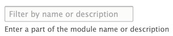

# General Q&A

This area of Archipelago documentation is reserved for general questions and answers for commonly encountered issues pertaining to Archipelago configuration settings.

To contribute to this section, please review our [Code of Conduct](CODE_OF_CONDUCT.md), and after that please follow [this set of guidelines](docs/giveortake.md) to help you get started.

---

## Twig Modules Configuration
**Q:** When attempting to save a Twig template for a Metadata Display, I receive an error message related to an `Unknown "bamboo_load_entity" function`.


**A:** You need to enable the necessary Twig modules.

1. Navigate to: `yoursite/admin/modules`

2. In the “Enter a part of the module name or description” box, enter “bam” to filter for the related Bamboo Twig modules. Alternatively, scroll down to the Bamboo Twig modules section on this page.



3. Check the box next to each of the following to enable (some may already be enabled):

  - Bamboo Twig
  - Bamboo Twig - Loaders
  - Bamboo Twig - Path & Url
  - Bamboo Twig - Token


4. Click `Install`.

5. After receiving the successful installation confirmation, check to make sure you are now able to save your Twig template without receiving an error message.

---

## SMTP Configuration
**Q:** How can I enable SMTP for Archipelago?

**A:** For standard demo deployments, SMTP is not setup to send emails. To enable SMTP:

1. Enter the following commands in your terminal.
_Note: make sure docker is running. Optionally, you can verify that all Archipelago containers are present by entering the `docker ps` command first_.

```Shell
docker exec -ti esmero-php bash -c 'php -dmemory_limit=-1 /usr/bin/composer require drupal/smtp:^1.0'
docker exec -ti esmero-php bash -c 'drush en -y smtp'
```


2. Check that the SMTP module has been enabled by navigating (as admin user) to the EXTEND module menu item (`localhost:8001/admin/modules`). You should see "SMTP Authentication Support" listed.

3. Navigate to `localhost:8001/admin/config/system/smtp` to configure the SMTP settings.

<details><summary>This screenshot shows settings if a GMAIL account is used.</summary>

<span>


</span>
</details>
<br>

4. Save your settings, then test by adding a recipient address in the “SEND TEST E-MAIL” field.

_Note: Depending on your email provider, you may also need to enable “less secure” applications in your account settings (such as here for Google email accounts: https://myaccount.google.com/lesssecureapps)_

---

## Min.io Logging
**Q:** How can I see my minio (S3) docker container's realtime traffic and requests?

**A:** For standard demo deployments, mini.io storage server runs on the `esmero-minio` docker container. Steps are:

1. Install the `mc` binaries (minio client) for your platform following [this instructions](https://docs.min.io/docs/minio-client-quickstart-guide.html). e.g for OSX run on your terminal:

```SHELL
brew install minio/stable/mc
mc alias set esmero-minio http://localhost:9000 user password
```

with `http://localhost:9000` being your current machines mini.io URL and exposed port,  `user` being your username (defaults to `minio`) and your original choosen `password` (defaults to `minio123`)

2. Run a `trace` to watch realtime activity on your terminal:

```SHELL
mc admin trace -v -a --debug  --insecure --no-color esmero-minio
```

_Note: `mc` client is also AWS S3 compatible and can be used to move/copy/delete files on the local instance and to/from a remote AWS storage._

---

Thank you for reading! Please contact us on our [Archipelago Commons Google Group](https://groups.google.com/forum/#!forum/archipelago-commons) with any questions or feedback.

Return to the [Archipelago Documentation main page](../README.md).
