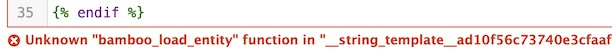
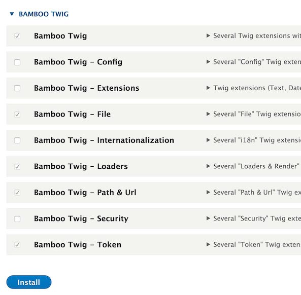

# General Q&A

This area of Archipelago documentation is reserved for general questions and answers for commonly encountered issues pertaining to Archipelago configuration settings.

To contribute to this section, please review our [Code of Conduct](CODE_OF_CONDUCT.md), and after that please follow [this set of guidelines](docs/giveortake.md) to help you get started.

---

## Twig Modules Configuration
**Q:** When attempting to save a Twig template for a Metadata Display, I receive an error message related to an `Unknown "bamboo_load_entity" function`.

**A:** You need to enable the necessary Twig modules.

1. Naviate to: yoursite/admin/modules

2. In the “Enter a part of the module name or description” box, enter “bam” to filter for the related Bamboo Twig modules. Alternatively, scroll down to the Bamboo Twig modules section on this page.

3. Check the box next to each of the following to enable (some may already be enabled):

  - Bamboo Twig
  - Bamboo Twig - Loaders
  - Bamboo Twig - Path & Url
  - Bamboo Twig - Token

4. Click `Install`.

5. After receiving the successful installation confirmation, check to make sure you are now able to save your Twig template without receiving an error message.

---

Additional general discussions may be found on the [Archipelago Commons Google Group](https://groups.google.com/forum/#!forum/archipelago-commons)  

Return to [Archipelago Documentation](https://github.com/esmero/archipelago-documentation/tree/8.x-1.0-beta1).
