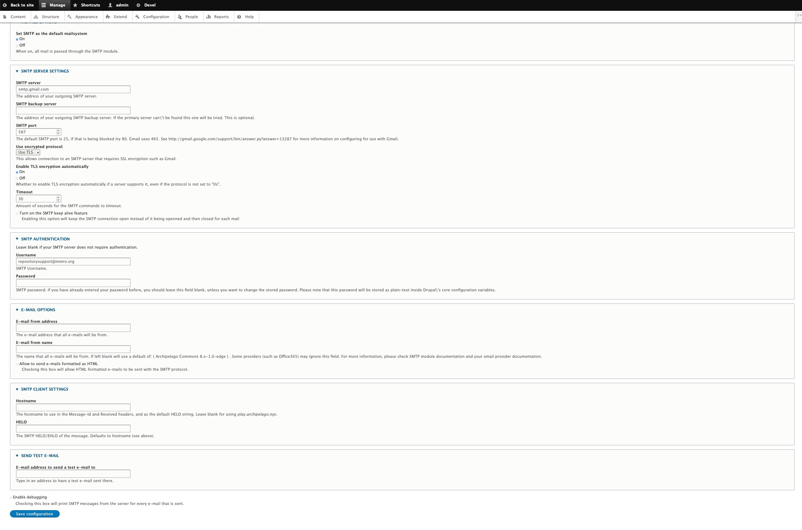

# SMTP Configuration

**Q:** How can I enable SMTP for Archipelago?

**A:** For standard demo deployments, SMTP is not setup to send emails. To enable SMTP:

1. Enter the following commands in your terminal.
_Note: make sure docker is running. Optionally, you can verify that all Archipelago containers are present by entering the `docker ps` command first_.

```Shell
docker exec -ti esmero-php bash -c 'php -dmemory_limit=-1 /usr/bin/composer require drupal/smtp:^1.0'
docker exec -ti esmero-php bash -c 'drush en -y smtp'
```


2. Check that the SMTP module has been enabled by navigating (as admin user) to the EXTEND module menu item (`localhost:8001/admin/modules`). You should see "SMTP Authentication Support" listed.

3. Navigate to `localhost:8001/admin/config/system/smtp` to configure the SMTP settings.

??? info "This screenshot shows settings if a GMAIL account is used."

    

4. Save your settings, then test by adding a recipient address in the “SEND TEST E-MAIL” field.

_Note: Depending on your email provider, you may also need to enable “less secure” applications in your account settings (such as here for Google email accounts: https://myaccount.google.com/lesssecureapps)_

---

Thank you for reading! Please contact us on our [Archipelago Commons Google Group](https://groups.google.com/forum/#!forum/archipelago-commons) with any questions or feedback.

Return to the [Archipelago Documentation main page](index.md).
