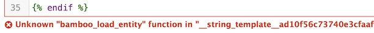
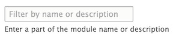
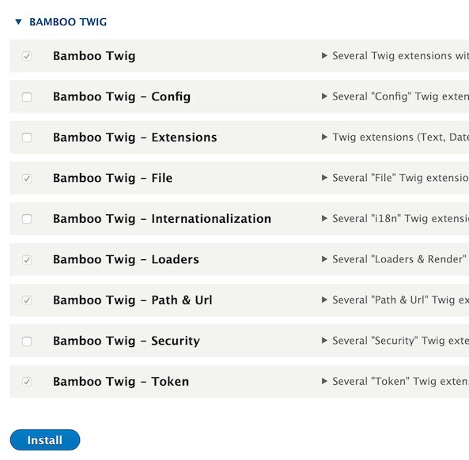

# Twig Modules Configuration

**Q:** When attempting to save a Twig template for a Metadata Display, I receive an error message related to an `Unknown "bamboo_load_entity" function`.

**A:** You need to enable the necessary Twig modules.

1. Navigate to: `yoursite/admin/modules`

2. In the “Enter a part of the module name or description” box, enter “bam” to filter for the related Bamboo Twig modules. Alternatively, scroll down to the Bamboo Twig modules section on this page.

3. Check the box next to each of the following to enable (some may already be enabled):

  - Bamboo Twig
  - Bamboo Twig - Loaders
  - Bamboo Twig - Path & Url
  - Bamboo Twig - Token

4. Click `Install`.

5. After receiving the successful installation confirmation, check to make sure you are now able to save your Twig template without receiving an error message.

___

Thank you for reading! Please contact us on our [Archipelago Commons Google Group](https://groups.google.com/forum/#!forum/archipelago-commons) with any questions or feedback.

Return to the [Archipelago Documentation main page](index.md).
