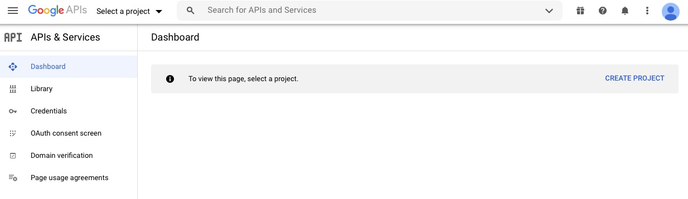
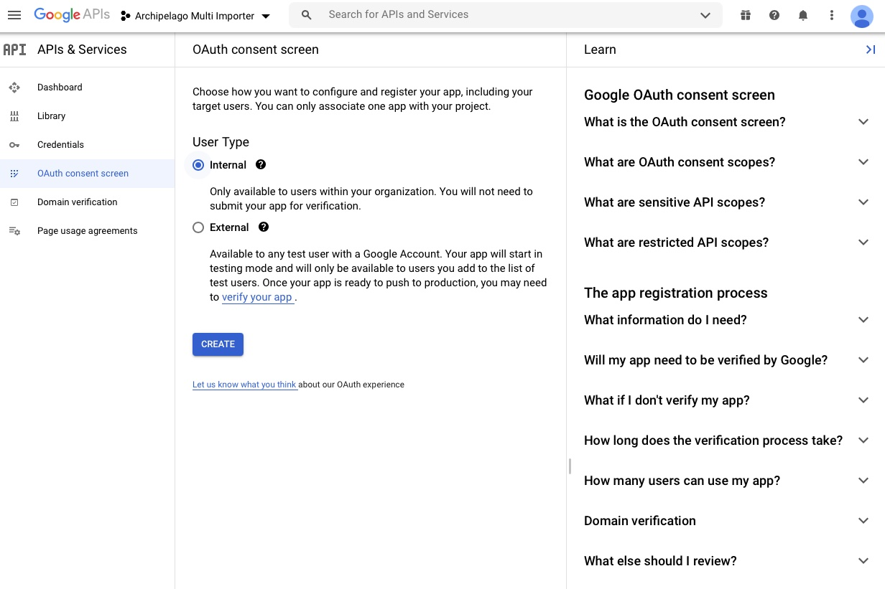

# Configuration for Google Sheets API

To allow the Archipelago Multi Importer (AMI) to read from Google spreadsheets, you first need to configure the Google Sheets API as outlined in the following instructions.

_*Please note, this set of instructions will only work for individuals using Google accounts affiliated with Organizations. We are working on the separate set of instructions needed for individuals who will be using personal/general Google accounts.*_

### Generating Google OAuth2 Credentials

1. Login to the [Google Developer Console](https://console.developers.google.com). You will see the API & Services Dashboard.

2. If you have not created Credentials or a Project before, you will need to first create a Project.  
  * Recommended Project Name: "Archipelago Multi Importer" or "AMI".
  * The Organization and Location information should be specific to you and your organization/institution.

3.  Next, click the `Create credentials` select box and select `OAuth client ID`

4. You will now need to Configure the Consent Screen.

5. On the initial OAuth Consent Screen setup, select `Internal` for User Type.

6. Now enter `AMI` as the App name, and your email address in the User support email. You may also wish to add Authorized domains (bottom of image below) as well.

7. On the Scopes page, select `Add or Remove Scopes`. Then either search/filter the API table for the Google Sheets API. Or, under `Manually add scopes` enter: https://www.googleapis.com/auth/spreadsheets.readonly

8. After selecting or entering in the Google Sheets API, you should see this listed under `Sensitive Scopes`.

9. Review the information on the `Summary` page, then Save.

10. You will now be able to `Create Oauth client ID`. Select `Web Application` as the `Application type`

11. Enter "AMI" under 'Name' and add any URIs you will be using below.
  * For using AMI within your local Archipelago environment, enter `http://localhost:8001/google_api_client/callback`
  * All URIs need to include `/google_api_client/callback`

12. After Saving, you will see a message notifying you that the OAuth client was created. You can copy the `Client ID` and `Client Secret` directly from this confirmation message into a text editor. You can also access the information from `Credentials` in the `APIs & Services` section in the Developer console, where you will have additional options for downloading, copying, and modifying if needed.

### Configuring Google API Client Listing in Archipelago

13. In your Archipelago, navigate to the Google API Client Listing found under `/admin/config` (here, in a local instance: `http://localhost:8001/admin/config`).  

14. On the 'Add Google Api Client account' configuration page, enter the following information using your `Client ID` and `Client Secret`. 'Developer Key' is optional. Select `Google Sheets API` under 'Services' and `https://www,googleapis.com/auth/spreadsheets.readonly` under 'Scopes'. Check the box for `Is Access Type Offline`. Select the Save button.

15. You will now need to Authenticate your AMI Google API Client. Return to the Google API Client Listing page. Under the Operation menu on the right-hand side of the AMI client listing, select `Authenticate`.

16. You will be directed to the Google Consent Screen. You may need to login to your corresponding Google Account before proceeding. When loged in, you will see the following screen requesting that AMI is allowed to "View your Google Spreadsheets".  Click `Allow`.

* On the Google API Client Listing page, your AMI client listing should now have 'Yes' under 'Is Authenticated'. You are now ready to use Google Sheets with AMI! Return to the [main AMI documentation page](ami_index.md) to get started.

---

Thank you for reading! Please contact us on our [Archipelago Commons Google Group](https://groups.google.com/forum/#!forum/archipelago-commons) with any questions or feedback.

Return to the [Archipelago Documentation main page](index.md).
