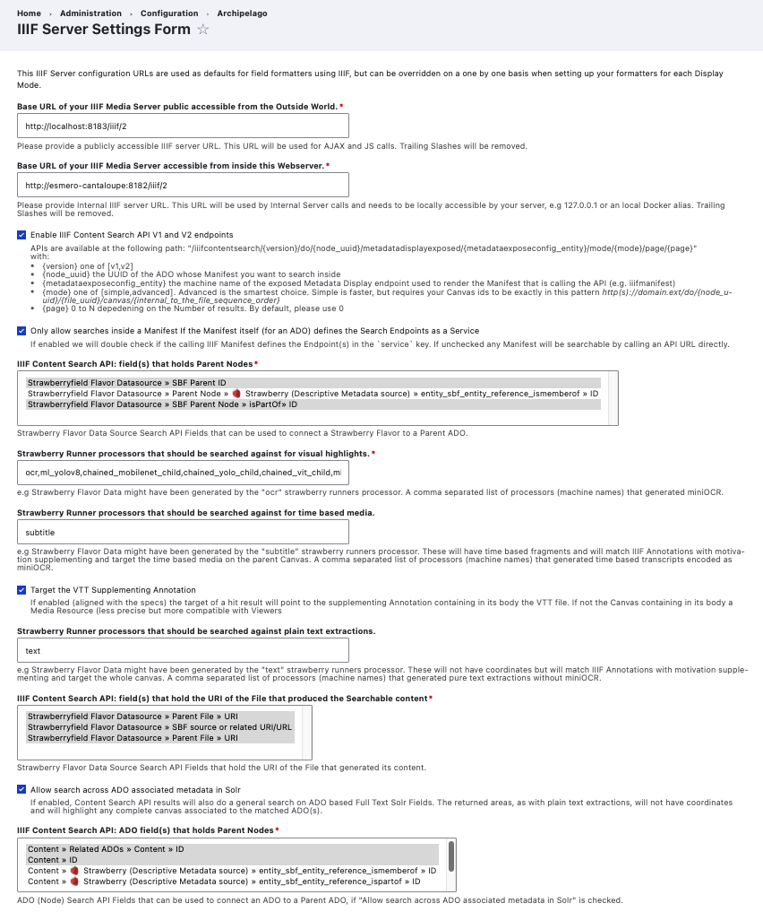
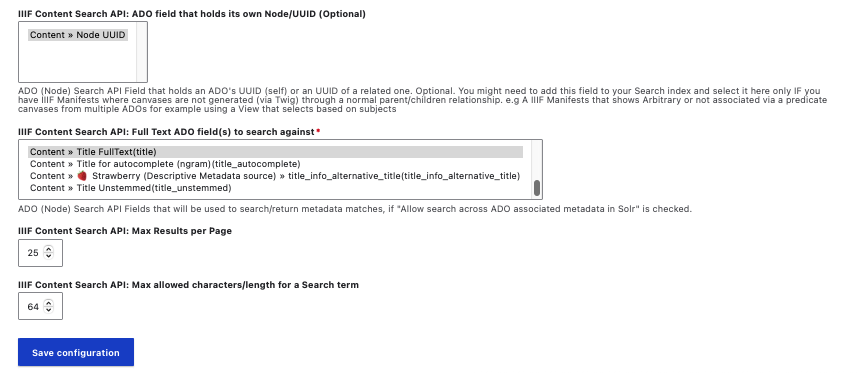

# IIIF Server Settings Form Default Settings

The IIIF Server Settings Form is used to configure different IIIF related settings used throughout your Archipelago environment. We strongly advise keeping the default settings intact. The necessary [Solr Fields](strawberry_key_name_providers.md#creating-a-solr-field) listed below should be setup by default.

You can find the IIIF Configuration Form:

- Through the `Manage` menu > `Configuration` > `Archipelago` > `Configure Strawberry Runners Post Processors`
- Directly at `/admin/config/archipelago/iiif` 

On the IIIF Server Settings Form page, you will see the following:

1. Note that these 'IIIF Server configuration URLs are used as defaults for field formatters using IIIF, but can be overridden on a one by one basis when setting up your formatters for each Display Mode.'
    
2. Base URL of your IIIF Media Server public accessible from the Outside World.
    - Please provide a publicly accessible IIIF server URL. This URL will be used for AJAX and JS calls. Trailing Slashes will be removed.
    - Set to `http://localhost:8183/iiif/2` by default.
    - We do not recommend changing this selection. 

3. Base URL of your IIIF Media Server accessible from inside this Webserver.
    - Please provide Internal IIIF server URL. This URL will be used by Internal Server calls and needs to be locally accessible by your server, e.g 127.0.0.1 or an local Docker alias. Trailing Slashes will be removed.
    - Set to `http://esmero-cantaloupe:8182/iiif/2` by default.
    - We do not recommend changing this selection.

4. Checkbox to 'Enable IIIF Content Search API V1 and V2 endpoints'.
    - Checked by default in later (1.4.0+) versions of Archipelago.
    - See the [related (and essential) IIIF Manifest snippet shared here](iiif-content-search.md#1-iiif-manifest-templates)
    - APIs are accesible at the following path: "/iiifcontentsearch/{version}/do/{node_uuid}/metadatadisplayexposed/{metadataexposeconfig_entity}/mode/{mode}/page/{page}" with:
      - {version} one of [v1,v2]
      - {node_uuid} the UUID of the ADO whose Manifest you want to search inside
      - {metadataexposeconfig_entity} the machine name of the exposed Metadata Display endpoint used to render the Manifest that is calling the API (e.g iiifmanifest)
      - {mode} one of [simple,advanced]. Advanced is the smartest choice. Simple is faster, but requires your Canvas ids to be exactly in this pattern http(s)://domain.ext/do/{node_uuid}/{file_uuid}/canvas/{internal_to_the_file_sequence_order}
      - {page} 0 to N depedening on the Number of results. By default please use 0

5. Checkbox to 'Only allow searches inside a Manifest If the Manifest itself (for an ADO) defines the Search Endpoints as a Service'
    - Checked by default in later (1.4.0+) versions of Archipelago.
    - If enabled we will double check if the calling IIIF Manifest defines the Endpoint(s) in the `service` key. If unchecked any Manifest will be searchable by calling an API URL directly.

6. IIIF Content Search API: field(s) that holds Parent Nodes
    - Strawberry Flavor Data Source Search API Fields that can be used to connect a Strawberry Flavor to a Parent AD0.
    - Default specified fields are: `Strawberryfield Flavor Datasource >> SBF Parent ID` and `Strawberryfield Flavor Datasource >> SBF Parent Node >> isPartOf >> ID`

7. Strawberry Runner processors that should be searched against for visual highlights.
    - e.g Strawberry Flavor Data might have been generated by the "ocr" strawberry runners processor. A comma separated list of processors (machine names) that generated miniOCR.
    - Defaults for Archipelago 1.5.0 is: `ocr,ml_yolov8,chained_mobilenet_child,chained_yolo_child,chained_vit_child,ml_insightface`
    - If you are using the [Strawberry Runners `pager` and `ocr` post-processors](strawberryrunners_subtitle.md), you should always keep this enabled.
    - For Production Archipelagos, please note that only the `ocr` post-processor will be active, and not any of the additional processors listed related to Archipelago's [Experimental ML Tools](experimental_tools.md)--which are only available for local deployments.

8. Strawberry Runner processors that should be searched against for time based media.
    - e.g Strawberry Flavor Data might have been generated by the "subtitle" strawberry runners processor. These will have time based fragments and will match IIIF Annotations with motivation supplementing and target the time based media on the parent Canvas. A comma separated list of processors (machine names) that generated time based transcripts encoded as miniOCR.
    - Default is: `subtitle`
    
9. Checkbox to 'Target the VTT Supplementing Annotation'
    - If enabled (aligned with the specs) the target of a hit result will point to the supplementing Annotation containing in its body the VTT file. If not the Canvas containing in its body a Media Resource (less precise but more compatible with Viewers
    - If you are using the [Strawberry Runners `subtitle` post-processor](strawberryrunners_subtitle.md), you should always keep this enabled.
    - Checked by default in later (1.4.0+) versions of Archipelago.

10. Strawberry Runner processors that should be searched against plain text extractions.
    - e.g Strawberry Flavor Data might have been generated by the "text" strawberry runners processor. These will not have coordinates but will match IIIF Annotations with motivation supplementing and target the whole canvas. A comma separated list of processors (machine names) that generated time based transcripts encoded as miniOCR.
    - Default is: `text`
    - If you are using the [Strawberry Runners `subtitle` post-processor](strawberryrunners_subtitle.md) or - If you are using the [Strawberry Runners `text` post-processor](strawberryrunners_text.md), you should always keep this enabled., you should always keep this enabled.

11. IIIF Content Search API: field(s) that hold the URI of the File that produced the Searchable content
    - Strawberry Flavor Data Source Search API Fields that hold the URI of the File that generated its content.
    - Default specified fields are: `Strawberryfield Flavor Datasource >> Parent File`, `Strawberryfield Flavor Datasource >> SBF source or related URI/URL`, and` Strawberryfield Flavor Datasource >> Parent File >> URI`
    
12. Checkbox to 'Allow search across ADO associated metadata in Solr'
    - If enabled, Content Search API results will also do a general search on ADO based Full Text Solr Fields. The returned areas, as with plain text extractions, will not have coordinate nd will highlight any complete canvas associated to the matched ADO(s).
    - Checked by default in later (1.5.0+) versions of Archipelago.

13. IIIF Content Search API: ADO fields) that holds Parent Nodes
    - ADO (Node) Search API Fields that can be used to connect an ADO to a Parent ADO, if "Allow search across ADO associated metadata in Solr" is checked.
    - Default specified fields are: `Content » Related ADOs » Content » ID` and `Content » ID`.

14. IIIF Content Search API: ADO field that holds its own Node/UUID (Optional)
    - ADO (Node) Search API Field that holds an ADO's UUID (self) or an UUID of a related one. Optional. You might need to add this field to your Search index and select it here only IF you have IIIF Manifests where canvases are not generated (via Twig) through a normal parent/children relationship. e.g A IIIF Manifests that shows Arbitrary or not associated via a predicate canvases from multiple ADOs for example using a View that selects based on subjects
    - Default specified field is: `Content » Node UUID`

15. IIIF Content Search API: Full Text ADO field(s) to search against
    - ADO (Node) Search API Fields that will be used to search/return metadata matches, if "Allow search across ADO associated metadata in Solr" is checked.
    - Default specified field is: `Content » Title FullText(title)` 

16. IIIF Content Search API: Max Results per Page
    - Default is: `25`

17. IIIF Content Search API: Max allowed characters/length for a Search term
    - Default is: `64`

### See also

Please see our [IIIF Content Search API Integration](iiif-content-search.md) for an overview of Archipelago's integration of IIIF's Content Search API.

___

Return to the main [Strawberry Runners](strawberryrunners.md) or the [Archipelago Documentation main page](index.md).
