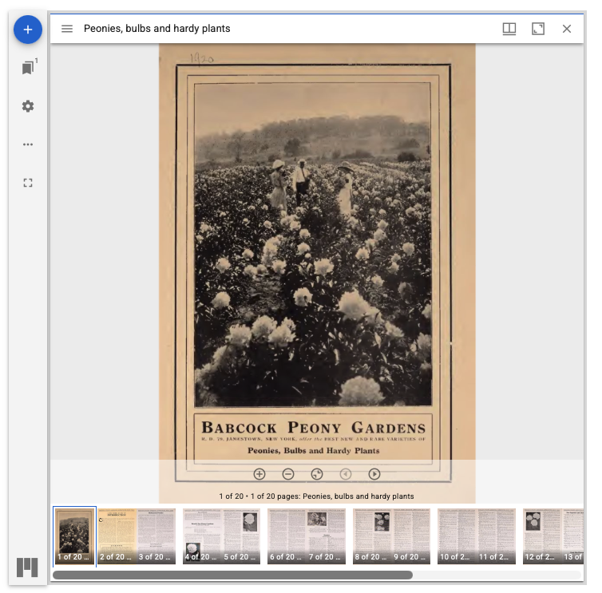

# Strawberry Field Media Formatter using the Mirador * IIIF Viewer plugin

This formatter displays media using the [Mirador](https://projectmirador.org) IIIF viewer.

!! note "Recommended prerequisite documentation"

    Please also see our '[Primer on Display Modes](primerdisplaymodes.md)' and '[Strawberryfield Formatters](strawberryfield-formatters.md)' guides for more information about Display Modes and Formatters.

You can find the default example of the `Strawberry Field Media Formatter using the Mirador * IIIF Viewer plugin` settings configuration form at:
- `admin/structure/types/manage/digital_object/display/digital_object_with_mirador_viewer`
- Through the `Manage` menu > `Structure` > Content types > Digital Object > Manage display > Select 'Digital Object with Mirador Viewer'

Click on the small settings cogwheel on the right hand side of the listed formatter fields to review the formatter settings.

For this formatter, repository administrators are able to take advantage of the available adjustable settings provided through [Mirador’s codebase](https://github.com/ProjectMirador/mirador/blob/main/src/config/settings.js) and Archipelago’s specific integration to easily customize default display setups for Mirador. Please see related notes [here](metadatainarchipelago.md#strawberry-field-media-formatter-using-the-mirador-iiif-viewer-plugin), and a link to the related [IIIF online meeting (2026) presentation recording here](https://www.youtube.com/watch?v=gjD6I3WmlD4&t=494s). 

In addition to the Javascript UI/UX settings noted above, repository administrators have Mirador IIIF Viewer formatter configuration options for: defining Max Height + Width, sourcing of media files, embargo behavior preferences, and defining the source IIIF Twig templates and Exposed Metadata Endpoints.

??? info "Default configurations used"

    - IIIF Manifest generated from Node IDs fetched from JSON "isrelatedto" key.
    - IIIF Manifest generated by the "iiifmanifest" Metadata Data Expose Endpoint(PRIMARY).
    - IIIF Manifest URL fetched from JSON "iiifmanifest" key.
    - Maximum size: 100% x 960 pixels
    - Use IIIF Global Urls? Yes.
    - IIIF Media Server base URI: http://localhost:8183/iiif/2
    - IIIF Media Server Internal base URI: http://esmero-cantaloupe:8182/iiif/2
    - Limited to the following file upload JSON Keys: Fetch from any available
    - Embargo Alternate upload JSON Keys: Do not provide alternate files when embargoed
    - Viewer for embargoed Objects is visible

___

Thank you for reading! Please contact us on our [Archipelago Commons Google Group](https://groups.google.com/forum/#!forum/archipelago-commons) with any questions or feedback.

Return to the [Archipelago Documentation main page](index.md).
