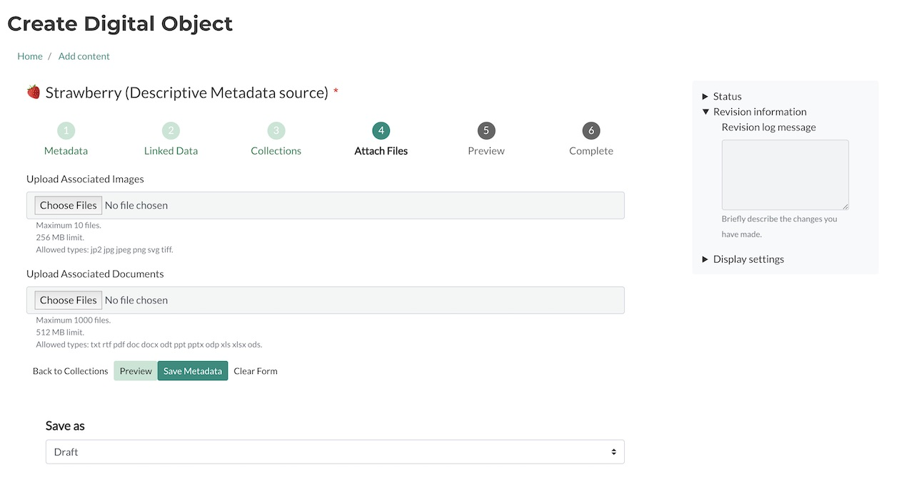

# Customizing Webforms: Modifying allowable file extensions

A guide to walk users through how to modify the Webform `Descriptive Metadata` to allow additional file extensions to be ingested into Archipelago.

## Context

When creating, for example, a `DigitalDocument` Object in Archipelago and you reach the step to upload your documents, you will see a section outlining the maximum number of files, the maximum file size and the allowed file extensions that can be uploaded. Let's say this `DigitalDocument` Object contains a data set saved as a `csv` file. Well, if you look below at the screenshot of the default settings shipped with the Webform `Descriptive Metadata`, you'll notice that `csv` is not included in the allowed file extensions. Archipelago has no restrictions on what types of files can be uploaded into a repository however, some use cases require a little configuring to fit a specific need. This guide will walk users through the steps to modify a webform to allow additional file extensions to be included during ingest.

**Prerequisites for following this guide:**
- Running Archipelago (on http://localhost:8001 if you followed the [deployment guide](https://github.com/esmero/archipelago-deployment#archipelago-docker-deployment) verbatim)
- Admin credentials

## Let's begin!

### Managing Webforms

Once logged in as an admin, the first thing we need to do is navigate to the Wbeforms page so we can edit the Webform `Descriptive Metadata.` Click on `Manage`, then `Structure` and when the page loads, scroll down and click `Webforms`.

This is where all of the Webforms inside your Archipelago live. In this screenshot you'll notice a few custom webforms that have been created to fit the needs of this particular repository: `Digital Object Collection Webform`, `My Favorite Webform` and `Student Webform`. For this guide we're going to edit the default Webform `Descriptive Metadata`. Go ahead and click `Build` under the `OPERATIONS` column for `Descriptive Metadata`.

### Step 3: Editing Elements

Here we see all of the elements in `Descriptive Metadata`; *Title*, *Media type*, *Description*, *Linked Data* elements, etc. The element that we want to edit is `Upload Associated Documents` as this is the field you will use to upload `pdf`, `doc`, `rtf`, `txt`, etc. files during the ingest workflow.  Go ahead and click on `Edit` under the `OPERATIONS` column.

A new screen will pop up named `Edit Upload Associated Documents element`. This is where you configure can configure maximum number of values (i.e. files - under `ELEMENT SETTINGS`), the maximum file size and, what we want to do, edit the allowed file extensions for this element. The latter both exist under `FILE SETTINGS`, high lighted in the screenshot below.

When you scroll down you'll see the `Maximum file size` and `Allowed file extensions` fields. This is where we will add the `csv` file extension and where you can also edit the maximum file size allowed to be uploaded. You can see in the screenshot, this repository is configured to allow the maximum.

**Please note:** All file extensions are separated by a space; no `,` or `.` between the values (i.e. file extensions).

Once you've added all the file extensions your project needs, scroll down to the bottom of `Edit Upload Associated Documents element` and click `Save`.

**This next step is imperative for saving your changes**, scroll to the bottom of your elements list page and click `Save elements` in order to persist all changes made.

### Complete

Woohoo! Now when you go to ingest a `DigitalDocument` object, you will be able to add `csv` files. 🍓

### Recap + "What if I want to...?"

When logged in as an admin, we go to *Manage > Structure > Webforms* and click on `Build` under the `OPERATIONS` column of `Descriptive Metadata` (shortcut: /admin/structure/webform/manage/descriptive_metadata). Then we click on `Upload Associated Documents` to edit the element, scroll down to the *Allowed file extensions* field and add `csv` without `.` or `,` separating the values. Click `Save` at the bottom of that page and then `Save elements` at the bottom of the Webform page.

That's great, but what if I want to upload a `wav` or `aiff` file for `MusicRecording`? Currently `mp3` is the only allowed audio file extension.

The steps are virtually the same! The difference here is that instead of editing `Upload Associated Documents`, you'll edit `Upload Audio File` and add "wav aiff" under the `Allowed file extension` field.

[Back to Instructions and Guides](https://github.com/esmero/archipelago-documentation#archipelago-deployment-quickstart)
