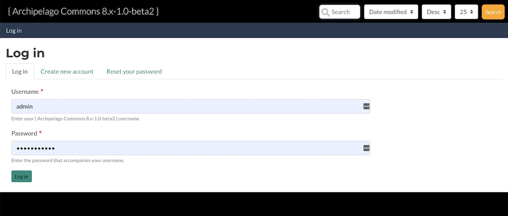
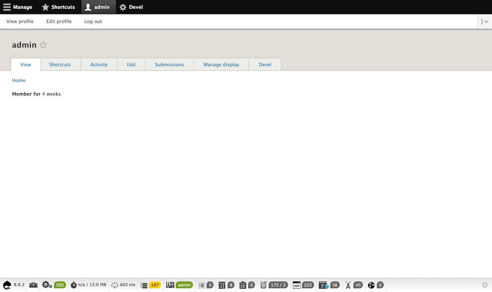
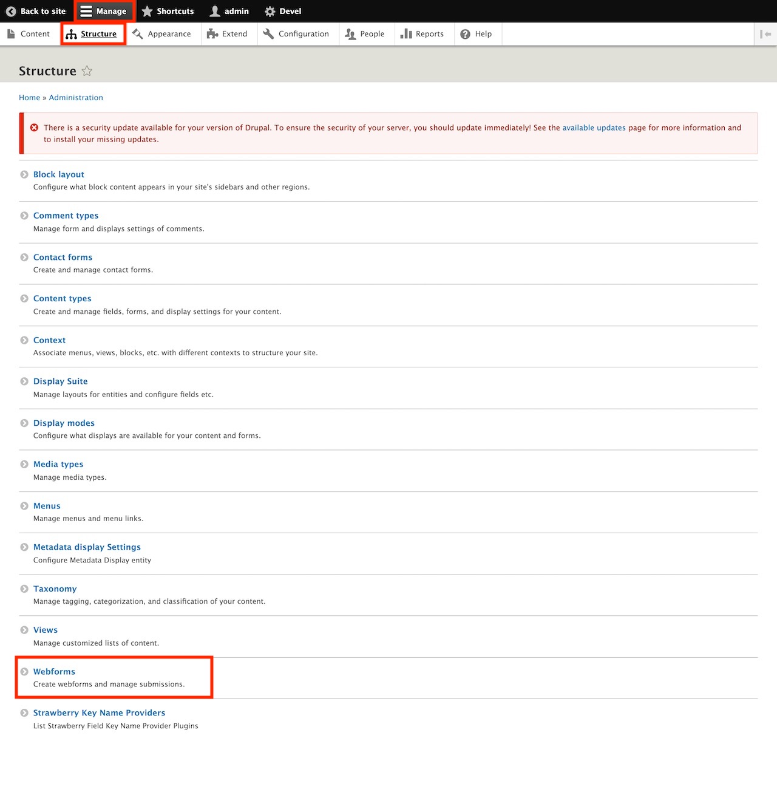
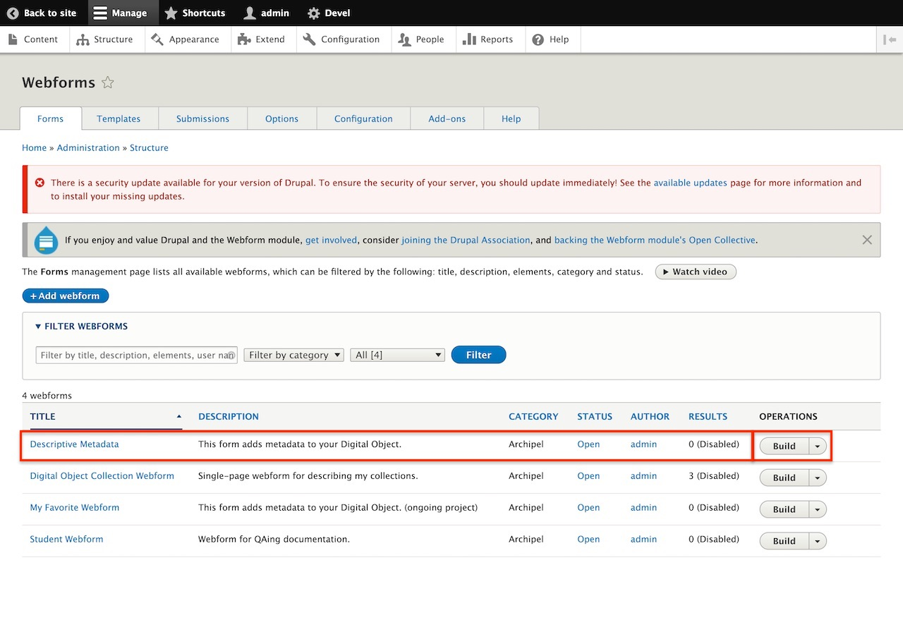
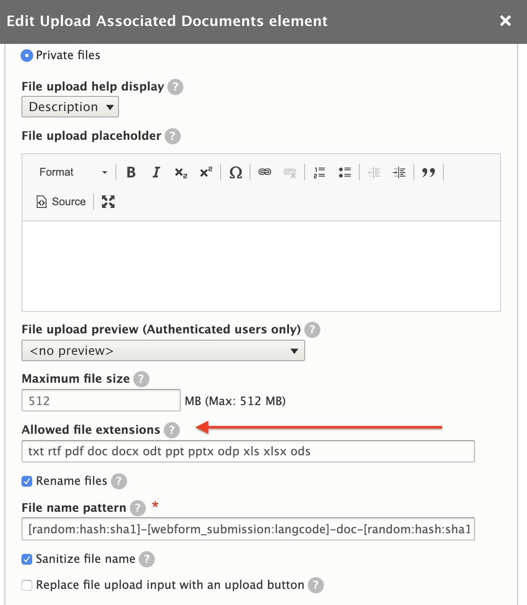
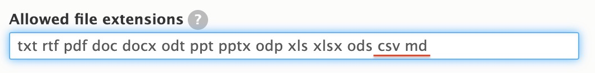
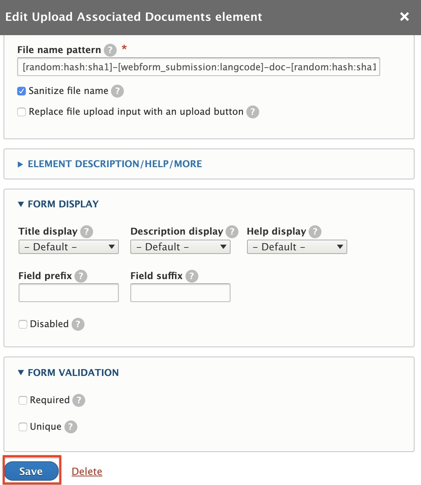
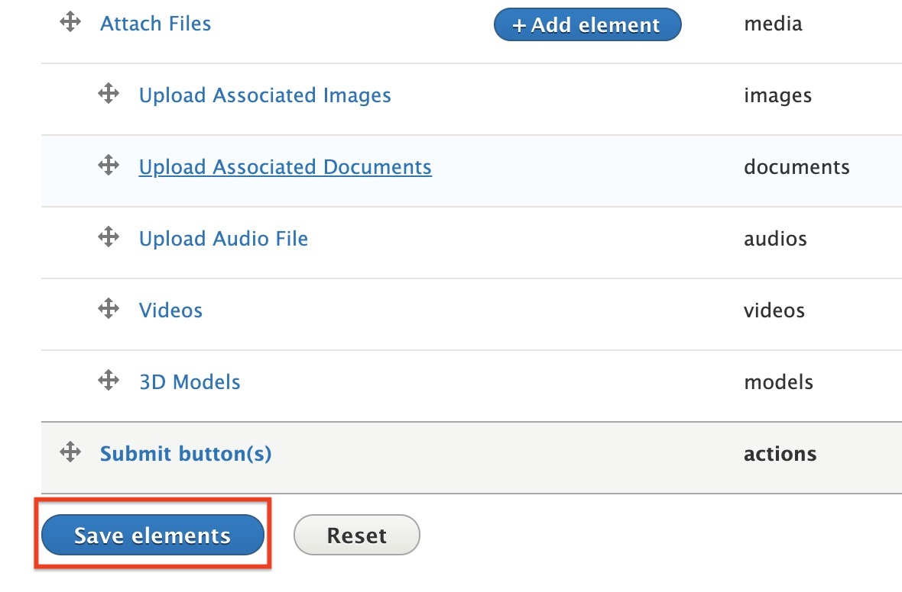
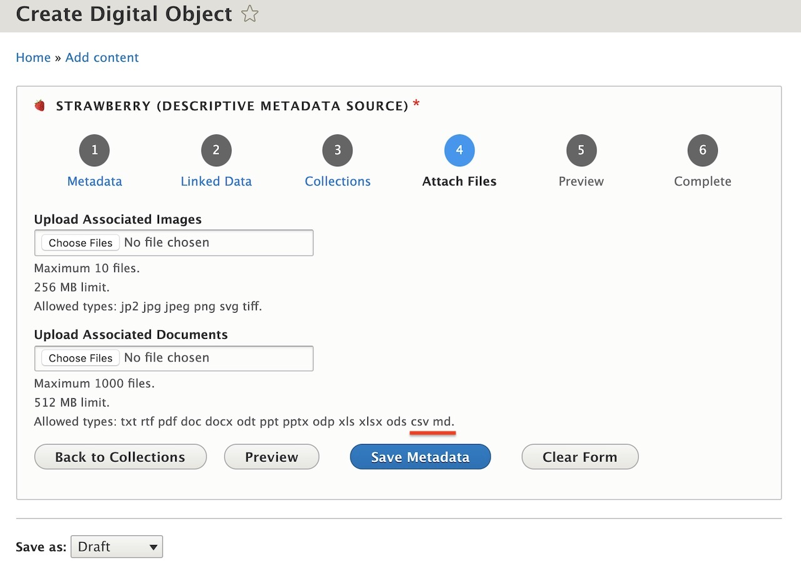

# Modifying allowable file extensions in a Webform

This guide will walk users through how to modify their webform to allow additional file extensions to be ingested into Archipelago. For this guide, we will be adding `csv` and `md` files to be included in our workflow when creating, for example, a `DigitalDocument` object.

**Prerequisites for following this guide:**
- Running Archipelago (http://localhost:8001)
- Admin credentials

## Let's begin!

### Admin log in

First thing we want to do is log in with our admin credentials. Assuming that you have followed the [deployment guide](https://github.com/esmero/archipelago-deployment#archipelago-docker-deployment) verbatim, let's open `http://localhost:8001` and log in with the admin credentials:

- user: admin
- pass: archipelago

Once logged in, you'll see your admin user's profile page. Take note of the tool bar at the top. That `Manage` button is going to be our first friend in this guide.

### Managing Webforms

Let's click on `Manage`, then `Structure` and when the page loads, scroll down and you'll find `Webforms`. Go ahead and click `Webforms`.

Here is where all of the Webforms inside your Archipelago live. In this screenshot, you'll see that I've begun creating a few custom webforms (`Digital Object Collection Webform`, `My Favorite Webform` and `Student Webform`) to suit some of my repository needs. However, let's focus on the default wenform shipped with Archipelago: `Descriptive Metadata`. This will be the webform we're going to modify. Go ahead and click `Build` on under the `OPERATIONS` column.

### Step 3: Editing Elements

Here we see all of the elements in our Webform: *Title*, *Media type*, *Description*, *Linked Data* elements, etc. The element that we want to edit is `Upload Associated Documents`. Go ahead and click on `Edit` under the `OPERATIONS` column.

A new screen will pop up named `Edit Upload Associated Documents element`. Inside, among many other things, you'll find a block titled `File Settings` and inside that block you'll see a field titled `Allowed file extensions`. This is where we'll modify which file extensions are allowed to be uploaded.

Let's add `csv` and `md` as file types we want to allow to be upload with for the `Upload Associated Documents` element.

**Two things to note**
- All file extensions are separated by a space; no `,` or `.` between the values (i.e. file extensions).
- Notice that above the `Allowed file extensions` is a `Maximum file size` field. This is where you can change the minimum or maximum file size allowed for ingest.

Scroll down on this screen and click `Save`.

Now, **this step is imperative for saving your changes**, scroll to the bottom of your elements list page and click `Save elements`. So again, first we hit `Save` at the bottom of the `Edit Upload Associated Documents element` page (where we added which file extensions are allowed to be uploaded) and then scroll to the bottom of the Webform elements page and click `Save elements`.

### Complete

Woohoo! Now when you go to ingest a `DigitalDocument` object, you will be able to add `csv` and `md` files. 🍓

### Final recap and "What if I want to...?"

When logged in as an admin, we went to *Manage > Structure > Webforms* and click `Build` under the OPERATIONS column for `Descriptive Metadata` to edit the elements in the Webform (shortcut: /admin/structure/webform/manage/descriptive_metadata). Then we click on `Upload Associated Documents` to edit the element, scroll down to the *Allowed file extensions* field and add `csv` and `md` without `.` or `,` separating the values. Click `Save` at the bottom of that page and then `Save elements` at the bottom of the Webform page.

That's great, but what if I want to upload a `wav` or `aiff` file for `MusicRecording`? Currently `mp3` is the only allowed audio file extension.

The steps are virtually the same! The difference here is that instead of editing `Upload Associated Documents`, you'll edit `Upload Audio File` and add "wav aiff" under the `Allowed file extension` field.

[Back to Instructions and Guides](https://github.com/esmero/archipelago-documentation#archipelago-deployment-quickstart)
