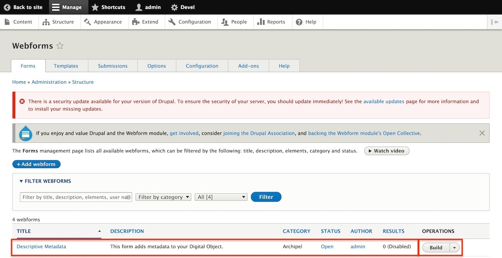

# Customizing Webforms: Modifying allowable file extensions

A guide to walk users through how to modify the Webform `Descriptive Metadata` to allow additional file extensions to be ingested into Archipelago. This is the default Webform shipped by following [archipelago-deployment](https://github.com/esmero/archipelago-deployment).

## Context

When creating an Archipelago Digital Object (ADO), there is a step during the ingest to upload the files associated with your ADO. You may notice there is a section on the Webform outlining the maximum number of files allowed, the maximum file size allowed, and the allowed file extensions that can be uploaded.

Let's say we are creating an ADO with the media type `DigitalDocument` and this ADO contains a data set saved as a `csv` file. Archipelago has no restrictions on what file extensions can be uploaded, however some use cases will require a little configuring to  fit a specific need. This guide will walk users through the steps to modify the default Webform shipped with Archipelago, `Descriptive Metadata`, to allow additional file extensions to be included during an ingest.

**Prerequisites for following this guide:**
- Running Archipelago (on http://localhost:8001 if you followed the [deployment guide](https://github.com/esmero/archipelago-deployment#archipelago-docker-deployment) verbatim)
- Admin credentials

## Let's begin!

### Managing Webforms

Once logged in as `admin`, the first thing we need to do is navigate to the Wbeforms page so we can edit the Webform `Descriptive Metadata.` Click on `Manage`, then `Structure` and when the page loads, scroll down and click `Webforms`.

This is where all of the Webforms inside your Archipelago live. For this guide we're going to edit the Webform `Descriptive Metadata`, which is the default Webform shipped with Archipelago. Go ahead and click `Build` under the `OPERATIONS` column for `Descriptive Metadata`.

### Step 3: Editing Elements

Here we see all of the elements in `Descriptive Metadata`; *Title*, *Media type*, *Description*, *Linked Data* elements, etc. The element that we want to edit is `Upload Associated Documents` as this is the field you will use to upload `pdf`, `doc`, `rtf`, `txt`, etc. files during the ingest workflow. Click on `Edit` under the `OPERATIONS` column.

A new screen will pop up named `Edit Upload Associated Documents element`. This is where you configure can configure the maximum number of values (under `ELEMENT SETTINGS`), the maximum file size and also edit the allowed file extensions for this element, which is what we'll be doing. The latter both exist under `FILE SETTINGS`, high lighted in the screenshot below.

When you scroll down you'll see the `Allowed file extensions` field. This is where we will add the `csv` file extension. **Please note:** All file extensions are separated by a space; no `,` or `.` between the values.

Once you've added all the file extensions your project needs, scroll down to the bottom of `Edit Upload Associated Documents element` and click `Save`.

**This next step is imperative for saving your changes**, scroll to the bottom of your elements list page and click `Save elements` in order to persist all changes made.

### Complete

Woohoo! Now when you go to ingest a `DigitalDocument` object, you will be able to add `csv` files. 🍓

### Recap

When logged in as an admin, we go to *Manage > Structure > Webforms* and click on `Build` under the `OPERATIONS` column of `Descriptive Metadata` (shortcut: /admin/structure/webform/manage/descriptive_metadata). Then we click on `Upload Associated Documents` to edit the element, scroll down to the *Allowed file extensions* field and add `csv` without `.` or `,` separating the values. Click `Save` at the bottom of the `Edit Upload Associated Documents element` page and then `Save elements` at the bottom of the Webform page.

### That was helpful, but...

How do I upload a `wav` or `aiff` file for "MusicRecording" or an `mov` file for a "Movie"?

The steps are virtually the same as what is outlined in this guide! The difference here is that instead of editing `Upload Associated Documents`, you will need to edit the field element that is associated with your ADO's media type. For example, with Media type `MusicRecording`, you will edit `Upload Audio File`, for `Movie`, will edit `Videos`.

How do I know which element in Descriptive Metadata to edit per media type?

When editing an element inside `Descriptive Metadata`, at the top of the window `Edit Upload Associated Documents element` (see Step 3 for a recap on how to get here) there is a tab next to `General` titled `Conditions`. Inside of `Conditions` we have `CONDITIONAL LOGIC` which is where the Webform is told which `Media type` needs this element to be visible in the Webform. In the example below, we know that the field element `Upload Associated Documents` will be visible when `DigitalDocument`, `Thesis` and `Book` are the selected `Media type`.

This is also the place you can add new logic or delete present logic by clicking the `+` or `-` next to the `TRIGGER/VALUE` to create new conditionals.

[Back to Instructions and Guides](https://github.com/esmero/archipelago-documentation#archipelago-deployment-quickstart)
