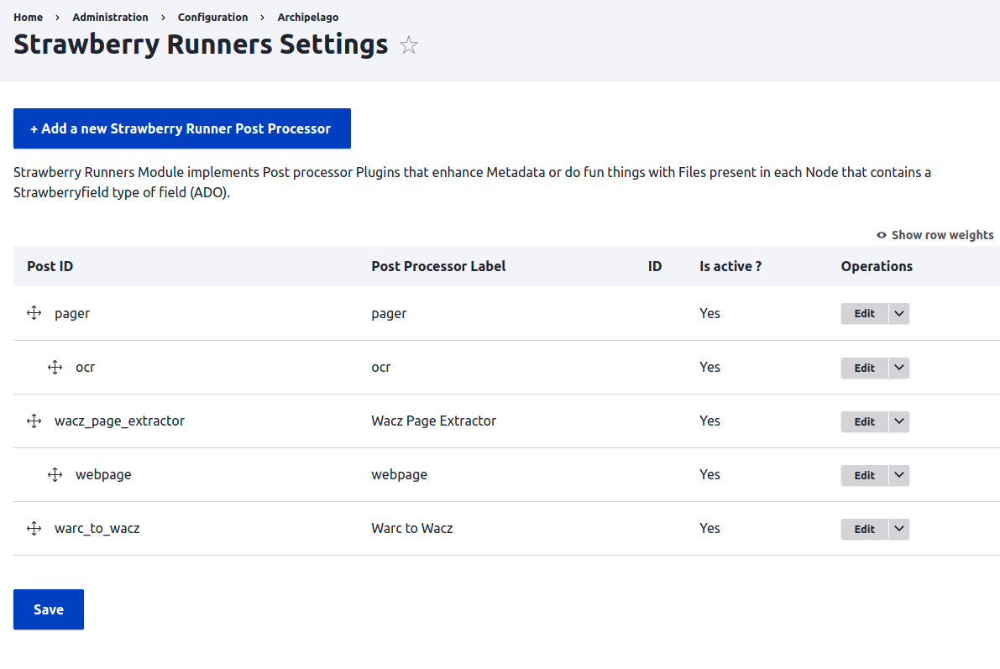

# Extracting document content and exposing it to search and display

In Archipelago, text that may be extracted from files that are attached to ADOs is stored in a special type of drupal entity that is distinct from the ADOs themselves. This entity type is called a "strawberry flavor". Under the hood, these entities are stored using Drupal's state engine, and are employed for a variety of uses, only one of which is storing extracted file data. This text can be indexed and used in search, and for paged content, can be displayed, searched and highlighted in the book viewer.

These kinds of files can be attached to objects and have and their text content extracted and indexed:
- Image files whose text can be extracted using Tesseract to perform OCR (optical character recognition). Permissible types:

  | file extension | mime type |
  | --- | --- |
  | png | image/png |
  | jpeg, jpg | image/jpeg |
  | tiff, tif | image/tiff |
  |jp2 | image/jp2,image/x-jp2 |
  | webp | image/webp |
  | bmp | image/bmp |
- Portable document format (PDF) files whose text can be extracted directly (if the PDF contains searchable text), or extracted using OCR:

  | file extension | mime type | 
  | --- | --- |
  | pdf | application/pdf |

# Strawberry runners
The process of extracting content from files attached to digital objects is performed in a batch process that is queued to run some time after the digital object itself is ingested or updated. Archipelago uses a system of "strawberry runners" that you can think of as the runners in the next leg in a relay race. To perform content extraction from attached files, you need to configure these strawberry runners so that they can step in and perform their task after digital objects are saved.

To do so, go to `Configuration > Archipelago > Configure Strawberry Runners Post Processors`.

_(For general discussion of strawberry runners, discussion of common configuration options, and an explanation of the hierarchy and ordering of them, see the [Strawberry Runners Documentation Page](strawberryrunners.md).)_

In a new archipelago install, you will see that there are a number of strawberry runner postprocessors configured out of the box. Two of these are involved with extracting text content from files attached to ADOs: 'pager' and 'ocr'.

# pager
The first, 'pager' splits out the individual files that are attached to an object - and in the case of multi-page PDF files, the pages of the PDF - into individual requests to a child strawberry runner process, called 'ocr'.

'ocr' takes the input file from 'pager', along with a sequence number that 'pager' give it. It performs searchable text extraction and saves this data into strawberry flavor entities, each of which is identified by its sequence number so that archipelago can keep them in order.

As just mentioned, the purpose of the **pager** strawberry runner is to take files attached to a digital object and (splitting as necessary in the case of PDF files) and feeding them into the ocr runner. It utilizes the **_"Post processor that extracts/generates Ordered Sequences of files/pages/children using Files present in an ADO"_** plugin", and gives it the label "pager".

## Important fields on this form:

- **ADO type(s) to limit this processor to.** This optional text field can be used to limit which ADO types to perform pagination on. There is little harm in leaving this field blank and letting this process run on all ADO types unless you have specific reasons not to. One reason might be if you want to have more than one file sequence post processor running on different types of ADOs. On the other hand, if you know that you will only ever be running text extraction on "Book" and "Article" ADO types, entering them into this field will save some needless processing time.
- **The JSON key that contains the desired source files.** When files are attached to digital objects, metadata about these file attachments is stored under different sections of the object's strawberryfield json metadata, based on the type of file. These sections are identified by the json keys listed here. If you are unsure which to use, you can look at an object's JSON metadata and see which keys attached files are identified under. For the purposes of OCR, the two obvious json keys to use are as:document and as:image, because pdf files (as:document) and raster image files (as:image) are the ones that we want pager to pass on to the `ocr` processor for searchable text extraction. **This is a required field.**
- **Mimetypes(s) to limit this Processor to.** This is another (optional) field that can be used to limit which files are passed on to the OCR processor. See the list of mimetypes for image and pdf files above for a complete list. Leaving this blank is fine. The OCR processor will simply skip file types that it can't work with.

# ocr
The second strawberry runner in this sequence, 'ocr', utilizes the _**"Post processor that Runs OCR/HOCR against files"**_ plugin. It is configured on the _Strawberry Runners Settings_ page to receive the output - the files (and pdf pages) - from the 'pager' processor, along with their sequence numbers. It attempts to perform searchable text extraction of plain text and/or HOCR xml, which it saves into strawberry flavor entities that will subsequently be indexed and available to be searched globally, and utilized in searches within the bookreader display. 

Raster image files are sent directly to tesseract for optical character recognition. 

**TODO: verify and update the following once _pdftoalto_ support is finished.**

PDF files may be handled in two possible ways:
- If they are constructed with embedded text, and if the necessary executable binary `pdftoalto` is installed on the web server _(`php` container for Docker installations)_, then plain and HOCR text will be extracted directly from the PDF file. 
- Otherwise, if a path to the executable `ghostscript` is provided, then the OCR processor will convert the PDF page to a temporary raster image, and pass it into `tesseract` to perform optical character recognition.

## Important fields on this form:

- **ADO type(s) to limit this processor to.** As with the `pager` strawberry runner, this optional text field can be used to limit which ADO types to perform OCR on. And as with `pager`, there is little harm in leaving this field blank and letting this process run on all ADO types unless you have specific reasons not to. One reason might be if you want to have more than one ocr post processor running under a  given `pager`. On the other hand, if you know that you will only ever be running text extraction on "Book" and "Article" ADO types, entering them into this field will save some needless processing time.
- **The JSON key that contains the desired source files.** For the purposes of OCR, the two obvious json keys to use are as:document and as:image, because pdf files (as:document) and raster image files (as:image) are the ones that we want the `ocr` processor to attempt to extract text from. **This is a required field.**
- **Within the image file metadata, the field that contains the sequence number.** This field appears only when `as:image` is checked in the JSON keys. When files are attached to a digital object, file metadata is written into the strawberryfield JSON data struction. One of the values provided for each file is a sequence identifier. The string entered into this field identifies what json key this sequence id value is found under. Normally, this json key is 'sequence', but it could be something else depending on how other parts of Archipelago are configured. For example if you are using a different viewer for multi-page content and want to use a different sequence identifier for that viewer. You may inspect the JSON data for a sample digital object, under the 'as:image' section, to determine what value is being used.
- **Mimetypes(s) to limit this Processor to.** This is another (optional) field that can be used to limit which files are processed by the OCR plugin. See the list of mimetypes for image and pdf files above for a complete list. Leaving this blank is fine. The OCR processor will simply skip file types that it can't work with.
- **Executable binary paths and arguments**: What follows is a series of fields that, for the most part can be left at their defaults if you are using a Docker-based installation of Archipelago. The path is the root-relative file path to the executable binary on the server (php container, on Docker). The arguments field always needs a "%file" token, but may also include other arguments for the utility in question.
  - **Ghostscript** Used to convert PDF files to raster for OCR processing. No extra arguments normally needed.
  - **Tesseract** Extracts text from raster images. Standard argument string is `%file stdout -l eng hocr`. This tells tesseract to write to standard output, to use English as its lookup language and character set, and to include hocr xml in the output. 
  - **PdfToAlpine** **TODO!!**
- **The expected and desired output of this processor** Here we have the choice of.
  - _"One or more Files"_ and
  - _"Data/Values that can be serialized to JSON"_.

  For most cases, the "Data/Values that can be serialized to JSON" option is chosen, which causes this plugin to generate content that can be saved into a strawberry flavor entity that is indexed in solr. **TODO: Document some examples of how and why you might want to select "One or more Files"**

- **Where and how the output will be used** Here we have the choice either or both of:
  - _"As input for another processor Plugin"_ and
  - _"In a Search API Document using the Strawberryfield Flavor Data Source (e.g. used for HOCR highlight"_.

  For most cases, the "In a Search API Document..." option is chosen, which causes this plugin to generate content that is saved into a strawberry flavor entity that is indexed in solr. 
**TODO: Document some examples of how to pipe into another processor plugin**
- **The queue to use for this processor.** Select whether to run this processor immediately, or whether to have it generate a queue entry that is run in the background via cron.
- **Use NLP to extract entities from Text** If checked, and if the NLP64 server is configured, [Natural Lanaguage Processing](https://en.wikipedia.org/wiki/Natural_language_processing) will be used to extract symbolic entities from the text.

