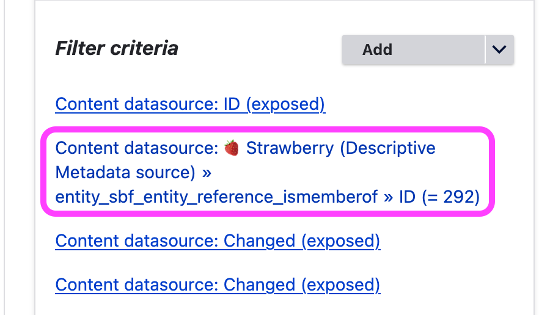

# Notes for Adapting Archipelago's Default OAI-PMH Configurations for an ILS/Discovery Layer

This set of notes can be used to assist with using Archipelago's Metadata API Module and provided default OAI-PMH configurations to expose Archipelago collections and objects to an ILS/Discovery Layer. 

In the example scenario described below, an institution has the Metadata API Module installed and configured in their Archipelago instance already, and is using the Archipelago default OAI-PMH Dublin Core (DC) Twig template without any changes for their local metadata schema.

Please refer to the [main Metadata API Module documentation](open_api.md) for more information about the provided default configurations and templates.

## Example of using the Metadata API Module

### Open Archives Initiative Protocol for Metadata Harvesting (OAI-PMH)

The OAI-PMH protocol allows for sharing information from one repository to another. In this example we are interested in sharing a collection of objects we have in Archipelago with an ILS/Discovery Layer index. The metadata API module helpfully translates Drupal node IDs and strawberry field UUIDs into the proper formats for sharing. The Metadata API module comes out of the box with a Dublin Core (DC) Twig template which we can use without modification for this example.


### Understanding the OAI-PMH API URL format

The URL that one uses in Archipelago is set via code and a Drupal view. The view limits the returned data to a singular collection by default. This collection value is the isMemberOf ID in your metadata. The URL also contains a set value and that is the UUID of the collection as found in the collection metadata.

The URL will always look like the following:


```shell
https://YOUR-DOMAIN/ap/api/oai_pmh/oai?verb=ListRecords&set=SET-UUID&metadataPrefix=oai_dc
```

### Configuring Archipelago to output the collection you want to share

#### Update the default view to retrieve the correct collection

1. Go to any object that is part of your collection as a logged in user with the proper permissions to view ADO Tools.
2. Select ADO Tools, and search the metadata for "ismemberof". You will see a numeric ID, make a note of that ID to use in the next step.
3. With your ismemberof ID known go to the view:
  - Structure -> Views, and then select edit for the view OAI exposed entity reference
  - In the filter criteria, find the filter named Content datasource: 🍓 Strawberry (Descriptive Metadata source) » entity_sbf_entity_reference_ismemberof » ID (= 25)
  - Select that filter and change the ID value to the one you have just made note of. In the following screenshot, it has bee set to an ID of 292.

  

#### Find the set UUID of the collection

1. Navigate in Archipelago to the top level collection that your object from earlier is a member of.
2. Retrieve the UUID of the collection. You may have this printed on your default TWIG display for a collection already, if so copy and paste. If not, select ADO Tools and in the metadate find the "node_uuid" and make note of that.

#### Craft your new URL

With your view updated and knowing your node_uuid you can form your API URL. Put your node_uuid as the set parameter, it would look like this, but with your node_uuid.

```shell
https://YOUR-DOMAIN/api/oai_pmh/oai?verb=ListRecords&set=67acd47d-3cfd-427d-ada0-79b918e028e5&metadataPrefix=oai_dc
```

The metadata API module configuration is what is taking that node_uuid and passing it back as the set for the API.

```shell
                        {
                            "name": "set",
                            "in": "query",
                            "description": "",
                            "required": false,
                            "deprecated": false,
                            "style": "form",
                            "explode": true,
                            "schema": {
                                "type": "string",
                                "format": "uuid"
                            }
```

### Permissions to view the REST URL

If you plan to share the URL to be consumed by other tools note that by default only the administrator role can access the URL. You need to allow view permission by role by selecting which role you want to allow access via the View/access Metadata APIs permission at /admin/people/permissions.

__

Return to the [Archipelago Documentation main page](index.md).
