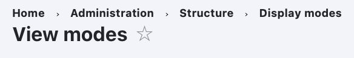
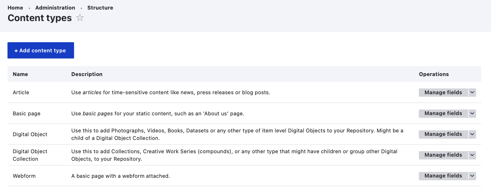
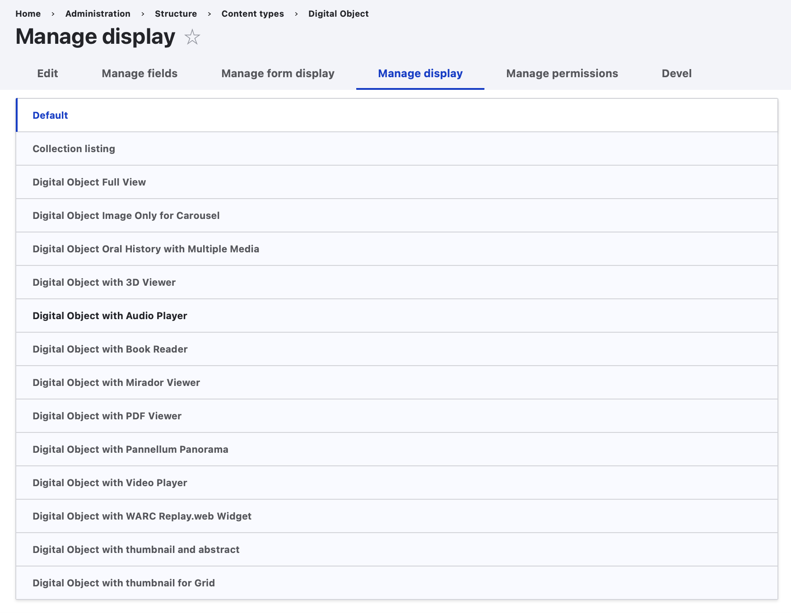
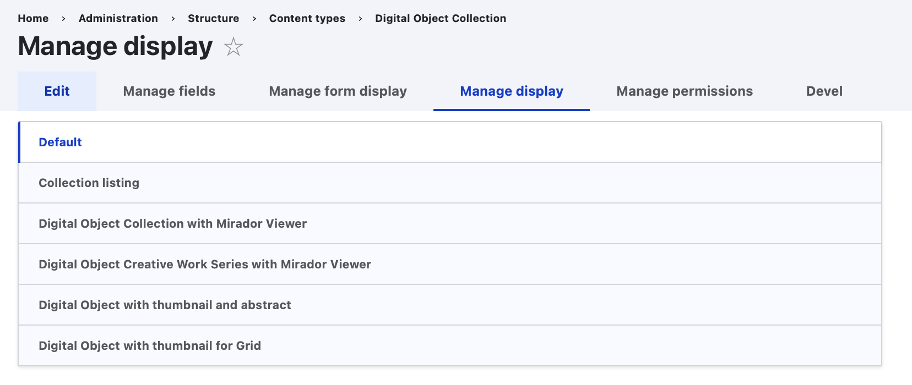
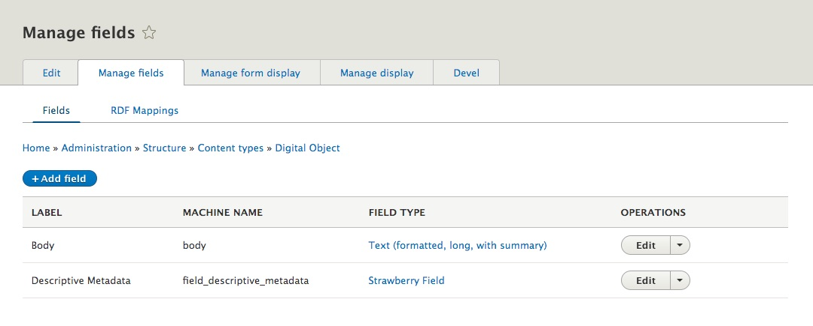

# Primer on Display Modes

Drupal provides a lot of out-of-the-box functionality to setup the way Content Entities (Nodes or in our case Archipelago Digital Objects, ADOs) are exposed to users with the proper credentials. That functionality lives under the "Display Modes" >> and can be accessed at `yoursite/admin/structure/display-modes`.

In a few quick words, the Display Mode Concept covers: formatting your Content Entities and their associated Fields so when a user lands on a Content Page, they are displayed in a certain, hopefully pleasing, way and also how users with proper Credentials can fill inputs/edit values for each `field` a Content Entity provides.

First, formatting output (basically building the front facing page for each content entity) is done by a `View Mode`. Second, defining how/what input method you are going to use to create or edit Content entities, is handled by a `Form Mode`. Both Modes, are, in Drupal Lingo, Configuration Entities, they provide things you can configure, you can name them and reuse them and those configurations can all be exported and reimported using YAML files. Also both Modes have the following in common:

- Drupal always provides a "default" one that can not be deleted.
- You can create new ones.
- You can apply permissions to them.
- All Modes work on "fields", means the tiny little input/output pieces that are either part of a Content Entity or attached to them (the title, the Body, and in our case a Strawberryfield (SBF),
- They Provide Config/setting options for each Field.
- They are always associated to Content Types/Bundles. Means all Nodes of the same Content type will share the same modes.

The main difference, other than their purpose (Output v/s Input) is that, on View Modes, the settings you apply to each field are associated to "Formatters" and on Form Modes, the settings you apply to each field are connected to "Widgets".

Please refer to our [How to Create a Webform as an Input Method for Archipelago Digital Objects (ADO) guide](webformsasinput.md) for more information about Form Modes. 

_Note that this guides features some older screenshots using earlier versions of Archipelago/Drupal Adminsitrative Theming. Please pardon any jumps between themes._

## View Mode

Resuming, this is what lives under the Concept of a "Display Mode" or "View Mode"...

- Each field attached to a Content Entity can have a Formatter applied and most of them have configuration options.
- Formatters do one thing right: they take the raw, stored value and make it "visible" inside Drupal.
- Which formatters are available will depend on the "type" of field the Content Entity has.
    - E.g A Node title/Label will have a Title formatter with the option of just displaying a text or a text with a link to the entity.
    - More Complex and fun Fields, like the ones of type `SBF` will provide a large list of possible `Formatters`, like IIIF driven viewers, Video formatters, Metadata Display (Twig template driven) ones, etc. This is because a SBF type of field has much more than just a text value, it contains a full graph of metadata and properties, inclusive links to Files and provenance metadata.

### Default View Modes Bundled in Archipelago 

* Collection listing
* Digital Object and Collection Search API Rendered Item
* Digital Object Collection with Mirador Viewer		
* Digital Object Creative Work Series with Mirador Viewer
* Digital Object Image Only for Carousel	
* Digital Object Oral History with Multiple Media
* Digital Object Full View	
* Digital Object with 3D Viewer		
* Digital Object with Audio Player		
* Digital Object with Book Reader		
* Digital Object with Mirador Viewer		
* Digital Object with Pannellum Panorama		
* Digital Object with PDF Viewer
* Digital Object with WARC Replay.web Widget	
* Digital Object with thumbnail and abstract		
* Digital Object with thumbnail for Grid		
* Digital Object with Video Player		
* Search index		
* Search result highlighting input		
* _Plus Drupal default View Modes: Default, Full content, RSS, Teaser, and Token_

### I think I get this...but how can I use this knowledge now?

Good question! So, to enable, configure, and customize these Display/View Modes you have to navigate to your `Content Type` Configuration page in your running Archipelago. This is found at `/admin/structure/types`. Note: the way things are named in Drupal can be confusing to even the most deeply committed Drupal user, so bear in mind some terms will change. Feel free to read and re-read.

You can see that for every existent Content Type, there is a drop down menu with options:

- Manage Display: will lead you to configuration page where you can setup each View/Display Mode and its settings for a given Content Type
- Manage Form Display: will lead you to configuration page where you can setup each Form Mode and its settings ([related documentation guide here](webformsasinput.md))

## Manage Display

For Digital Objects:

For Digital Object Collections and Compounds/Creative Work Series

When reviewing the 'Manage Display' tab for your selected Digital Object/Collection type, you will see all your configured Display/View Modes Listed, with the `Default` one selected and expanded.

The table that follows has one row per Field attached/part of this Content Type. Some of the fields are part of the Content Type itself. In this case Digital Object (bundled) and some other ones are common to every Content Entity derived from a Node.

The "Field" column contains each field name (not their type, reason why you don't see Strawberry Field there!) but we can tell you right now that there is one, named "Descriptive Metadata", that is of `SBF` type.

### Which are the fields in my Content Type?

How do we know that the field named "Descriptive Metadata" is a Strawberryfield? Well, we set-up the Digital Object Content Type for you that way, but also you can know what we know by pressing on "Manage fields" Tab on the top (don't forget to come back to "Manage display", afterwards!)

*Also Surprise:* You Content Entity has really really just 2 fields! And that, friends, is one of the secret ingredients of Archipelago. All goes into a Single Field.

But wait: i see more fields in my Manage Display table. Why?
Well. Some of them are base fields, part of what a Drupal Node is: base field means you can not remove them, they are part of the Definition itself. One obvious one is the `Title`.

But there are also some fields very particular to Archipelago: You can see there are also ones named "Formatter Object Metadata", "Media" and one named "Static Media"!. Where does come from? Those are also Strawberryfields. It sounds confusing but it is really simple. They are really not "fields" in the sense of having different data than "Descriptive Metadata". Those are In Memory, realtime, copies of the "Descriptive Metadata" SBF field and are there to overcome one limitation of Drupal: Each Field can have a single "Formatter" setup per field.

But we want to re-usue the JSON data to show a Viewer, Show Metadata as HTML directly on the ADO/NODE landing page, and we want also to, for example, format sometimes images as Thumbnails and not using a IIIF viewer only. This CopyFields (Legal term) have also a nice Performance advantage. Drupal needs to fetch only once the data from the real Field, "Descriptive Metadata", from the database. And then just makes the data available in real time to its copies. That makes all fast, very very fast! And of course flexible. As you dig more into Archipelago you will see the benefits of this approach. Finally, if you need to, you can make more CopyFields. But the reality is, there is a single, only one, SBF in each Digital Object and its named "Descriptive Metadata".

You can also simply not care about the type and trust the UI. It will just show Formatters that are right for each type and expose Configuration options (and a little abstract of the current ones) under the Widget Column. Operations Columns allows you to setup each Widget. Widget term here is a bit confusing. These are not really Widget in terms of Data Input, but in terms of "Configuration" Input. But D8/9 is evolving and its getting better. Those settings apply always only to the current View Mode.

You can play with this, experiment and change some settings to get more comfortable. We humbly propose you that you complete this info with the official Drupal 8 Documentation and also apply custom settings to your own, custom View Mode so you don't end changing base, expected functionality while you are still learning.

___

Thank you for reading! Please contact us on our [Archipelago Commons Google Group](https://groups.google.com/forum/#!forum/archipelago-commons) with any questions or feedback.

Return to the [Archipelago Documentation main page](index.md).
