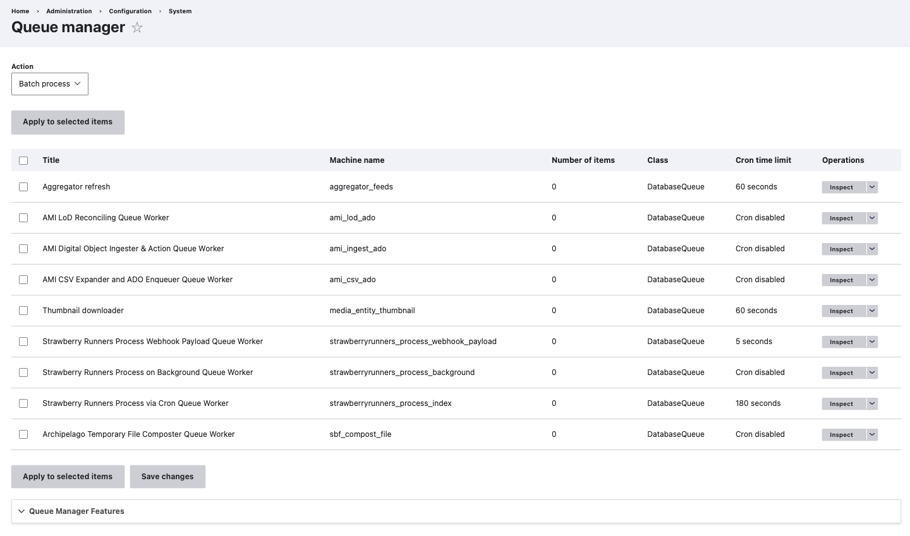
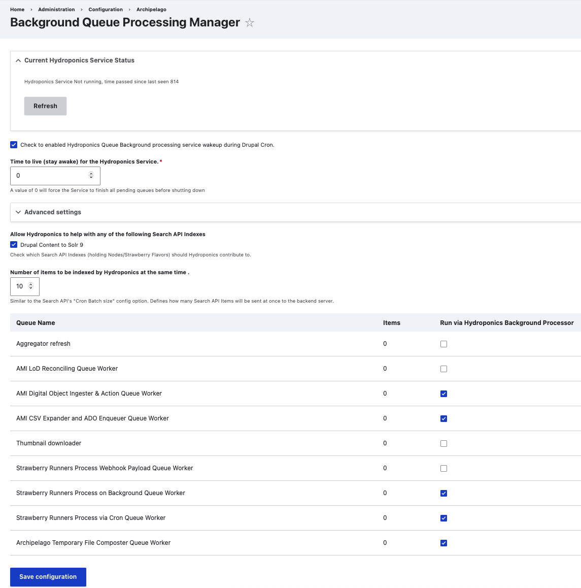
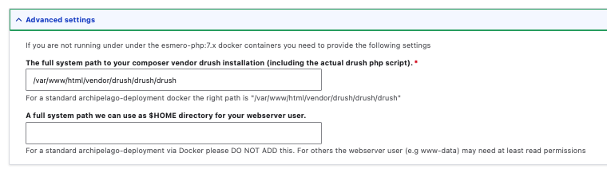

# Archipelago Processing Queues Explainer

Archipelago has multiple helpful background queues to help keep your repository workflows running smoothly. These different queues will be triggered based on different workflow events, such as one-off create/update/delete actions for digital objects, or batch ingests or updates through AMI or Find and Replace operations. 

!!! note "Important Note: Queues Automation"

    The Secondary Background / Hydroponics Queue Manager runs independently from the primary Queue Manager. For the Secondary Background Hydroponics Queue Manager, as long as the option to 'Check to enabled Hydroponics Queue Background processing service wakeup during Drupal Cron' and a particular singular/set of Queue Actions are enabled, Archipelago will automatically run through these queues as configured, on a regular basis. 
    

## Primary Queue Manager

The primary Queue Manager handles the main Archipelago batch ingest and update operations, processed in a first in, first out (FIFO) basis. The Primary Queue Manager allows you to push or clear out Queue Actions in realtime, if desired.

You can access the primary Queue Manager:

- Through the `Manage` menu > `Configuration` > `System` > `Queue Manager`
- Directly at `/admin/config/system/queue-ui` 

### Queue Actions & Inspect Button

Using/forcing any of the Actions on the Queue Manager will run in realtime, over your browser window. Only use the Actions if you have a stable internet connection and time to observe the resulting Actions.

#### Batch process
- This Action will start the Queue Operations for the selected items
- May be useful to [push along AMI ingests](AMIviaSpreadsheets.md#step-8-queue-manager-push-may-be-restricted-to-administrator-users-only) 

#### Remove Leases
- This Action will remove the 'leases'--aka holds tagged for particular digital objects/operations related to a Queue Operations
- May be useful to stop a queued process and release the impacted Digital Objects for a different or refreshed operations

#### Clear
- This Action will clear all of the Queue Operations for the selected items
- Recommendation is to always first use the 'Remove Leases' Queue Action, then use 'Clear' only if needed. This order of Actions will help ensure no orphan operations are left behind if you interrupt and reset Queues operations.

#### Inspect Button
- Found on the right-hand side of the Queue Operations table
- Allows you to review the individual processes enqueued, such as the particulars for the 'AMI CSV Expander and ADO Enqueuer Queue Worker' or the specific file being passed through the [Strawberry Runners Post Processing pipeline for HOCR extraction](strawberryrunners_pager_ocr.md). 

### Queue Workers

Every Queue Worker refers to a specific machine process, and has settings for when it executes based on your site's daily Cron runs.

#### Aggregator refresh
- Machine name: aggregator_feeds
- Cron time limit: 60 seconds
- Function: Drupal related operation
- Typically not used for Archipelago repository workflows

#### AMI LoD Reconciling Queue Worker
- Machine name: ami_lod_ado
- Cron disabled
- Function: processes AMI LoD Reconciliation one-by-one
- Can be useful for very large AMI Sets with hundreds of terms to be processed through LoD queries

#### AMI Digital Object Ingester & Action Queue Worker
- Machine name: ami_ingest_ado
- Cron disabled
- Function: processes the ingest of digital objects and collections enqueued in [AMI Set Processing](AMIviaSpreadsheets.md#step-7-ami-set-processing)

#### AMI CSV Expander and ADO Enqueuer Queue Worker
- Machine name: ami_csv_ado
- Cron disabled
- Function: expands an AMI Set CSV and assigns the individual digital object and collection rows as Queue items for the `AMI Digital Object Ingest & Action Queue Worker`

#### Thumbnail downloader
- Machine name: media_entity_thumbnail
- Cron time limit: 60 seconds
- Function: Drupal related operation
- Typically not used for Archipelago repository workflows

#### Strawberry Runners Process Webhook Payload Queue Worker
- Machine name: strawberryrunners_process_webhook_payload
- Cron time limit: 5 seconds
- Function: placeholder for future custom webhook routing, to be developed for future Archipelago releases
- This will always be empty until used in future developments

#### Strawberry Runners Process on Background Queue Worker
- Machine name: strawberryrunners_process_background
- Cron disabled
- Function: processes, **in real time**, the complete ['Strawberry Runners' post-processor operation](strawberryrunners.md), such as HOCR extraction --> output mapped to a 'Strawberryflavour' field in Solr for the corresponding digital object

#### Strawberry Runners Process via Cron Queue Worker
- Machine name: strawberryrunners_process_index
- Cron time limit: 180 seconds
- Function: processes, **via Cron, in background*, the complete ['Strawberry Runners' post-processor operation](strawberryrunners.md), such as HOCR extraction --> output mapped to a 'Strawberryflavour' field in Solr for the corresponding digital object

#### Archipelago Temporary File Composter Queue Worker
- Machine name: sbf_compost_file
- Cron disabled
- Function: processes the deletion of temporary (unnecessary copy) files

## Secondary Background / Hydroponics Queue Manager

The Background Queue Processing Manager, also referred to as the Hydroponics Queue, is used to review the Hydroponics Service status and also configure what Queue Workers are enabled. 

!!! note "Important Note: Changing Hydroponics Settings"

    Changing settings for the Hydroponics Queue does not immediately change the actions to be executed over already/previously Enqueued items. If there are items already listed in the different Queues, those operations will be complete as originally scheduled. 
    
    If you wish to stop, clear, and reconfigure background Queue operations already in process, you will need to use the Primary Queue Manager as detailed above. Be cautious when interupting and reconfiguring the background queue operations, and work through the necessary changes one step at a time.
    

You can access the secondary background / Hydroponics Service Queue Manager:

- Through the `Manage` menu > `Configuration` > `Archipelago` > `Queue Manager for Hydroponic Service`
- Directly at `/admin/config/archipelago/hydroponics` 

#### Current Hydroponics Service Status
- Used to check on the status of the Hydroponics Services
- If running, you will see a message such as "Hydroponics Service Is Running on PID 211, time passed since last seen 1"
- If there are not items in the different queues, you will see a message such as "Hydroponics Service Not running, time passed since last seen 814"
- Selecting the 'Refresh' button will run a real-time check and refresh the message displayed..

#### Checkbox to enable the Hydroponics Queue 
- The option to `Check to enabled Hydroponics Queue Background processing service wakeup during Drupal Cron.` is enabled by default in Archipelago.
- It is recommend to always leave Hydroponics enabled.

#### Time to live (stay awake) for the Hydroponics Service.*
- A value of 0 will force the Service to finish all pending queues before shutting down

#### Advanced settings

- If you are not running Archipelago under the `esmero-php` docker containers (not common/advanced) you will need to provide the following settings.
- You will have the option to enter:
    1. The full system path to your composer vendor drush installation (including the actual drush php script).For a standard archipelago-deployment docker the right path is "/var/www/html/vendor/drush/drush/drush*
    2. A full system path we can use as $HOME directory for your webserver user. For a standard archipelago-deployment via Docker please DO NOT ADD this. For others the webserver user (e.g www-data) may need at least read permissions
- Recommended to leave the default settings

#### Allow Hydroponics to help with any of the following Search API Indexes
- This will enable you to determine the different Search API Indexes (holding Nodes/Strawberry Flavors) should Hydroponics contribute to.
- Checkbox for 'Drupal Content to Solr 9' is enabled by default
- If your site has different Search API Indexes, they will be listed here.

#### Number of items to be indexed by Hydroponics at the same time .
- Similar to the Search API's "Cron Batch size" config option. Defines how many Search API Items will be sent at once to the backend server.
- Default setting: 10
- Recommended to leave the default setting

#### Listing of Queue Workers and Checkboxes for Enabling
- You will also see a listing of the same Queue Workers found in the Primary Queue Manager, any items currently enqueued for each, and a checkbox option to enable each to 'Run via Hydroponics Background Processor'
- Recommended to leave the default settings and keep 

### Strawberry Runners, AMI, and Queues

Please refer to the [Archipelago Multi Importer](ami_index.md) and [Strawberry Runners](strawberryrunners.md) documentation for more information about the different ingest, update, deletion, and post-processing operations that relate to the various queues in Archipelago.

___

Return to the [Archipelago Documentation main page](index.md).
