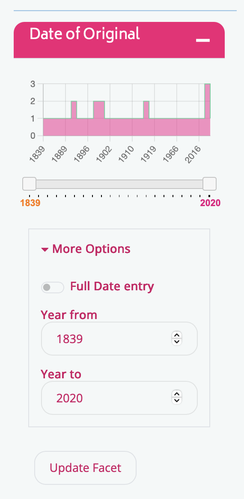
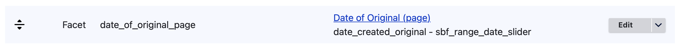
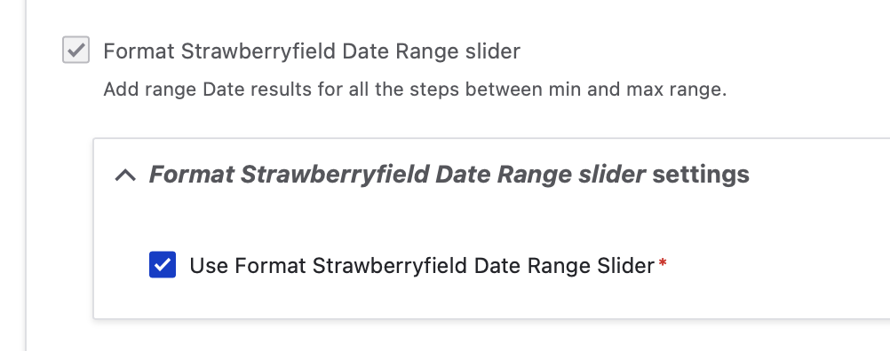
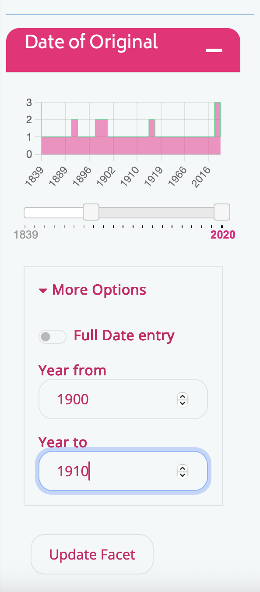
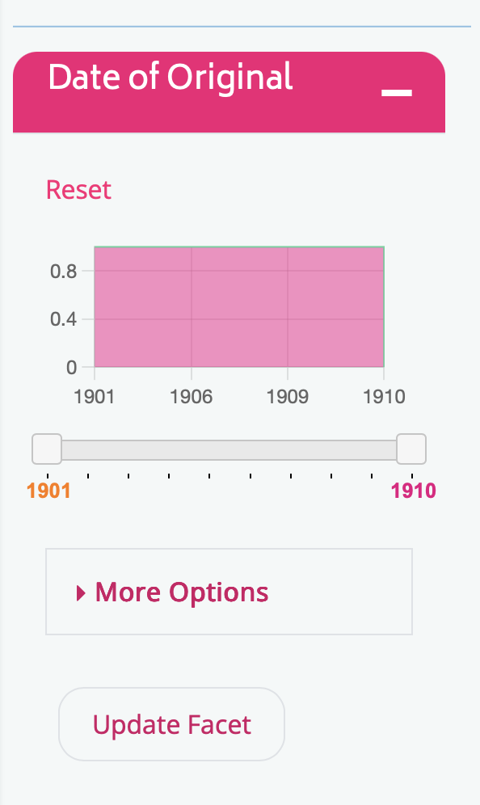

#  Strawberryfield Date Slider Facet

This guide covers the default configuration and general usage of the custom Archipelago Format Strawberryfield Date Range Slider Facet. The Format Strawberryfield Date Range Sider provides an enriched date range slider facet with input, histogram, and other output styling options. This specialty facet is available for Archipelago 1.6.0 and onward.



### Prerequisites 

Before diving into any Search/Solr/Facet configuration related changes, we recommend you read through our [in-a-nutshell](search_solr_index.md/#in-a-nutshell-json-data-to-strawberry-keyname-providers-to-solr) overview as a primer, and also review the process outlined in our full [Strawberry Key Name Providers, Solr Field, and Facet Configuration documentation guide](strawberry_key_name_providers.md)--this guide documents an example of adding an EDTF date Solr field and corresponding regular (non-slider) Date Facet. 

### Important notes about date values

This example default facet configuration is paired with an updated 'date_created_original' Strawberry Keyname Provider (if applied requires reindexing to refresh the corresponding Solr Field values). The updated Strawberry Keyname Provider uses the following JMESPath, which incorporates additional logic for indexing date ranges:

```json
"date_created", date_created_edtf.date_free, [date_created_edtf][?"date_type" == 'date_range'][ join('/',[date_from,date_to])][]
```

!!! note "Check Your Repository's Indexed Date Values"

    We strongly recommend that you review the actual date values and ranges indexed for your Archipelago Digital Objects and Collections.
    
    The settings you establish for this specialty facet are best informed by your repository's underlying indexed date field values.
  
## Default Archipelago 1.6.0+ Configuration

You can find the Default Archipelago 1.6.0+ Strawberryfield Date Slider for the 'Date of Original' Facet Configuration Form:

- Through the `Administration` menu > `Configuration` > `Search and metadata` > `Facets` > `Facet source search_api:views_page__solr_search_content__page_1 : View *Solr search* content, display *Page*` > `Facet - Date of Original`
- Directly at `/admin/config/search/facets/date_created_original/edit`



The default settings selections found on the main facet 'Edit' tab are:

1. Facet source: View Solr search content, display Page
    - This field + facet combination is also configured for the 'Date of Original' Facet found on the Grid and Advanced Search Pages as well, in Archipelago 1.6.0+ default deployments.

2. Widget: Format Strawberryfield Date Range slider
    * Not-selected: the 'Format Strawberryfield Date Range Picker (No Slider)' presents an option for this facet with no slider bar present on the display.
    * Not-selected: the 'Format Strawberryfield Date Slider' uses only the slider bar and histogram with no specified to/from date inputs on the display.



3. Format Strawberryfield Date Range slider settings
    * Option to `Show the amount of results` is checked.
    * `Minimum value type` is set to be 'Based on search result'
    * `Minimum value (in Years)` is set to 1810
        * This value is used as hard minimum limit if "Minimum value type" is set "Fixed value" or if set to "Based on search result" and also "Truncate Facet results outside of the user selected range" is checked
    * `Maximum value type` is set to be 'Based on search result'
    * `Maximum value (in Years)` is set to 2025
        * This value is used as hard maximum limit if "Maximum value type" is set "Fixed value" or if set to "Based on search result" and also "Truncate Facet results outside of the user selected range" is checked. Any valued larger than the current YEAR will be capped to NOW().No metadata futurism for the sake of performance.
    * Option to `Cap result based max/min to Fixed Ranges` is checked.
        * Checking this option means that even if max and min are "Based on search results", max and min will be capped to the Fixed values. This allows Outliers and wrong metadata to be never be taken in account.
    * Option to `Use the real facet max/min instead of the User selected input` is checked.
        * When checked, the user input will not be used in the Widget, but the actual max/min from the facets
    * The `Text for the reset link, if enabled` is set to 'Reset'
    * The  `Update Filter button Text` is set to 'Update Facet'
    * Option checked for `Enable Reset Link. It not present user needs to either reset the complete Search or use Facet Summaries, if enabled`
    * Option checked for `Hide Reset Link if the facet has no active values`
    * The `Base slider Step and Date range Facet Query "gap" in years` is set to a value of '1'.
    * Option checked for `Variable date Granularity and Date range Facet Query "gap" in the Slider UI, based on results`
        * Gaps are always calculated dynamically and will vary based on the min/max facet values (divided by the the hard limit of this facet). But when this is enabled, sliders steps (UI) will also use that GAP . If not, by default the base slider "step" setting in years will be used.
    * Option checked to `Allow manual Full DD/MM/YYYY entry`
        * Because of Browser support limitations for BCE dates entry in FULL ISO8601 format, if the returned range contains a negative year this input will be hidden.
    * Option checked to `Allow manual Full YYYY entry`
    * Option checked to `Display Histogram`
    * The default `Histogram Line Color` is set to a value of 'rgb(97, 211, 157)'
    * The default `Histogram Background Color` is set to a value of 'rgba(245, 40, 145, 0.55)'

4. Facet settings - initial section
    * In the long list of initial options for other Facet Settings, you will see the `Format Strawberryfield Date Range slider` is checked and non-changeable, and a separate subsection with the corresponding checked option to `Use Format Strawberryfield Date Range Slider`.

5. Facet settings - lower section
    * Further down in the Facet Settings section, you will see:
        * `URL handler` is checked and non-changeable. This will trigger the URL processor, which is set in the facet source configuration.
        * `VBO batch handler` is checked and non-changeable. This enables the VBO Batch Facet processor.
        * Under the 'VBO batch handler settings subsection, the option `Use URL based facets in VBO Batches` is unchecked and should remain so.
        * `Hide facet when facet source is not rendered` is checked. This option will only display the facet if the facet source is rendered. If you want to display the facets on other pages too, you need to uncheck this setting.
        * `Ensure that only one result can be displayed` is checked and non-changeable. This ensures that only one result at a time can be selected for this facet.
        * `URL alias` value is set to 'date_created_original_as_native_range'. This alias appears in the URL to identify this facet. It cannot be blank. Allowed are only letters, digits and the following characters: dot ("."), hyphen ("-"), underscore ("_"), and tilde ("~").
        * `Show title of facet` is unchecked by default. Check this option to show the title of the facet through a Twig template (not likely needed for this particular facet).
        * `Empty facet behavior`, which determines what action to take if a facet has no items, is set to 'Do not display facet'
        * `Operator` is set to 'AND'. AND filters are exclusive and narrow the result set. OR filters are inclusive and widen the result set.
        * `Hard limit` is set to a value of '100' for the maximum number of facet items to display.
        * `Minimum count` is set to a value of '1'. Please note that this facet will only display the results if there is this minimum amount of results. A setting of "0" might result in a list of all possible facet items, regardless of the actual search query. the result of a minimum count of "0" is not reliable and may very on the type of the field, the Search API backend and even between different releases or runtime configurations of the backend (for example Solr). Therefore it is highly recommended to avoid any feature that depends on a minimum count of "0".
        * `Weight` is set a value of '0'. This weight is used to determine the order of the facets in the URL if pretty paths are used.

6. Facet sorting section 
    * `Sort by active state` is checked, which sorts the widget results by active state. The `Sort order` is set to 'Ascending'.
    * `Sort by count`is checked, which sorts the widget results by count. The `Sort order` is set to 'Descending'.
    * `Sort by display value is checked, which sorts the widget results by display value. The `Sort order` is set to 'Ascending'.

## Default Settings and Expected Facet Behaviors

For the default configured settings for the 'Date of Original' field referenced above, the following example query illustrates the expected facet behaviors.

1. Part 1 - Under 'More Options', a user inputs a date span of 1900 to 1910. The date range slider shifts to the initial 'Year from' date entered when the user moves to the 'Year to' box, but the overal histogram graph and end range do not yet update. This shift gives the user a visual cue that the Facet is responding to their query, but the fuller settings are not yet applied until the user selects the 'Update Facet' button.




2. Part 2 - After the user selects the 'Update Facet' button, the full Year From and Year To date range is applied to the executed query. For the 'Date of Original' facet display, the date range histogram is updated to reflect the queried date ranges.




!!! note "Unexpected Results From Certain Queries"

    It is possible that the search results found after a query will include objects which may appear to have a dates within a smaller version of the queried range. 
    
    For the above example, the results may show objects that have uncertain dates or ranges falling between the 1900 and 1910 query, which are indexed differently from the primary display date visible to end users.
    
    As also noted above, it is that you review the actual date values and ranges indexed for your Archipelago Digital Objects and Collections when using this facet.

### Optional - New Date Range type Solr Field

Archipelago 1.6.0+ also feature a new Date Range type Solr Field. Default deployments will include a new 'date_created_original_as_native_range' Strawberry Keyname Provider (found at ~/admin/structure/strawberry_keynameprovider/date_created_original_as_native_range/edit) that populates a new 'Date Range' Solr Field for 'date_as_range' (machine name).


You may wish to experiment with this new Date Range type Solr Field before using a production environment. The logic of date range value processing it applies may be 


___

Thank you for reading! Please contact us on our [Archipelago Commons Google Group](https://groups.google.com/forum/#!forum/archipelago-commons) with any questions or feedback.

Return to the [Archipelago Documentation main page](index.md).


