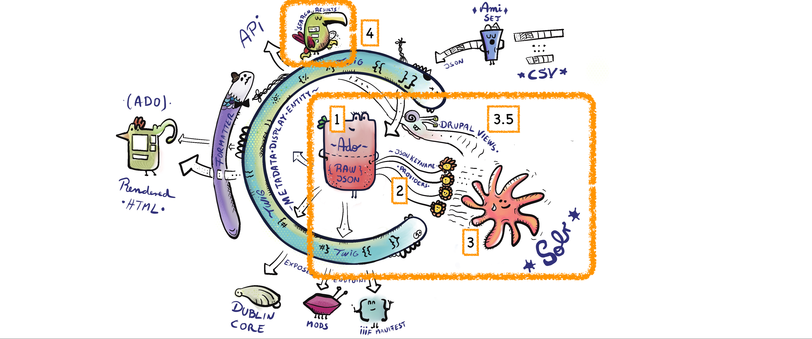

# Search and Solr

Archipelago's default Search and Solr configurations are intended to cover the most common needs for a typical repository search experience.

### Preamble + prerequisites 

Before diving into any Search and Solr configuration changes, we strongly recommend that you read our [Metadata in Archipelago](metadatainarchipelago.md) overview documentation, which provides important context for understanding how the shape of your Archipelago Digital Objects/Collections (ADOs) metadata will inform your Search and Solr options and outcomes.

### Archipelago and Solr
Archipelago's latest Release (1.1.0) uses [Apache Solr 9.1](https://solr.apache.org/guide/solr/9_1/index.html), which incorporates some [major improvements and changes from Solr 8](https://solr.apache.org/guide/solr/9_1/upgrade-notes/major-changes-in-solr-9.html). Please refer to the [primary Solr documentation](https://solr.apache.org/guide/solr/9_1/index.html) for the most comprehensive and in-depth information about Solr's wide breadth of functionality and configuration options.

### OCR Highlights

Archipelago uses [solr-ocrhighlighting v0.8.4](https://github.com/dbmdz/solr-ocrhighlighting/releases/tag/wip), built by the Development Team at the [Bavarian State Library](https://github.com/dbmdz). See our [Strawberry Runners Post-Processing documentation](strawberryrunners.md) for more information about configuring page-based HOCR/OCR extraction for image and pdf-based ADOs and options for sending that output to the Search API.

## In-a-nutshell : JSON data to Strawberry Keyname Providers to Solr

If you don't have the bandwidth to read the (stellar) [Metadata in Archipelago](metadatainarchipelago.md) documentation, focus on the following in-a-nutshell understanding of the way Archipelago's Search and Solr is crafted. Then follow the step-by-step instructions found in [Strawberry Key Name Providers, Solr Field, and Facet Configuration](strawberry_key_name_providers.md) to get started customizing your Search setup.

1. JSON Data for your Archipelago Digital Objects: you need to have your descriptive metadata in JSON keys and values for ADOs and Collections in your Archipelago. Your JSON metadata and (extracted technical) data is the crucial source for Search and Solr.

2. Strawberry Keyname Providers: you need to have corresponding Strawberry Keyname Providers configured to feed the _values_ from your desired JSON keys to Solr fields. One of the most powerful tools in Archipelago's Search functionality comes from the extensibility of Strawberry Keyname Providers, which can be used to source specific data points from a variety of JSON keys found in your repository.

??? info "More about Strawberry Keyname Providers"

    #### Excerpted from [Metadata in Archipelago](metadatainarchipelago.md)
    One of the challenges of our flexible approach is how to allow Drupal to access the JSON in a way, as native as possible, to generate filtered listings via Drupal Views, free text Search and Faceting. To make this happen Strawberry Field uses a JSON Querying and Exposing as "Native Field Properties" logic. Through a special type of Plugin system named Strawberry Key Name Providers and associated Configuration Entities (can be found at /admin/structure/strawberry_keynameprovider), you have control on which keys and values of your JSON are going to be exposed as field properties of any Strawberry Field, allowing Drupal through this to access values in a flat manner and expose them to the Search API natively. The access to the values of any JSON is done via JMESPATH expressions and then transformed either to a list of values or even "cast" into more complex data Data types, like an Entity Reference (means a connection to another Entity).
    This gives you a lot of power and control and makes a lot of very heavy operations lighter. You can even plan upfront or evolve these properties in time.

3. Solr Fields: you need to configure your desired Solr Fields to source from the Strawberry Keynames you have configured. By default, Archipelago also provider Solr Fields sourced from your HOCR data and the Rendered HTML output of your ADOs.

* _*3.5._ Drupal Views: for your regular Search, Advanced Search, and potentially other specialized Views, you can configure to search within specific and/or a variety of Solr Fields. 

4. Search Results: your metadata and data, as configured through Keyname Providers and Fields, indexed into your Solr. 

## Instructions and Guides

* [Strawberry Key Name Providers, Solr Field, and Facet Configuration](strawberry_key_name_providers.md) 
* [Advanced Search](search_advanced.md)
* [How to Add a 'Search Within Collection' Block](search-within-collection.md)

___

Thank you for reading! Please contact us on our [Archipelago Commons Google Group](https://groups.google.com/forum/#!forum/archipelago-commons) with any questions or feedback.

Return to the [Archipelago Documentation main page](index.md).
