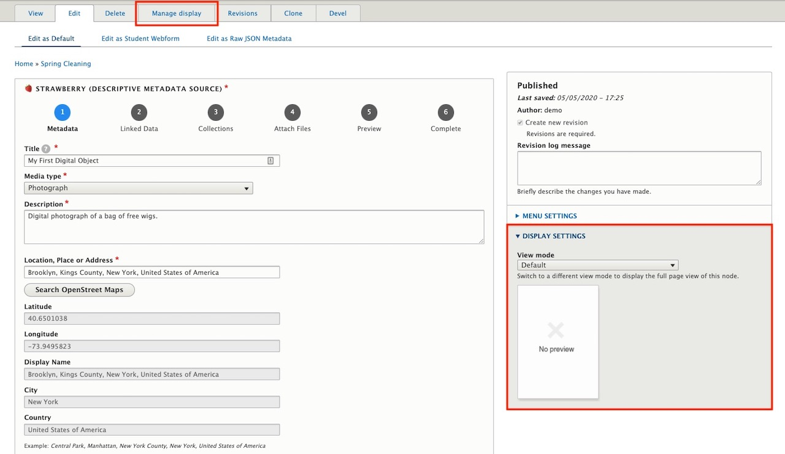
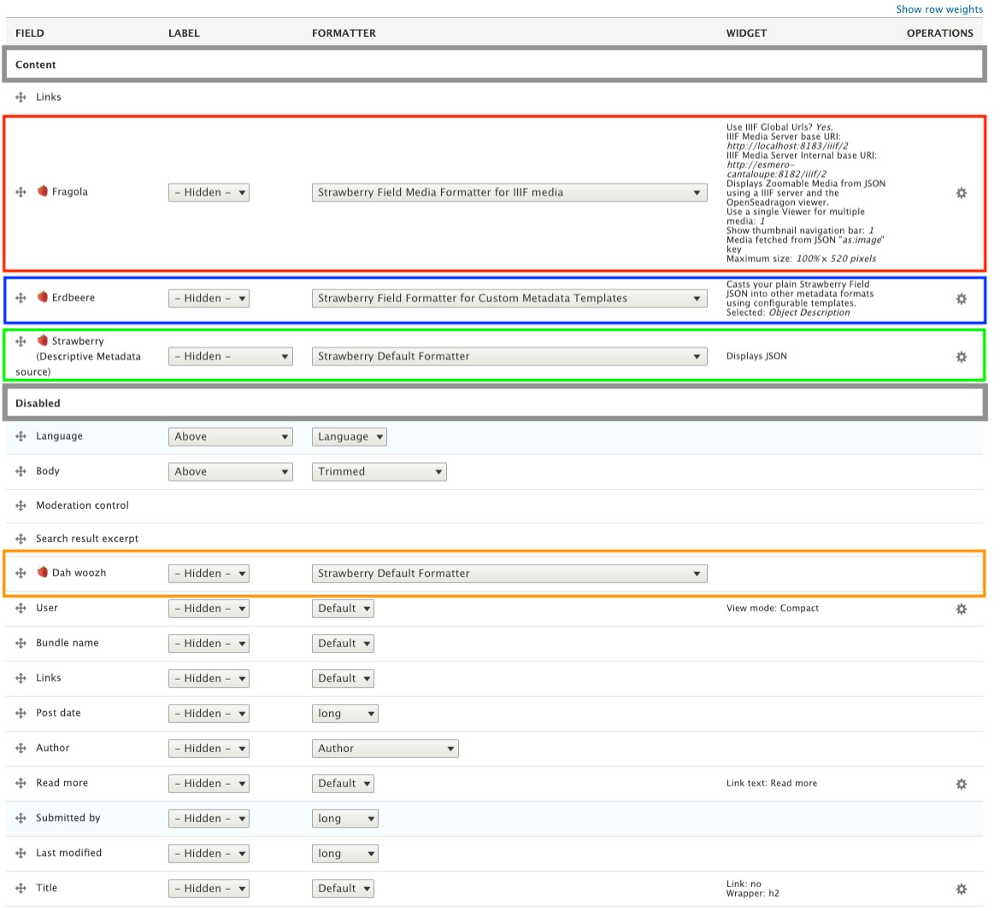
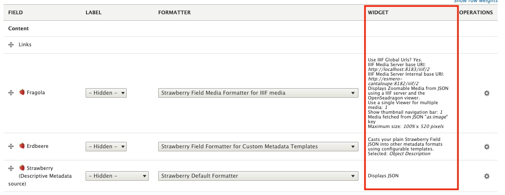

# Strawberryfield Formatters

This documentation will give a brief overview of Archipelago's [Strawberryfield Formatters](https://github.com/esmero/format_strawberryfield) and how they work using the default View mode `Digital Object Full View` as an example.

## At a glance
When taking a look at your [First Digital Object](https://github.com/esmero/archipelago-documentation/blob/1.0.0-RC1/docs/firstobject.md) note that multiple formatters are working together to create this `Display` ( or `View mode`). Since "*My First Digital Object*" is a `Photograph` the `Display` being used is `Digital Object Full View` which, by default, uses formatters to:

- (**Red**) Create the image viewer where users can zoom in, zoom out, fullscreen and rotate all the images associated with the ADO.
- (**Blue**) Display the `Object Description` and `Type of Resource`.
- (**Green**) Display the Raw JSON Metadata and IIIF Presentation Manifest.

## In Greater Detail

When editing an ADO, at the top of the Webform page there is a tab titled `Manage display` which will take us to where all the Formatters live. _Take note that the `DISPLAY SETTINGS` shown in the screenshot below are using the **Default** View mode._

Once the page loads the `Default` View mode is automatically selected. However, because we are editing an object with the `Media type` `Photograph`, we need to edit the View mode `Digital Object Full View` since it is the *Default* View mode for this `Media type`.

#### How to find and configure which View mode is Default per Media type

The **ADO Type to View mode Mapping** page tells the ADOs which View mode to use by default per Media type. This page can be accessed at `yoursite//admin/config/archipelago/viewmode_mapping`

??? info "Formatters Shipped with Archipelago"

    1. Default
    2. Collection listing
    3. Digital Object Full View
    4. Digital Object with 3D Viewer
    5. Digital Object with A/V Player
    6. Digital Object with Book Reader
    7. Digital Object with Mirador Viewer
    8. Digital Object with Pannellum Panorama
    9. Digital Object with PDF Viewer
    10. Digital Object with Replay.web Webarchive Player
    11. Digital Object with Replay.web Webarchive with Navbars
    12. Digital Object with Video Player
    13. Digital Object with thumbnail and abstract

??? info "Default View Mode Mappings by Media Type"

    |JSON (Media) Type | View Mode Name                   |  
    |----------|----------------------------------|
    |1. Video     | Digital Object with Video Player |
    |2. 3DModel   | Digital Object with 3D Viewer    |
    |3. Photograph| Digital Object Full View         |
    |4. Thesis   | Digital Object with PDF Viewer    |
    |5. Panorama   | Digital Object with Pannellum Panorama  |
    |6. Book   | Digital Object with Book Reader  |
    |7. Podcast   | Digital Object with A/V Player |
    |8. Collection   | Collection Listing |
    |9. Article   | Digital Object with PDF Viewer  |
    |10. Map   | Digital Object with Mirador Viewer  |
    |11. MusicRecording   | Digital Object with A/V Player  |
    |12. Sculpture  | Digital Object with 3D Viewer  |
    |13. VisualArtwork  | Digital Object with Video Player  |
    |14. Painting  | Digital Object with Mirador Viewer  |
    |15. WebPage  | Digital Object with Replay.web Webarchive Player |
    |16. PanoramaTour | Digital Object with Pannellum Panorama  |

There are two sections in `Manage display` for `Digital Object Full View`: 1) **Content** and 2) **Disabled**. Moving a field into **Content** means this formatter will be used to the display the ADO in some way. The formatters moved to **Disabled** are inactive and are subsequently not being used for displaying the ADO.

There are four fields named `🍓Strawberry` and each one is a copy of the field `🍓Strawberry (Descriptive Metadata source)`. Since the names of the fields do not imply their function, they have been named *Strawberry* in four different ways (Italiano, Deutsch, Diné Bizaad, and English) in order to organize and help users visually remember which field is doing what for the `Display`.

Recall *My First Digital Object* at beginning of this document where there were 3 sections highlighted in **Red**, **Blue**, and **Green**.

- In **Red** (`🍓Fragola`) there is the [Strawberry Field Formatter for IIIF media](tbd.md) which takes the image stored in S3 to display the photograph with the image viewer.
- In **Blue** (`🍓Erdbeere`) there is the [Strawberry Field Formatter for Custom Metadata Templates](tbd.md) which displays the raw JSON metadata using configurable Twig templates. In this example, the default Twig template uses the JSON key `type` to display the `Type of Resource`.
- In **Green** (`🍓Strawberry (Descriptive Metadata)`) there is the [Strawberry Default Formatter](tbd.md) which is used to display the Raw JSON Metadata.

## At the end of the day
The decision for how your metadata is displayed is totally in your control.

Under the `WIDGET` column, there is a quick description/overview of what the formatter is doing.

And by clicking on the gear icon under the `OPERATIONS` column, all of the options for configuring the formatter are revealed. To use `🍓Fragola` as an example (the Formatter for IIIF media), we can choose which JSON Key is being used to fetch the IIIF Media URLs (found inside the raw JSON being played with `Strawberry Default Formatter`), the maximum height and width of the viewer, etc.

And then with `🍓Erdbeere` (the Formatter for Custom Metadata Templates) there is the option, among many others, to configure which Twig template the formatter will use for displaying your Metadata.

More information about Managing Metadata Displays with Twig Templates can be found [here](metadatatwigs.md).

---

Thank you for reading! Please contact us on our [Archipelago Commons Google Group](https://groups.google.com/forum/#!forum/archipelago-commons) with any questions or feedback.

Return to the [Archipelago Documentation main page](index.md).
