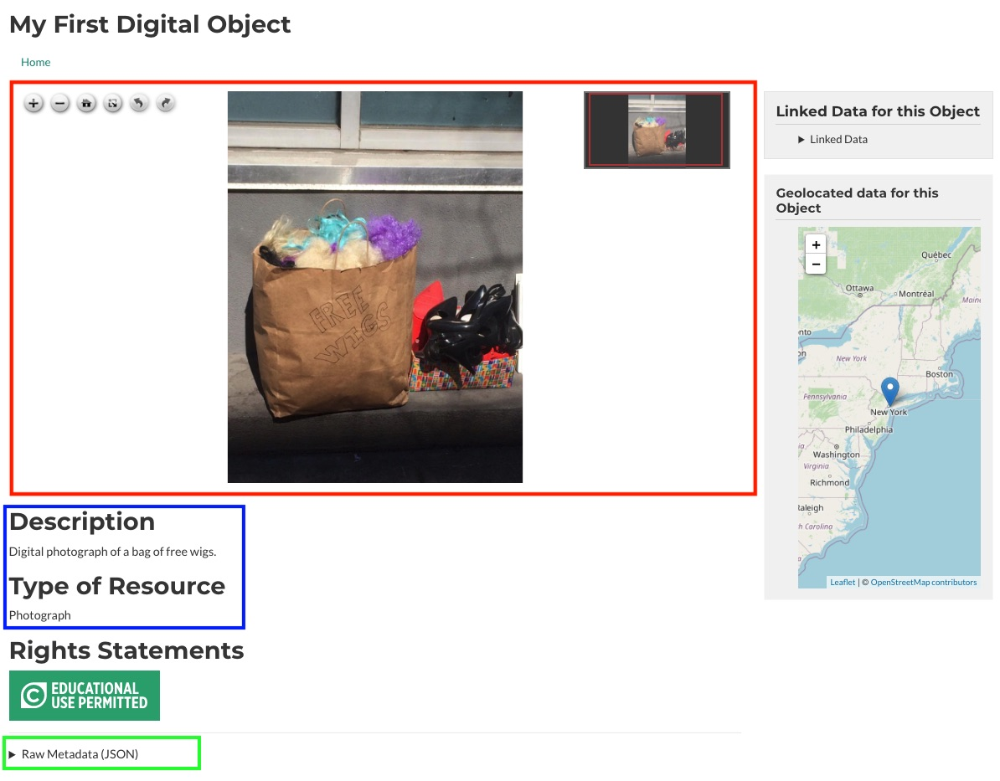
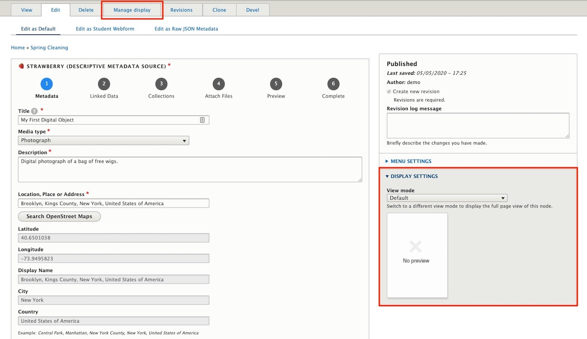
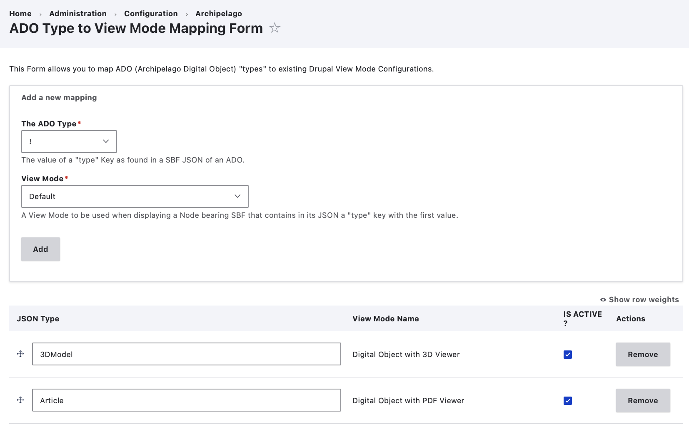
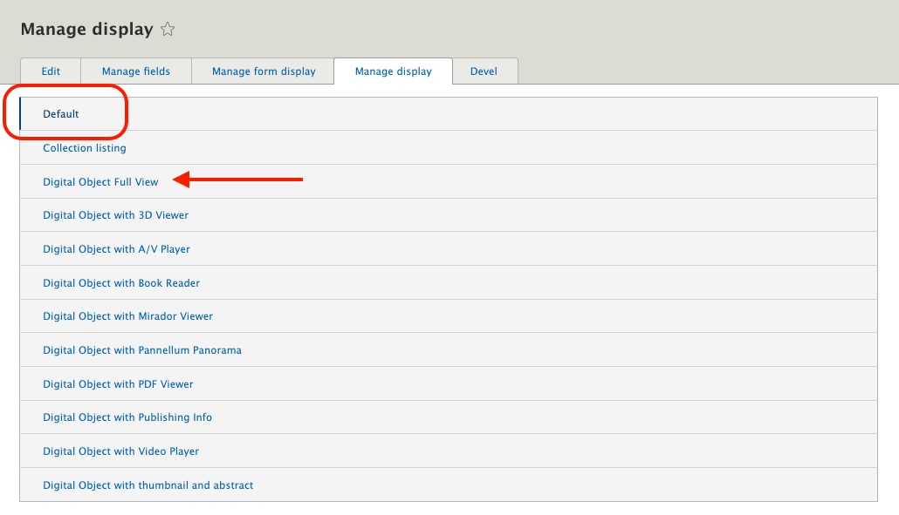
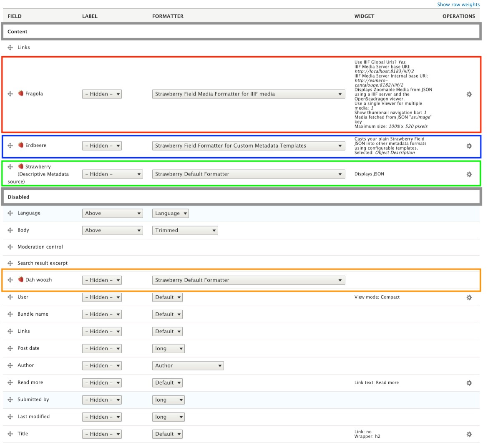
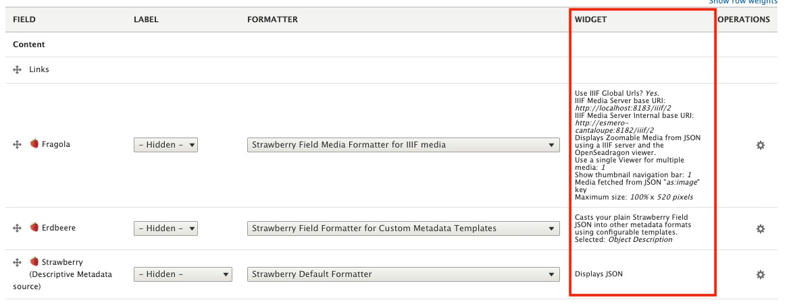
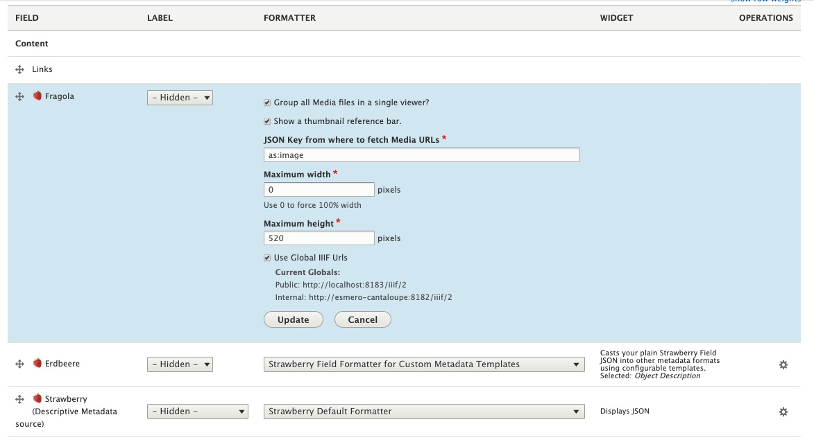
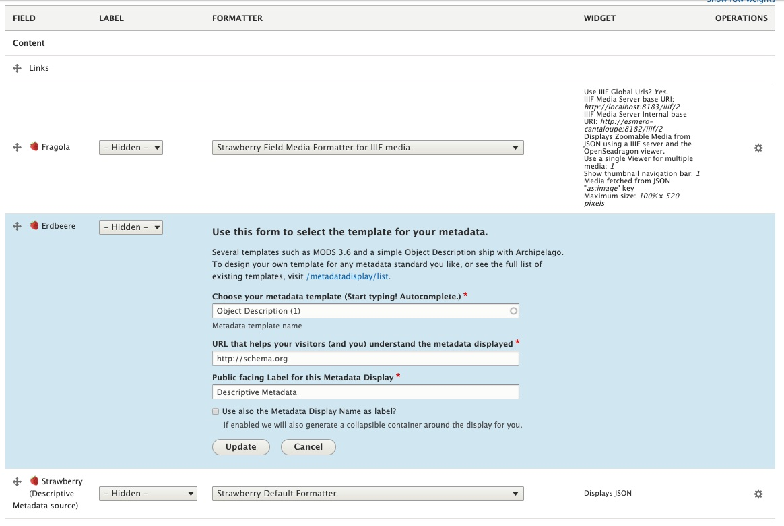

# Strawberryfield Formatters

Archipelago's [Strawberryfield Formatters](https://github.com/esmero/format_strawberryfield) provide specialty media and other data processing formatters for StrawberryField (JSON) fields. These speciality Formatters power different parts of the display outputs for Archipelago Digital Objects (ADOs).

## Archipelago Provided Formatters

The following Strawberryfield Formatters are shipped and configured with corresponding [View Modes](primerdisplaymodes.md#default-view-modes-bundled-in-archipelago) in Archipelago.

### IIIF Mediated Formatters

See separate guide for [IIIF mediated Viewers here](iiif_mediated_formatters_overview.md)

Formatters that use IIIF Twig templates to process media and generate IIIF manifests:

- Strawberry Field Simple Image Formatter using IIIF
- Strawberry Field Media Formatter using OpenSeadragon for IIIF media
- Strawberry Field Media Formatter using the Mirador * IIIF Viewer plugin
- Strawberry Field Paged Formatter using IABook Readerplugin
- Strawberry Field 3D Model Formatter
- Strawberry Field Panorama Formatter using Pannellum * and IIIF
- Strawberry Field PDF Formatter for IIIF served PDFs
- Strawberry Field Media Formatter using the Universal (UV) * IIIF Viewer plugin

### Direct Media or JSON Object Data Formatters

See separate guide for [Direct Media or JSON Object Data Formatters here](direct_media_json_formatters.md)

Formatters that process media files or JSON object data directly for display outputs:

- Strawberry Field Audio Formatter
- Strawberry Field Simple Citation Formatter
- Strawberry Field Map Formatter using the Leaflet and GeoJson*
- Strawberry Field Formatter for Custom Metadata Templates
- Strawberry Field Video Formatter
- Strawberry Warc Formatter using replay.web embedded player
- Strawberry Default Formatter
- Strawberry Field Pretty Formatter

## Overview and Example Walkthrough

The rest of this documentation guide will provide an overview of Archipelago's Strawberryfield Formatters more generally and how they work using the default View Mode `Digital Object Full View` as an example.

### At a glance

When taking a look at your [First Digital Object](firstobject.md) note that multiple formatters are working together to create this `Display` ( or `View mode`). Since "*My First Digital Object*" is a `Photograph` the `Display` being used is `Digital Object Full View` which, by default, uses formatters to:

- (**Red**) Create the image viewer where users can zoom in, zoom out, fullscreen and rotate all the images associated with the ADO.
- (**Blue**) Display the `Object Description` and `Type of Resource`.
- (**Green**) Display the Raw JSON Metadata and IIIF Presentation Manifest.

### In Greater Detail

When editing an ADO, at the top of the Webform page there is a tab titled `Manage display` which will take us to where all the Formatters live. _Take note that the `DISPLAY SETTINGS` shown in the screenshot below are using the **Default** View mode._

Once the page loads the `Default` View mode is automatically selected. However, because we are editing an object with the `Media type` `Photograph`, we need to edit the View mode `Digital Object Full View` since it is the *Default* View mode for this `Media type`.

### ADO Type to View Mode Mapping Form

The **ADO Type to View Mode Mapping** form tells the ADOs which View mode to use by default per Media `type`. You can find the ADO Type to View Mode Mapping Form at `~yoursite/admin/config/archipelago/viewmode_mapping`

You can see the full list of [Default View Modes included in Archipelago here](primerdisplaymodes.md#default-view-modes-bundled-in-archipelago).

### Reviewing a View Mode in Depth

There are two sections in `Manage display` for `Digital Object Full View`: 1) **Content** and 2) **Disabled**. Moving a field into **Content** means this formatter will be used to the display the ADO in some way. The formatters moved to **Disabled** are inactive and are subsequently not being used for displaying the ADO.

There are four fields named `🍓Strawberry` and each one is a copy of the field `🍓Strawberry (Descriptive Metadata source)`. Since the names of the fields do not imply their function, they have been named *Strawberry* in four different ways (Italiano, Deutsch, Diné Bizaad, and English) in order to organize and help users visually remember which field is doing what for the `Display`.

Recall *My First Digital Object* at beginning of this document where there were 3 sections highlighted in **Red**, **Blue**, and **Green**.

- In **Red** (`🍓Fragola`) there is the [Strawberry Field Formatter for IIIF media](tbd.md) which takes the image stored in S3 to display the photograph with the image viewer.
- In **Blue** (`🍓Erdbeere`) there is the [Strawberry Field Formatter for Custom Metadata Templates](tbd.md) which displays the raw JSON metadata using configurable Twig templates. In this example, the default Twig template uses the JSON key `type` to display the `Type of Resource`.
- In **Green** (`🍓Strawberry (Descriptive Metadata)`) there is the [Strawberry Default Formatter](tbd.md) which is used to display the Raw JSON Metadata.

## At the end of the day

The decision for how your metadata is displayed is totally in your control.

Under the `WIDGET` column, there is a quick description/overview of what the formatter is doing.

And by clicking on the gear icon under the `OPERATIONS` column, all of the options for configuring the formatter are revealed. To use `🍓Fragola` as an example (the Formatter for IIIF media), we can choose which JSON Key is being used to fetch the IIIF Media URLs (found inside the raw JSON being played with `Strawberry Default Formatter`), the maximum height and width of the viewer, etc.

And then with `🍓Erdbeere` (the Formatter for Custom Metadata Templates) there is the option, among many others, to configure which Twig template the formatter will use for displaying your Metadata.

More information about Managing Metadata Displays with Twig Templates can be found [here](metadatatwigs.md).

___

Thank you for reading! Please contact us on our [Archipelago Commons Google Group](https://groups.google.com/forum/#!forum/archipelago-commons) with any questions or feedback.

Return to the [Archipelago Documentation main page](index.md).
