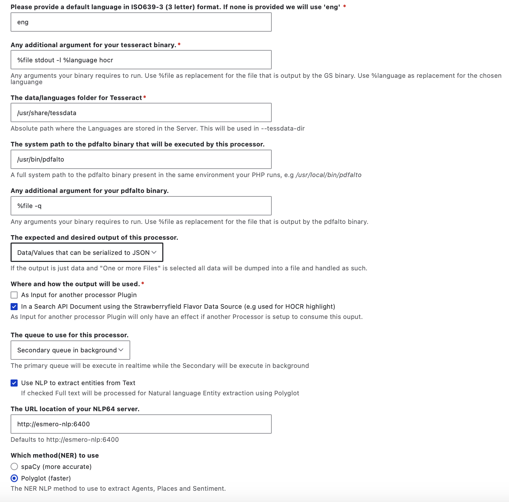

# Reviewing and adjusting the `pager` and `ocr` Post-Processor operations 

The `pager` and `ocr` Post-processor operations are likely the most important pair of Strawberry Runners in your Archipelago.

As stated on the [Strawberry Runners overview page](docs/strawberryrunners.md), the `pager` action uses the 'Post processor that extracts/generates Ordered Sequences of files/pages/children using Files present in an ADO' plugin. Nested one level in, the `ocr` action uses the 'Post processor that Runs OCR/HORC against files' plugin. The `ocr` operations will be executed after the completion of the `pager` operations.

Common changes you may wish to make for the `pager` and/or `ocr` operations include adding or removing particular types of Archipelago Digital Objects to apply these operations to.

# Pager Settings

To review or adjust the configurations for the `pager` operation, select `Edit` from the `Operations` menu.

In the `pager` settings, you will see the following configuration options:

1. Label: 
    - Label for this Processor; which should be a unique machine-readable name
    - Can only contain lowercase letters, numbers, and underscores
    - We do not recommend changing this Label from the default `pager`. 

2. Strawberry Runner Post Processor Plugin:
    - The `Post processor that extracts/generates Ordered Sequences of files/pages/children using Files present in an ADO` should be selected.
    - We do not recommend changing this Plugin selection.

3. Checkbox to mark this processor plugin as active 
    - We recommend keeping this checked as `active` at all times, but you may wish to temporarily disable this if you are performing certain types of administrative review tasks such as running large test ingests where you plan on deleting the ADOs before a final ingest.
    - If you accidentally uncheck this and need to re-trigger the `pager` (and corresponding nested `ocr` action), you can use Archipelago's [Find and Replace](find_and_replace.md) to first select a specific group of Digital Objects you wish to target for Post-Processing, then select the `Trigger Strawberrry Runners process/reprocess for Archipelago Digital Objects content item` from the [Find and Replace](find_and_replace.md) `Actions menu`.

4. ADO type(s) to limit this processor to:
    - A single ADO type or a comma delimited list of ado types that qualify to be Processed.
    - Leave empty to apply to all ADOs. If you do not provide any specific ADO types here, the processor will be applied for all ADOs with the JSON keys selected in the next step.
    - Default ADO types specified are: 'Document,Book,Article'	
    - You may wish to add additional types of document/multiple-paged type of ADOs to this list that are custom to you Archipelago environment. 

5. The JSON key that contains the desired source files:
    - By default, the `as:image` and `as:document` keys are selected.
    - We do not recommend changing this selection.

6. Mimetypes(s) to limit this Processor to:
    - A single Mimetype type or a comma separated list of mimetypes that qualify to be Processed.
    - Leave empty to apply any file.
    - Default mimetypes are: 'application/pdf,image/tiff,image/jpeg,image/jp2'	

7. Within the ADO's metadata, the JSON key that contains the language in ISO639-3 (3 letter) format to be used for OCR/NLP processing via Tesseract.
    - Default JSON key specified is: 'language_iso639_3'

8. Please provide a default language in ISO639-3 (3 letter) format. If none is provided we will use 'eng'.
    - Default language specified is: 'eng'

9. Timeout in seconds for this process.
    - If the process runs out of time it can still be processed again
    - Default selection is: 10

10. Order or execution in the global chain.
    - Default selection is: 0

# OCR / HOCR Settings

To review or adjust the configurations for the `ocr` operation, select `Edit` from the `Operations` menu.

In the `pager` settings, you will see several different configuration options.

1. Label: 
    - Label for this Processor; which should be a unique machine-readable name
    - Can only contain lowercase letters, numbers, and underscores
    - We do not recommend changing this Label from the default `ocr`. 

2. Strawberry Runner Post Processor Plugin:
    - The `Post processor that Runs OCR/HORC against files` should be selected.
    - We do not recommend changing this Plugin selection.

3. Checkbox to mark this processor plugin as active 
    - We recommend keeping this checked as `active` at all times, but you may wish to temporarily disable this if you are performing certain types of administrative review tasks such as running large test ingests where you plan on deleting the ADOs before a final ingest.
    - If you accidentally uncheck this and need to re-trigger the `pager` (and corresponding nested `ocr` action), you can use Archipelago's [Find and Replace](docs/find_and_replace.md) to first select a specific group of Digital Objects you wish to target for Post-Processing, then select the `Trigger Strawberrry Runners process/reprocess for Archipelago Digital Objects content item` from the [Find and Replace](docs/find_and_replace.md) `Actions menu`.

4. The type of source data this processor works on:
    - Select from where the source file this processor needs is fetched.
    - Default selection of 'File entities referenced in the as:filetype JSON structure'.
    - You also have the option of selecting 'Full file paths passed by another processor', but we do not recommend using this option as it is less granular in its application. 	 

5. ADO type(s) to limit this processor to:
    - A single ADO type or a comma delimited list of ado types that qualify to be Processed
    - Leave empty to apply to all ADOs. If you do not provide any specific ADO types here, the processor will be applied for all ADOs with the JSON keys selected in the next step.
    - Default ADO types specified are: 'Document,Book,Article'	
    - You may wish to add additional types of document/multiple-paged type of ADOs to this list that are custom to you Archipelago environment. 

6. The JSON key that contains the desired source files:
    - By default, the `as:image` and `as:document` keys are selected.
    - We do not recommend changing this selection.

7. Mimetypes(s) to limit this Processor to:
    - A single Mimetype type or a comma separated list of mimetypes that qualify to be Processed.
    - Leave empty to apply any file.
    - Default mimetypes are: 'application/pdf,image/tiff,image/jpeg,image/jp2'	
	
!!! warning "Advanced OCR/HOCR Settings"

    We do not recommend making changes to the follow settings unless you are the System Administrator.

8. The system path to the ghostscript (gs) binary that will be executed by this processor.
    - A full system path to the gs binary present in the same environment your PHP runs
    - Default path specified is: '/usr/bin/gs'

9. Any additional argument your executable binary requires.
    - Any arguments your ghostscript (gs) binary requires to run. Use %file as replacement for the file if the executable requires the filename to be passed under a specific argument. We recommend testing with -r150 (150dpi image extraction) for better performance but -r300 can be also used if source Images in a PDF are small
    - Default argument specified is: -r150 %file

10. The system path to the Tesseract binary that will be executed by this processor.
    - A full system path to the Tesseract binary present in the same environment your PHP runs
    - Default path specified is: '/usr/bin/tesseract'

11. Within the ADO's metadata, the JSON key that contains the language in ISO639-3 (3 letter) format to be used for OCR/NLP processing via Tesseract.
    - Default JSON key specified is: 'language_iso639_3'

12. Please provide a default language in ISO639-3 (3 letter) format. If none is provided we will use 'eng' 
    - Default language specified is: 'eng'

13. Any additional argument for your tesseract binary.
    - Any arguments your binary requires to run. Use %file as replacement for the file that is output by the GS binary. Use %language as replacement for the chosen language.
    - Default arguments specified are: '%file stdout -l %language hocr'

14. The data/languages folder for Tesseract
    - Absolute path where the Languages are stored in the Server. This will be used in --tessdata-dir
    - Default path specified is: '/usr/share/tessdata'	

15. The system path to the pdfalto binary that will be executed by this processor.
    - A full system path to the pdfalto binary present in the same environment your PHP runs, e.g /usr/local/bin/pdfalto
    - Default path specified is: '/usr/bin/pdfalto'

16. Any additional argument for your pdfalto binary.
    - Any arguments your binary requires to run. Use %file as replacement for the file that is output by the pdfalto binary.
    - Default arguments specified are: '%file -q

17. The expected and desired output of this processor.
    - If the output is just data and "One or more Files" is selected all data will be dumped into a file and handled as such.
    - Default selection is: 'Data/Values that can be serialized to JSON'
    - Additional optional is to select 'One or more Files', but it is not recommended unless to use this for the default `ocr` operation since this will alter how the data is incorporated in the Search API (Solr index).

18. Where and how the output will be used.
    - Default select is: 'In a Search API Document using the Strawberryfield Flavor Data Source (e.g used for HOCR highlight)'	
    - Additional option to select 'As Input for another processor Plugin' --which will only have an effect if another Processor is setup to consume this output.

19. The queue to use for this processor.
    - The primary queue will be execute in realtime while the Secondary will be execute in background
    - Default selection is for the 'Secondary queue in background'

20. Checkbox to Use NLP (Natural Language Processing) to extract entities from Text
    - If checked Full text will be processed for Natural language Entity extraction using Polyglot.
    - Default option is to have the option checked.	

21. The URL location of your NLP64 server.
    - Defaults to http://esmero-nlp:6400

22. Which method(NER) to use
    - The NER NLP method to use to extract Agents, Places and Sentiment.
    - Default selection: 'Polyglot (faster)'
    - Alternation selection: 'spaCy (more accurate)'

23. Timeout in seconds for this process.
    - 900
    - If the process runs out of time it can still be processed again.
24. Order or execution in the global chain.
    - 0

___

Thank you for reading! Please contact us on our [Archipelago Commons Google Group](https://groups.google.com/forum/#!forum/archipelago-commons) with any questions or feedback.

Return to the main [Strawberry Runners](strawberryrunners.md) or the [Archipelago Documentation main page](index.md).
