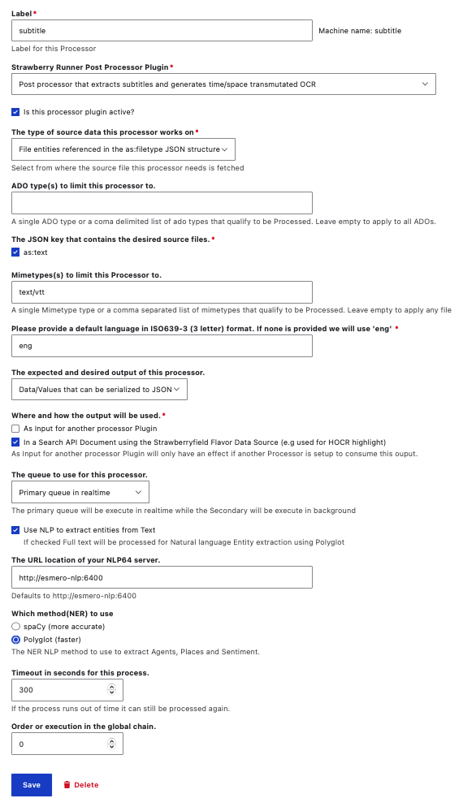

# Reviewing and adjusting the `subtitle` Post-Processor operations 

As stated on the [Strawberry Runners overview page](strawberryrunners.md), the `subtitle` action extracts textual values from subtitle/transcript VTT files and generates time/space transmuted OCR. This transmuted OCR can be used to search within a time-based video or audio file's corresponding subtitle/transcript VTT file(s), then navigate to the matching time of the video or audio file within a media viewer.

We strongly recommend using caution when making any adjustments to the default `subtitle` configurations as this may result in unexpected issues with the transmuted OCR values in your Solr Index. Also, the `subtitle` Strawberry Runner Post-Processor needs to used with corresponding related default IIIF Server Settings Form. 

# Subtitle Settings

To review or adjust the configurations for the `subtitle` operation, select `Edit` from the `Operations` menu.

In the `subtitle` settings, you will see the following configuration options:

1. Label: 
    - Label for this Processor; which should be a unique machine-readable name
    - Can only contain lowercase letters, numbers, and underscores
    - We do not recommend changing this Label from the default `subtitle`. 

2. Strawberry Runner Post Processor Plugin:
    - The `Post processor that extracts subtitles and generates time/space transmuted OCR` should be selected.
    - We do not recommend changing this Plugin selection.

3. Checkbox to mark this processor plugin as active 
    - We recommend keeping this checked as `active` at all times, but you may wish to temporarily disable this if you are performing certain types of administrative review tasks such as running large test ingests where you plan on deleting the ADOs before a final ingest.
    - If you accidentally uncheck this and need to re-trigger the `subtitle` Post-Processor, you can use Archipelago's [Find and Replace](find_and_replace.md) to first select a specific group of Digital Objects you wish to target for Post-Processing, then select the `Trigger Strawberrry Runners process/reprocess for Archipelago Digital Objects content item` from the [Find and Replace](find_and_replace.md) `Actions menu`.

4. The type of source data this processor works on:
    - Select from where the source file this processor needs is fetched.
    - Default selection of 'File entities referenced in the as:filetype JSON structure'.
    - You also have the option of selecting 'Full file paths passed by another processor', but we do not recommend using this option as the default `subtitle` Post-Processor has not been configured to be nested within a preceding Post-Processor set of operations.

5. ADO type(s) to limit this processor to:
    - A single ADO type or a comma delimited list of ado types that qualify to be Processed.
    - Leave empty to apply to all ADOs. If you do not provide any specific ADO types here, the processor will be applied for all ADOs with the JSON keys selected in the next step.
    - We recommend leaving empty.

6. The JSON key that contains the desired source files:
    - By default, `as:text` key is selected.
    - We do not recommend changing this selection.

6. Mimetypes(s) to limit this Processor to:
    - A single Mimetype type or a comma separated list of mimetypes that qualify to be Processed.
    - Leave empty to apply any file.
    - Default mimetypes are: 'text/vtt'

!!! warning "Do not set to apply to general text files"

    We do not recommend making changes to use this `subtitle` Post-Processor for non-structured, general text based transcript files. The transmutation operations executed require the parsing of VTT structured files specifically.  
	

7. Please provide a default language in ISO639-3 (3 letter) format. If none is provided we will use 'eng'.
    - Default language specified is: 'eng'

8. The expected and desired output of this processor.
    - If the output is just data and "One or more Files" is selected all data will be dumped into a file and handled as such.
    - Default selection is: 'Data/Values that can be serialized to JSON'
    - Additional optional is to select 'One or more Files', but it is not recommended unless to use this for the default `ocr` operation since this will alter how the data is incorporated in the Search API (Solr index).

9. Where and how the output will be used.
    - Default select is: 'In a Search API Document using the Strawberryfield Flavor Data Source (e.g used for HOCR highlight)'	
    - Additional option to select 'As Input for another processor Plugin' --which will only have an effect if another Processor is setup to consume this output.

10. The queue to use for this processor.
    - The primary queue will be execute in realtime while the Secondary will be execute in background
    - Default selection is for the 'Primary queue in realtime'

11. Checkbox to Use NLP (Natural Language Processing) to extract entities from Text
    - If checked Full text will be processed for Natural language Entity extraction using Polyglot.
    - Default option is to have the option checked.	

12. The URL location of your NLP64 server.
    - Defaults to http://esmero-nlp:6400

13. Which method(NER) to use
    - The NER NLP method to use to extract Agents, Places and Sentiment.
    - Default selection: 'Polyglot (faster)'
    - Alternation selection: 'spaCy (more accurate)'

14. Timeout in seconds for this process.
    - 300
    - If the process runs out of time it can still be processed again.

15. Order or execution in the global chain.
    - 0

# Related IIIF Server Settings Form Default Settings

The `subtitle` Strawberry Runner Post-Processor needs to used with corresponding related default settings of your Archipelago's IIIF Server Settings Form. 

Please refer to the [IIIF Server Settings Form documentation](iiif_server_settings.md) for more detailed information.

___

Thank you for reading! Please contact us on our [Archipelago Commons Google Group](https://groups.google.com/forum/#!forum/archipelago-commons) with any questions or feedback.

Return to the main [Strawberry Runners](strawberryrunners.md) or the [Archipelago Documentation main page](index.md).
