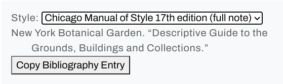
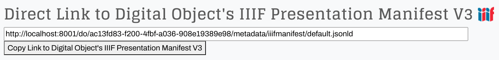
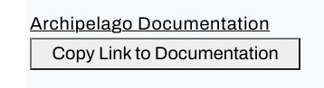

# Twig Extensions

One advantage of Drupal's integration of the [Twig](https://www.drupal.org/docs/theming-drupal/twig-in-drupal) template engine is the availability of extensions (filters and functions).

## Default Twig Extensions from Symfony

The [Symfony](https://symfony.com/) PHP framework, which is integrated into Drupal Core, provides extensions, which we use in our default templates:

* [Twig Filters from Symfony](https://twig.symfony.com/doc/2.x/filters/index.html)
* [Twig Functions from Symfony](https://twig.symfony.com/doc/2.x/functions/index.html)

## Default Twig Extensions from Drupal

Additionally, we have some very handy Drupal-specific extensions:

* [Twig Filters from Drupal](https://www.drupal.org/docs/theming-drupal/twig-in-drupal/filters-modifying-variables-in-twig-templates#s-drupal-specific-filters)
* [Twig Functions from Drupal](https://www.drupal.org/docs/theming-drupal/twig-in-drupal/functions-in-twig-templates)

## Default Twig Extensions from Archipelago

Finally, we have a growing list of extensions that apply to our own specific use cases:

### Twig Filters from Archipelago

!!! example "edtf_2_human_date"

    The `edtf_2_human_date` filter takes an EDTF date and an optional language code (defaults to English), and converts it to a human-readable format using the [EDTF PHP](https://github.com/ProfessionalWiki/EDTF) library. The list of language codes is available [here](https://github.com/ProfessionalWiki/EDTF/tree/master/i18n).

    Let's start with the following metadata fragment:
    ```json title="Metadata Fragment" hl_lines="5"
    ...
    "subject_wikidata": "",
    "date_created_edtf": {
        "date_to": "",
        "date_free": "~1899",
        "date_from": "",
        "date_type": "date_free"
    },
    "date_created_free": null,
    ...
    ```

    Then we pass the `date_free` field through the `trim` filter (as a precaution, in case there's any accidental whitespace), and then we finally hand off the field to our `edtf_2_human_date` filter:
    ```html+twig title="edtf_2_human_date" hl_lines="1 3"
    {{ data.date_created_edtf.date_free|trim|edtf_2_human_date('en') }}
    
    {# Output: Circa 1899 #}
    ```
    
!!! example "html_2_markdown"

    The `html_2_markdown` filter, as the name suggests, converts HTML to Markdown.

    We start with this string of HTML:
    ```html+twig title="HTML string"
    
    ```

    Then we pass it to the filter:
    ```html+twig title="html_2_markdown" hl_lines="1 3-7"
    {{ html_string | html_2_markdown }}
    
    {# Output:
      - One thing
      - Another thing
      - The last thing
    #}
    ```

!!! example "markdown_2_html"

    The `markdown_2_html` filter, as the name suggests, is the reverse of the above and converts Markdown to HTML.

    We start with this string of Markdown:
    ```html+twig title="Markdown string"
    
    ```

    Then we pass it to the filter:
    ```html+twig title="markdown_2_html" hl_lines="1 4-8"
    {{ markdown_string | markdown_2_html }}
    
    {# Output:
      <ul>
        <li>One thing</li>
        <li>Another thing</li>
        <li>The last thing</li>
      </ul>
    #}
    ```

!!! example "sbf_json_decode"

    The `sbf_json_decode` filter decodes a JSON-encoded string.

    We start with this string of JSON string:
    ```html+twig title="JSON string"
    
    ```

    Then we pass it to the filter:
    ```html+twig title="sbf_json_decode" hl_lines="1 3-6"
    
    
    {{ json_decoded.date_free }}
    {# Output:
      ~1899
    #}
    ```

### Twig Functions from Archipelago

!!! example "clipboard_copy"

    The `clipboard_copy` function, using the [clipboard-copy-element library](https://github.com/github/clipboard-copy-element), takes a provided CSS class for the element(s) whose text we'd like to copy, and targets the CSS class of an existing HTML element on the page or generates an HTML element that can be clicked to copy the text to the user's clipboard.

    !!! info "Usage"
    
        ```html+twig title="clipboard_copy usage" hl_lines="1"
        {{ clipboard_copy('CSS CLASS','OPTIONAL CSS CLASS(ES)','OPTIONAL TEXT') }}
        ```

        This function takes three arguments:
        
        * a CSS class for the element to copy
        * an optional CSS class (the default is `clipboard-copy-button`) or classes (space-separated) for the copy button if auto-generating or a single, unique class if using your own existing button(s) 
        * optional text (the default is `Copy to Clipboard`) for the copy button if auto-generating

    In the examples below, we want users to be able to copy the text from three different kinds of HTML elements: a `div`, an `input`, and an `a` hyperlink href.

    ??? example "Copying div element text with auto-generated button"

        First we start by giving the div element(s) we'd like to copy a unique class:

        ```html+twig title="div element text" hl_lines="2"
        <div class="csl-bib-body-container chicago-fullnote-bibliography">
          <div id="copy-csl" class="csl-bib-body">
            <div class="csl-entry">
              New York Botanical Garden. “Descriptive Guide to the Grounds, Buildings and Collections.”
            </div>
          </div>
        </div>
        ```

        Then we pass the class to the function:

        ```html+twig title="clipboard_copy for div element text" hl_lines="1"
        {{ clipboard_copy('csl-bib-body','','Copy Bibliography Entry') }}
        ```

        !!! note

            The class can be attached to parent elements of the element we are ultimately targeting if needed, but any intermediate characters may get caught up in the copied text.

        Or to give the generated button multiple classes (in case they need additional styling):

        ```html+twig title="clipboard_copy for div element text" hl_lines="1"
        {{ clipboard_copy('csl-bib-body','custom custom-button','Copy Bibliography Entry') }}
        ```

        The result for the above `div` example looks as follows:

        

        The following is the HTML for the auto-generated button with no provided CSS class:

        ```html
        <button class="clipboard-copy-button">
          <clipboard-copy for="copy-csl" tabindex="0" role="button">Copy Bibliography Entry</clipboard-copy>
        </button>
        ```

        And the following is HTML for the auto-generated button with multiple CSS classes provided:

        ```html
        <button class="custom custom-button">
          <clipboard-copy for="copy-csl" tabindex="0" role="button">Copy Bibliography Entry</clipboard-copy>
        </button>
        ```

        !!! note

            The clipboard-copy-element library requires an element ID. If the element being copied does not have an ID, one will automatically generated and assigned. 

    ??? example "Copying input element value with auto-generated button"

        First we start by giving the input element(s) we'd like to copy a unique class:

        ```html+twig title="input element value" hl_lines="7"
        
   	      <h2>
            <span class="align-middle">Direct Link to Digital Object's IIIF Presentation Manifest V3 </span>
            
          </h2>
   	      
   	      <input type="text" value="{{ iiifmanifest }}" id="iiifmanifest_copy" size="{{ iiifmanifest|length }}" class="col-xs-3 copy-content">
   	    
        ```

        Then we pass the class to the function:

        ```html+twig title="clipboard_copy for input element value" hl_lines="1"
        {{ clipboard_copy('copy-content','',"Copy Link to Digital Object's IIIF Presentation Manifest V3") }}
        ```

        Or to give the generated button multiple classes (in case they need additional styling):

        ```html+twig title="clipboard_copy for input element text" hl_lines="1"
        {{ clipboard_copy('copy-content','custom custom-button',"Copy Link to Digital Object's IIIF Presentation Manifest V3") }}
        ```

        The result for the above `input` example looks as follows:

        

        The following is the HTML for the auto-generated button with no provided CSS class:

        ```html
        <button class="clipboard-copy-button">
          <clipboard-copy for="iiifmanifest_copy" tabindex="0" role="button">Copy Link to Digital Object's IIIF Presentation Manifest V3</clipboard-copy>
        </button>
        ```

        And the following is HTML for the auto-generated button with multiple CSS classes provided:

        ```html
        <button class="custom custom-button">
          <clipboard-copy for="iiifmanifest_copy" tabindex="0" role="button">Copy Link to Digital Object's IIIF Presentation Manifest V3</clipboard-copy>
        </button>
        ```

        !!! note

            The clipboard-copy-element library requires an element ID. If the element being copied does not have an ID, one will automatically generated and assigned. 

    ??? example "Copying anchor element hyperlink href with auto-generated button"

        First we start by giving the `a` element(s) we'd like to copy a unique class:

        ```html+twig title="anchor element hyperlink href" hl_lines="7"
        <a id="copy-documentation-id" class="copy-documentation-class row" href="https://docs.archipelago.nyc">Archipelago Documentation</a>
        ```

        Then we pass the class to the function:

        ```html+twig title="clipboard_copy for anchor element hyperlink href" hl_lines="1"
        {{ clipboard_copy('copy-documentation-class','',"Copy Link to Documentation") }}
        ```

        Or to give the generated button multiple classes (in case they need additional styling):

        ```html+twig title="clipboard_copy for anchor element text" hl_lines="1"
        {{ clipboard_copy('copy-documentation-class','custom custom-button',"Copy Link to Documentation") }}
        ```

        The result for the above anchor example looks as follows:

        

        The following is the HTML for the auto-generated button with no provided CSS class:

        ```html
        <button class="clipboard-copy-button">
          <clipboard-copy for="copy-documentation-id" tabindex="0" role="button">Copy Link to Documentation</clipboard-copy>
        </button>
        ```

        And the following is HTML for the auto-generated button with multiple CSS classes provided:

        ```html
        <button class="custom custom-button">
          <clipboard-copy for="copy-documentation-id" tabindex="0" role="button">Copy Link to Documentation</clipboard-copy>
        </button>
        ```

        !!! note

            The clipboard-copy-element library requires an element ID. If the element being copied does not have an ID, one will automatically generated and assigned. 

    The above examples automatically generate `copy` buttons. They can be styled, but if we need more control over the button placement and styling, we can use our own button(s) by ensuring that they meet the following requirements:

    1. A `<copy-clipboard>` element (this can be hidden) with a `for` attribute, whose value is the ID of the source element, attached to the element acting as the button.
    2. A class on the existing button that can be targeted. The class must either be unique (if a single button) or the number of elements with the class must match the number of source elements.
    3. A separate class for the copy source(s) with the same requirements as the previous step.

    ??? example "Copying div element text with custom button"

        First we start by giving the div element(s) we'd like to copy a unique class:

        ```html+twig title="div element text" hl_lines="2"
        <div class="csl-bib-body-container chicago-fullnote-bibliography">
          <div id="copy-csl" class="csl-bib-body">
            <div class="csl-entry">
              New York Botanical Garden. “Descriptive Guide to the Grounds, Buildings and Collections.”
            </div>
          </div>
        </div>
        ```

        Then we generate the button and pass the class to the function:

        ```html+twig title="clipboard_copy custom button for div element text" hl_lines="1-3 5"
        <button class="custom-button btn btn-primary btn-sm">
          <clipboard-copy for="copy-csl">Copy Text</clipboard-copy>
        </button>

        {{ clipboard_copy('csl-bib-body','custom-button','') }}
        ```

        !!! note

            The clipboard-copy-element library requires an element ID. If the element being copied does not have an ID, one will automatically generated and assigned. 

    ??? example "Copying input element value with custom button"

        First we start by giving the input element(s) we'd like to copy a unique class:

        ```html+twig title="input element value" hl_lines="7"
        
   	      <h2>
            <span class="align-middle">Direct Link to Digital Object's IIIF Presentation Manifest V3 </span>
            
          </h2>
   	      
   	      <input type="text" value="{{ iiifmanifest }}" id="iiifmanifest_copy" size="{{ iiifmanifest|length }}" class="col-xs-3 copy-content">
   	    
        ```

        Then we generate the button and pass the class to the function:

        ```html+twig title="clipboard_copy custom button for input element value" hl_lines="1-3 5"
        <button class="custom-button btn btn-primary btn-sm">
          <clipboard-copy for="iiifmanifest_copy">Copy Input</clipboard-copy>
        </button>

        {{ clipboard_copy('copy-content','custom-button','') }}
        ```

        !!! note

            The clipboard-copy-element library requires an element ID. If the element being copied does not have an ID, one will automatically generated and assigned. 

    ??? example "Copying anchor element with custom button"

        First we start by giving the `a` element(s) we'd like to copy a unique class:

        ```html+twig title="anchor element hyperlink href" hl_lines="7"
        <a id="copy-documentation-id" class="copy-documentation-class row" href="https://docs.archipelago.nyc">Archipelago Documentation</a>
        ```

        Then we generate the button and pass the class to the function:

        ```html+twig title="clipboard_copy custom button for anchor element hyperlink href" hl_lines="1-3 5"
        <button class="custom-button btn btn-primary btn-sm">
          <clipboard-copy for="copy-documentation-id">Copy Link</clipboard-copy>
        </button>

        {{ clipboard_copy('copy-documentation-class','custom-button','') }}
        ```

        !!! note

            The clipboard-copy-element library requires an element ID. If the element being copied does not have an ID, one will automatically generated and assigned. 

!!! example "sbf_entity_ids_by_label"

    The `sbf_entity_ids_by_label` function, as the name suggests, provides a Drupal entity ID for the following Drupal entity types:

    * node
    * taxonomy_term
    * group
    * user 

    If we start with the user entity `jsonapi`, we can do the following:
    ```html+twig title="sbf_entity_ids_by_label" hl_lines="1 4 8"
    

    
      {{ jsonapi_user_id }}
    

    {# Output:
      3
    #}
    ```

    As you can see above, the `sbf_entity_ids_by_label` function takes three arguments:

    * the entity label
    * the entity type (see above for supported types)
    * an optional entity bundle

    We then loop through the returned result, which is an array of IDs (in this case, just a single one).

!!! example "sbf_search_api"

    The `sbf_search_api` function executes a search API query against a specified index.

    ```html+twig title="sbf_search_api" hl_lines="1"
    
    
    <ul>
      
        <li>{{ label }}</li>
      
    </ul>
    ```

    As you can see above, the `sbf_search_api` function takes eight arguments:

    * The machine name of the Search API index to search against (string)
    * A full text term to search (string)
    * An array of full text fields to search the term against. If empty all will be used. (array)
    * The fields => filters to match against (associative array)
    * The fields to facet (array)
    * The fields to sort against (associative array)
    * Offset for the results (int)

    For this example we end up with the following output:

    * JPEG File Interchange Format
    * Organic farming--United States
    * Strawberries
    * Strawberry Field at Thorpes Organic Family Farm
    * organic agriculture
    * strawberries
