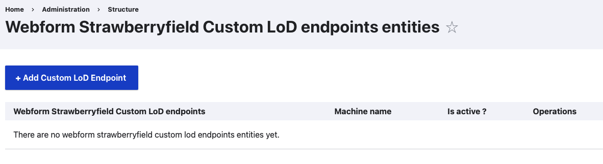
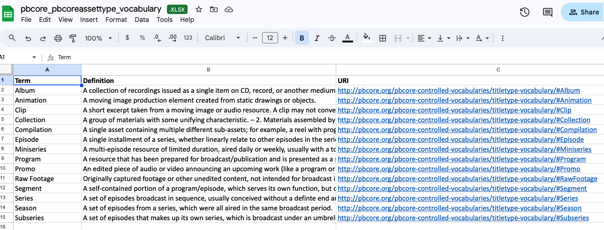
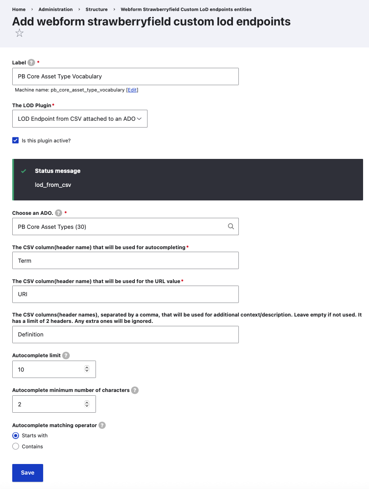
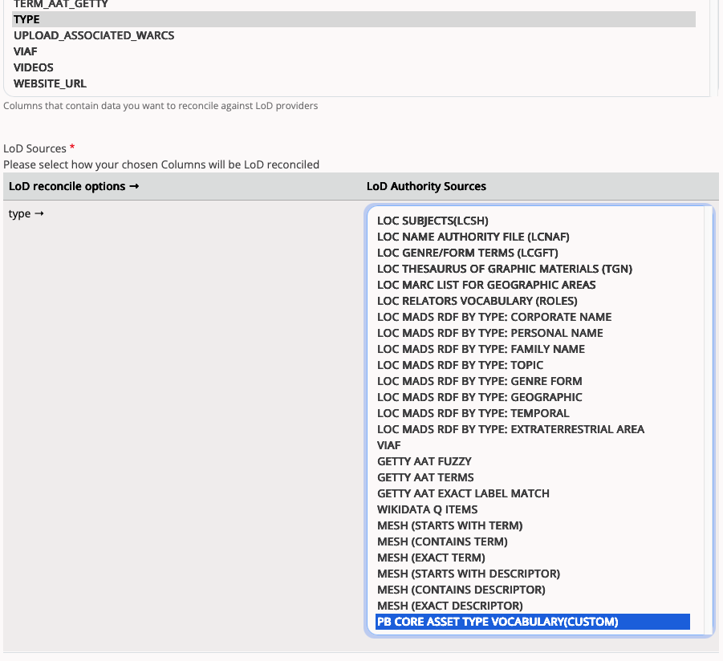
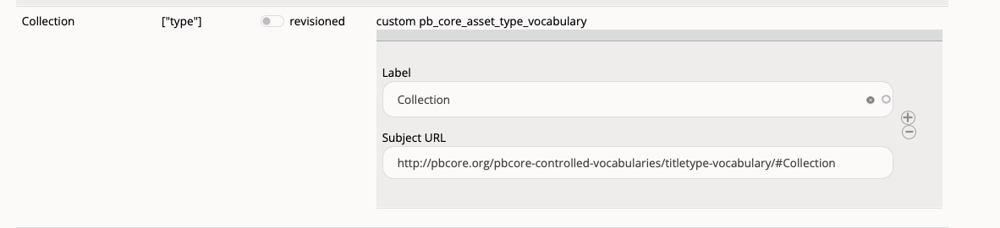

### Webform Strawberryfield Custom LoD Endpoints

Archipelago's 1.6.0+ release (December 2025) features a new functionality area for enabling custom LoD endpoints for Archipelago's [AMI Linked Data Reconciliation](ami_lod_rec.md) process. 

You can find the DataCite Webform Strawberryfield Custom LoD Endpoints Configuration Form:

- Through the `Manage` menu > `Structure` > `Webform SBF Custom LoD Endpoints`
- Directly at `admin/structure/webform_strawberryfield_lod` 

## How to Use

1. First, create a custom ADO using the steps outlined in [Archipelago's 'Webform LoD from CSV attached to an ADO suggest'](webformLoDfromCSV.md) documentation guide. For the example screenshots shown below, the '[PB Core Asset Type](https://pbcore.org/pbcore-controlled-vocabularies/pbcoreassettype-vocabulary/)' vocabulary was used.

2. Next, navigate to the `Webform Strawberryfield Custom LoD endpoints entitie`s page and select `Add Custom LoD endpoint`. Fill in the form as shown in the following screenshot, except reference the custom ADO you created in Step 1 under 'Choose an ADO' and be sure to use the column headings found in your custom ADO's associated CSV file. Be sure to Save your configuration form when you are ready.

3. Navigate to an AMI Set and select the 'Reconcile LoD' tab. You should now see your Custom LoD Endpoint listed under the 'LoD Authority Sources'.

Example successful match on the AMI Reconciliation Form:

Please see our [Using AMI's Linked Data Reconciliation](ami_lod_rec.md) guide for more information about Archipelago's LoD Reconciliation workflows.

___

Thank you for reading! Please contact us on our [Archipelago Commons Google Group](https://groups.google.com/forum/#!forum/archipelago-commons) with any questions or feedback.

Return to the [Archipelago Documentation main page](index.md).
