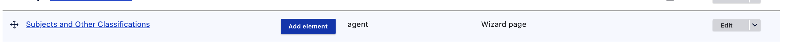
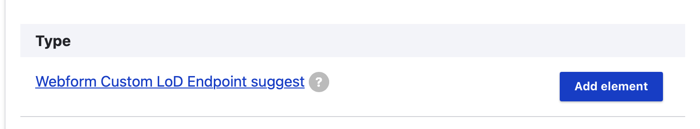
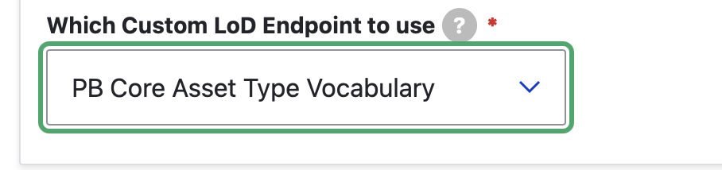
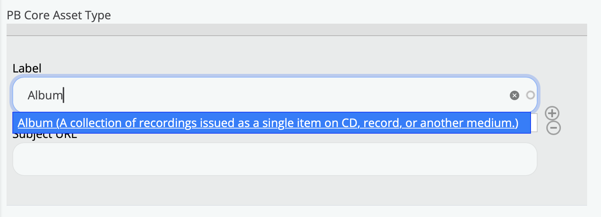

### Webform Strawberryfield Custom LoD Endpoints

Archipelago's 1.6.0+ release (December 2025) features a new functionality area for enabling custom LoD endpoints for Archipelago's [AMI Linked Data Reconciliation](ami_lod_rec.md) process. 

You can find the DataCite Webform Strawberryfield Custom LoD Endpoints Configuration Form:

- Through the `Manage` menu > `Structure` > `Webform SBF Custom LoD Endpoints`
- Directly at `admin/structure/webform_strawberryfield_lod` 

## How to Use

### Initial Setup

1. First, create a custom ADO using steps 1 and 2 outlined in [Archipelago's 'Webform LoD from CSV attached to an ADO suggest'](webformLoDfromCSV.md) documentation guide. For the example screenshots shown below, the '[PB Core Asset Type](https://pbcore.org/pbcore-controlled-vocabularies/pbcoreassettype-vocabulary/)' vocabulary was used.

2. Next, navigate to the `Webform Strawberryfield Custom LoD endpoints entitie`s page and select `Add Custom LoD endpoint`. Fill in the form as shown in the following screenshot, except reference the custom ADO you created in Step 1 under 'Choose an ADO' and be sure to use the column headings found in your custom ADO's associated CSV file. Be sure to Save your configuration form when you are ready.

### Use in AMI Set LoD Reconciliation

* Navigate to an AMI Set and select the 'Reconcile LoD' tab. You should now see your Custom LoD Endpoint listed under the 'LoD Authority Sources'.

Example successful match on the AMI Reconciliation Form:

Please see our [Using AMI's Linked Data Reconciliation](ami_lod_rec.md) guide for more information about Archipelago's LoD Reconciliation workflows.

### Use as a Webform Element

* Go to `Admin > Structure > Webforms` and select the 'Build' button beside the Default Descriptive Metadata Webform (or whatever webform you are wanting to add this Custom LoD Endpoint element to).

* Scroll down to the 'Subjects and Other Classifications' page of the Webform and select 'Add Element'.

    

* In the 'Select an element to add ..' popup that opens, either scroll down to select the 'Composite Element' section or search for the 'Webform Custom LoD Endpoint suggest.' 

* Select 'Add Element'.

    

#### Webform Element 'Edit' Tab

In the 'Edit' tab that opens for your newly added webform element, you will need to review the following sections.

* **Element Settings**

    - provide a Title for your element
    - check that the Key generated from the Title you supply is well formed and make changes if needed
    - specify the 'Allowed number of values'

* **Webform Custom LoD Endpoint suggest settings**:

    - It is recommended to keept both 'label' and 'uri' checked as Visible.
    - You may also wish to mark both elements as 'Required'

* **Which Custom LoD Endpoint to use**

    - Select the Custom LoD Endpoint to use in the dropdown menu.

    

#### Advanced Tab for Webform Element

Navigate to the 'Advanced' tab for this Webform element.

* Open the 'Multiple settings' section
* Deselect the options to 'Allow users to sort elements' and 'Allow users to add more items'

#### Save Your Work & Use Your New Webform Element

Save your new form element settings. Then Save your updated Webform.

Navigate to a Digital Object in your repository that you would like to use this new custom vocabulary element with. 

* Select 'Edit' for that Digital Object and navigate to the 'Subjects and Other Classifications' page of the webform.
* Begin typing a label found in your prepared CSV associated with the webform element.

    

You can now begin using this custom vocabulary element when using the corresponding webform (where you added this element) to Edit and Update your Digital Objects. You may also wish to add this same element to the Default Digital Object Collection/Creative Work Series webform.

___

Thank you for reading! Please contact us on our [Archipelago Commons Google Group](https://groups.google.com/forum/#!forum/archipelago-commons) with any questions or feedback.

Return to the [Archipelago Documentation main page](index.md).
