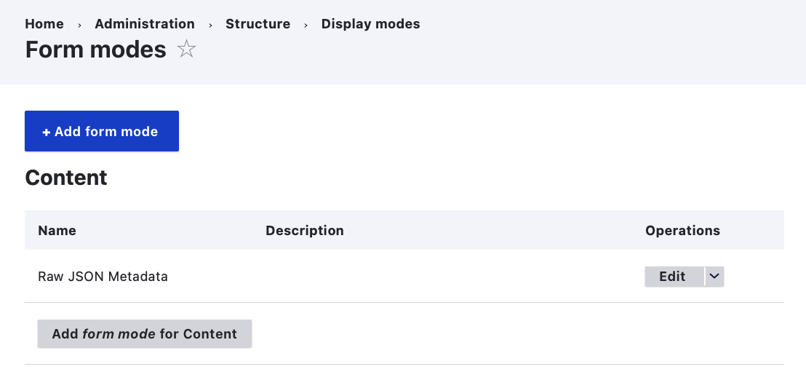
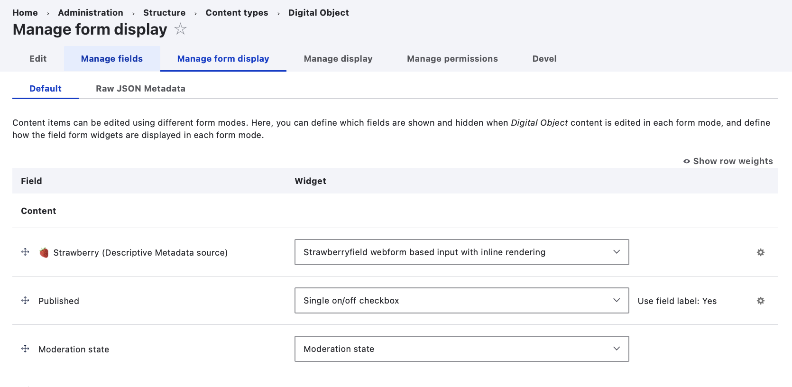
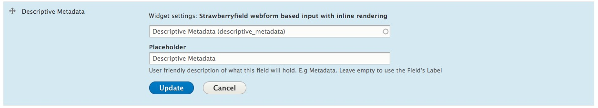
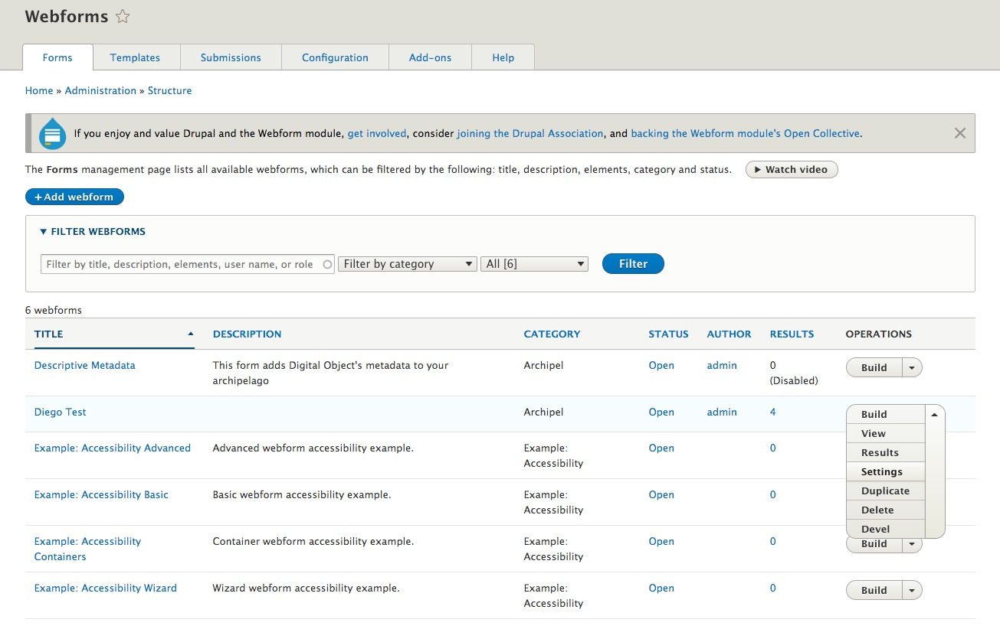
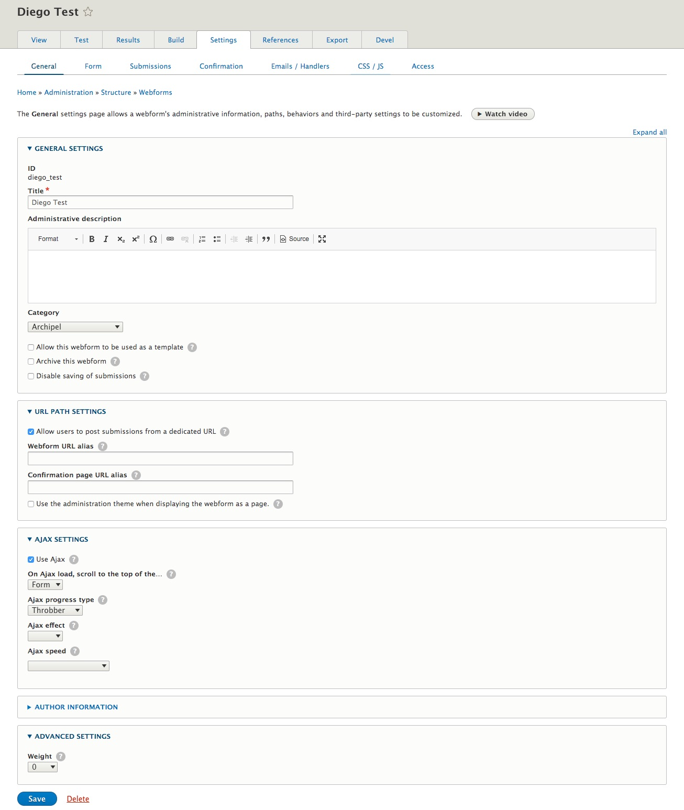
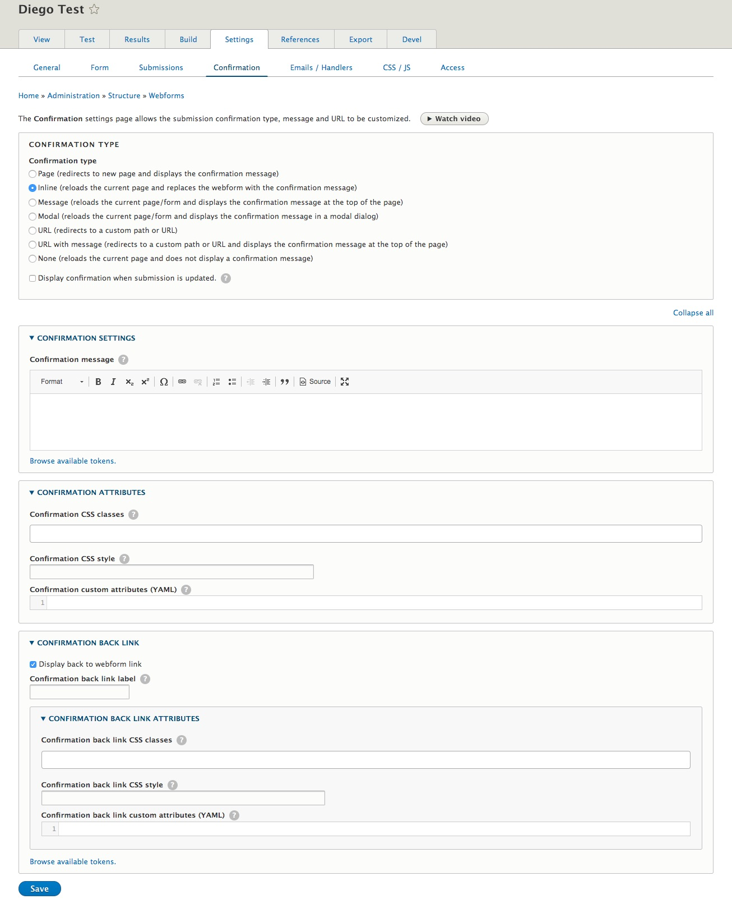
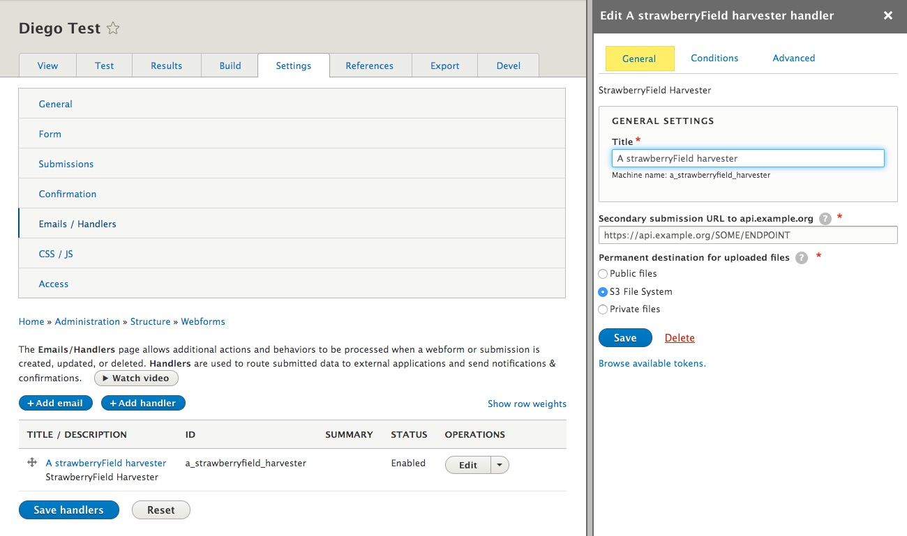
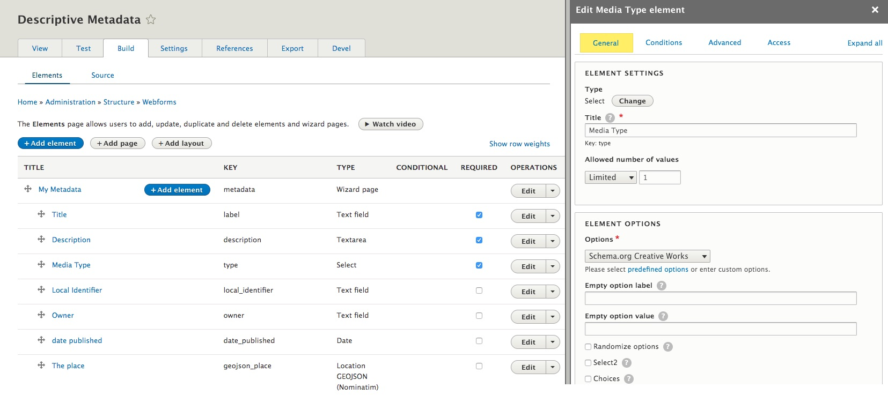

# How to Create a Webform as an Input Method for Archipelago Digital Objects (ADO)

Drupal provides a lot of out-of-the-box functionality to setup the way Content Entities (Nodes or in our case ADOs) are exposed to users with the proper credentials. This guide will explain additional information about 'Form Modes', which enable users with proper credentials to fill inputs or edit existing values for the Drupal `field` a Content Entity provides--in our case, an Archipelago Strawberryfield filled with JSON data and metadata for Digital Objects.

Please refer to our [Primer on Display Modes](primerdisplaymodes.md) for a little more information about both Display and Form Modes. Please also refer to our main [Webforms documentation page](webforms.md) for more information about working with Webforms in Archipelago.

## Form Modes

You can navigate to the Form Modes configuration area at `yoursite/admin/structure/display-modes`.



### How Drupal + Archipelago integrate Form Modes

- In Drupal, each `field` attached to a Content Entity can have a Form Mode Widget applied and most of them have configuration options.
- Widgets do one thing right: they expose some type of Form/UI interaction that allows a user to input data into the Entity, under that specific field. And of course they make sure that what you input is validated and saved (if good) correctly.
- For both Drupal and Archipelago instances, which Widgets are available for your Content Entity will depend on the "type" of field the Content Entity has.
    - Example: A `Node` Title will have a single Text Input with some options, like the size of the Textfield used to feed it.
    - More Complex and fun fields, like the ones of type `SBF` (strawberryfield), will provide a larger list of possible Widgets, ranging from raw JSON input (which you could select if your data was already in the right format) to the reason we are reading this: `Webform driven Widgets`. These Widgets include:
        - ones the _webform_strawberryfield_ Drupal module provides
        - ones that use an existing Webform (which are also Entitites!) which either 1) you created or 2) we provided as a setting
- In Archipelago, if you chose a widget other than the raw JSON, the widget will take the raw JSON to build, massage and enrich the data so that it can be presented in a visual format by the SBF. This is because a SBF type of field has much more than just a text value. It contains a full graph of metadata and properties, inclusive links to Files and provenance metadata, which for example allows us to use an Upload field directly in the attached/configured webform.
- Form modes also have an additional benefit. Each one can have fine grained permissions. That way you can have many different Form Modes, but allow only certain ones to be visible, or usable by users of a given Drupal Role.

## Manage Form Display

To enable, configure, and customize Form Modes, you have to navigate to the Content Type Configuration page in your running Archipelago. This is found at `/admin/structure/types`.

You can see that for every existent Content Type, there is a drop down menu with options. Select 'Manage Form Display' beside either the `Digital Object` or `Digital Object Collection` types, which will lead you to configuration page where you can setup each Form Mode and configure additional related settings.



On the top line below the main 'Edit' tab section, you will see all of your configured Form Modes Listed, with the `Default` one selected and expanded.

The Table that follows has one row per Field attached/part of your selected Content Type. The list of Fields here is shorter, the SBF CopyFields are not present because all data goes really only into real fields (aka, the single JSON strawberryfield associated with a Digital Object and the other real Drupal fields required for all Content Types). There are also see some other, display only Fields (means you cannot modify them) that will not appear here. Again, some of the Fields are part of the Content Type itself. In the above screenshot, for the Digital Object (content type/bundle), there is a single Strawberry (Descriptive Metadata source) Field and some other general Fields that are common to every Content Entity derived from a Drupal Node ('Published', 'Moderation State', etc).

In this same table, the "Field" column contains each field name and the Widget Column allows you to select what type of Input you are going to use to feed it on Ingest/edit. On the right you will see a little gear, which allows you to configure the settings for a particular Widget. Those settings apply always only to the current Form Mode.

For this example overview, the Widget we want to understand is the one attached to the "Descriptive Metadata" field, named "Strawberryfield webform based input with inline rendering". There are two others, but let's start with the main Strawberryfield (SBF). In your local Archipelago instance, press on the Gear to the right on that same row.



As you can see, there are not too many options. The main, first text input is an Autocomplete field that will resolve against your existing Webforms. If you want to use your own Webform to feed a SBF, what do you do? You type the name, let the autocomplete work, select the right Webform, maybe your own custom one, and then you press "Update". Once that is done you need to "Save" your Form Mode (button is at the bottom of the page).

We wish life was that easy (and it will be once we are done with refining Drupal's UI), but for now there are some extra things you need to do to make sure the Webform, your custom one, can speak JSON. The default one you get named also "Descriptive Metadata (descriptive_metadata)", same as the field, is already setup to be used. Means if you create a new Webform by Copying that one, you can start using it immediately. But if you created one from scratch (Different tutorial) you need to setup some settings.

## Setting up a Webform to talk Strawberryfield

Navigate to your Webform Managment form at `/admin/structure/webform`



If you already created a Webform (different tutorial on how to do that) you will see your own named one in that list. I created for the purpose of this documentation one named "Diego Test" (Hi, i'm Diego..) and on the most right Column, "Operations" you will have a dropdown menu. On your own Webform row, press on "Settings".

First time through, this setup can be a little bit intimidating. We recommend going baby steps since the Webform Module is a very powerful one and also exposes you to a lot (and sometimes too many) options. Even more, if you are new to Webforms, we recommend you to copy the "Descriptive Metadata" Webform we provided first, and make small changes to it (starting by naming it your own way!) so you can see how that affects your workflow and experience, and how that interacts with the created metadata. The Webform Module provides testing and building capabilities, so you have a Playground there before actually ingesting ADOs. Copying it will also make all the needed settings for SBF interaction to be moved over, so your work will be much easier.

But we know you did not do that (where is the fun there right?). So lets setup one from scratch.

### General Settings



Gist here is (look at the screenshot and copy the settings):

- GENERAL Settings: Check "Disable saving of submissions" option. You won't need this form to generate a Native Webform Submission entry.
- AJAX Settings: Check "use ajax" option. We want people to have the experience of staying in a single page while the create a new ADO via a Multi Step Webform Workflow.

### Confirmation Settings



Gist here is (again, look at the screenshot and copy the settings):

- Select "Inline Confirmation". You don't want Webform to send your user to another page while they are still ingesting their ADOs.

### Handler



The glue, the pièce de résistance: the `handler` is the one that knows how to talk to a SBF. In simple words, the handler (any handler) provides functionality that does something with a Webform Submission. The one that you want to select here is the "Strawberryfield harvester" handler. Add it, name it whatever you like (or copy what you see in the screenshot) and make sure you select, if running using our deployment strategy, "S3 File System" as the option for "Permanent Destination for uploaded files". The wording is tricky there, its not really Permanent (since that is handled by Archipelago), but is more akin to Temporary while working on ingesting an Object destination for the Webform. It's not really wrong neither. It's permanent for the Webform, but we have better longer term plans for the files and metadata!

Save your settings. And then you are ready to roll. That webform can now be used as a Setting for any of the StrawberryField Widgets that use Webforms.

Finally (the real finally). Archipelago encourages at least one Field/JSON key to be present always. One with "type" as key value. So make sure that your Custom Webform has that one.

There are two ways of doing that:

- You can copy how it is setup from the provided Webform's Elements, from the main Descriptive Metadata Webform and then add one "select" element to yours using the same "type" "key".Important in Archipelago is always the key value since that is what builds the JSON for your metadata. The Description can be any, but for UI consistency you could want to keep it the same across all your webforms.

    

- Or, advanced, you can use the import/export capabilities (Webforms are just YAML files!) and export/copy your custom one as text, add the following element before or after some existing elements there:

    ```YAML
     type:
          '#type': select
          '#title': 'Media Type'
          '#options': schema_org_creative_works
          '#required': true
          '#label_attributes':
            class:
              - custom-form-input-heading
    ```

- And then reimport. 
- Having a "type" value will make your life easier. You don't need it, but everything works smoother that way.
- Since you have a single Content Type named Digital Object, having a Webform field that has as key "type", which leads to a "type" JSON key, allows you to discern the Nature of your Digital Object, book or Podcast, Image or 3D and do smart, nice things with them.


Again, please refer to our main [Webforms documentation page](webforms.md) for more information about working with Webforms in Archipelago.

___

Thank you for reading! Please contact us on our [Archipelago Commons Google Group](https://groups.google.com/forum/#!forum/archipelago-commons) with any questions or feedback.

Return to the [Archipelago Documentation main page](index.md).
