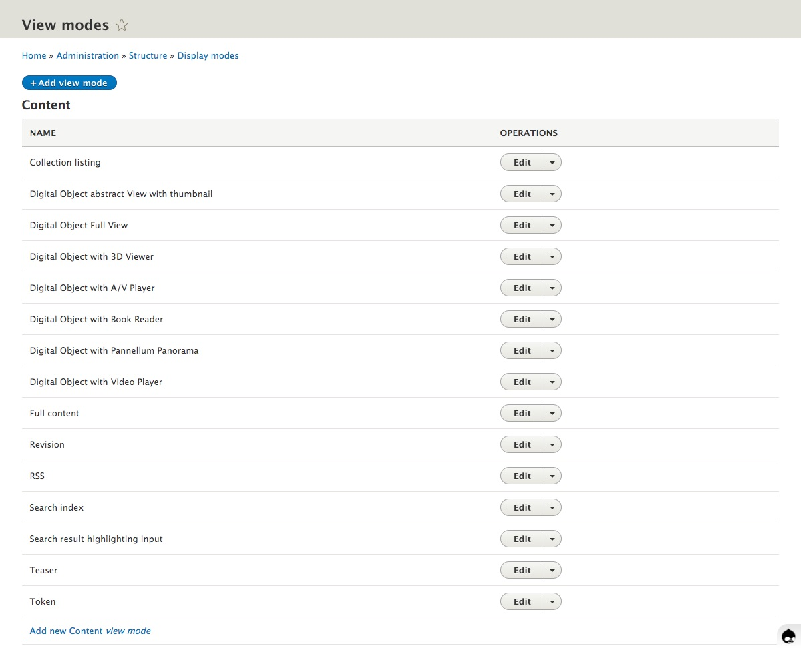
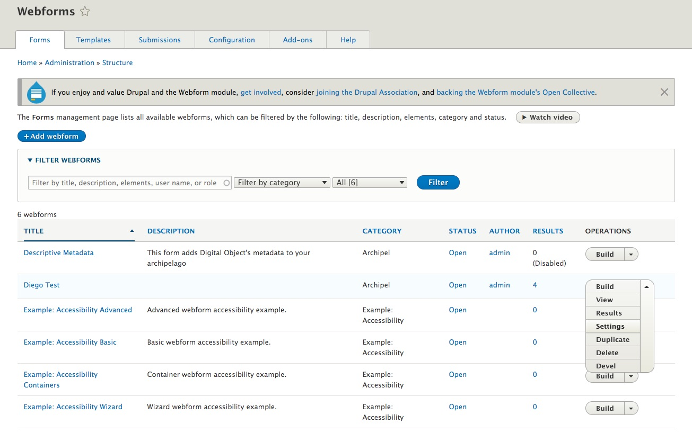
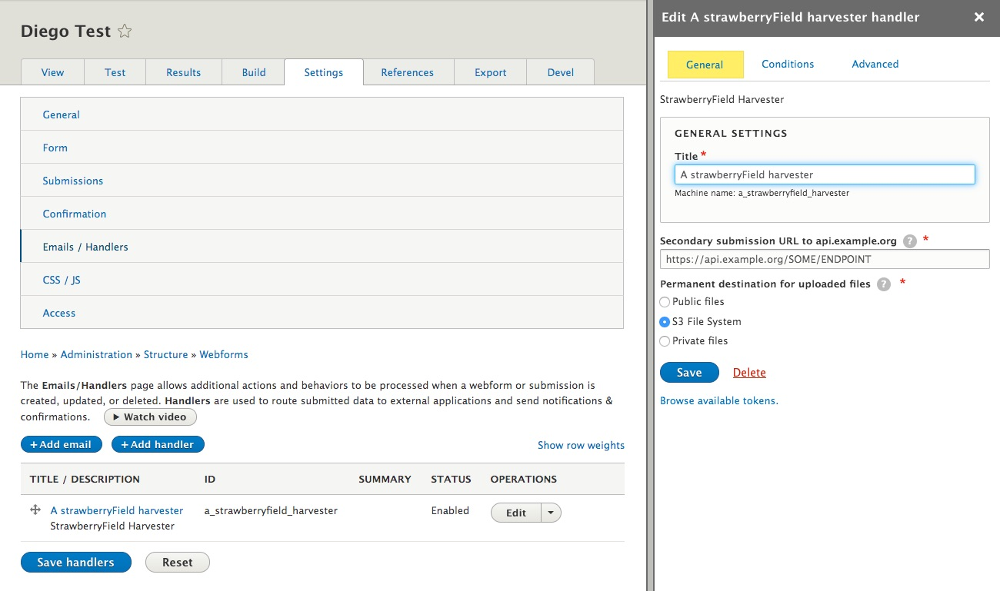

# How to Create a Webform as an Input Method for Archipelago Digital Objects (ADO) / Primer on Display Modes

Drupal 8/9 provides a lot of out-of-the-box functionality to setup the way Content Entities (Nodes or in our case ADOs) are exposed to users with the proper credentials. That functionality lives under the "Display Modes" and can be accessed at `yoursite/admin/structure/display-modes`.


In a few quick words, The Display Mode Concept covers: formatting your Content Entities and their associated Fields so when a user lands on a Content Page, they are displayed in a certain, hopefully pleasing, way and also how users with proper Credentials can fill inputs/edit values for each `field` a Content Entity provides.

First, formatting output (basically building the front facing page for each content entity) is done by a `View Mode`. Second, defining how/what input method you are going to use to create or edit Content entities, is handled by a `Form Mode`. Both Modes, are, in Drupal Lingo, Configuration Entities, they provide things you can configure, you can name them and reuse them and those configurations can all be exported and reimported using YAML files. Also both Modes the following in common:

- Drupal always provides a "default" one that can not be deleted.
- You can create new ones.
- You can apply permissions to them.
- All Modes work on "fields", means the tiny little input/output pieces that are either part of a Content Entity or attached to them (the title, the Body, and in our case a Strawberryfield (SBF),
- They Provide Config/setting options for each Field.
- They are always associated to Content Types/Bundles. Means all Nodes of the same Content type will share the same modes.

The main difference, other than their purpose (Output v/s Input) is that, on View Modes, the settings you apply to each field are associated to "Formatters" and on Form Modes, the settings you apply to each field are connected to "Widgets".

So, resuming, this is what lives under the Concept of a "Display Mode":

## View Mode



- Each field attached to a Content Entity can have a Formatter applied and most of them have configuration options.
- Formatters do one thing right: they take the raw, stored value and make it "visible" inside Drupal.
- Which formatters are available will depend on the "type" of field the Content Entity has.
    - E.g A Node title/Label will have a Title formatter with the option of just displaying a text or a text with a link to the entity.
    - More Complex and fun Fields, like the ones of type `SBF` will provide a large list of possible `Formatters`, like IIIF driven viewers, Video formatters, Metadata Display (Twig template driven) ones, etc. This is because a SBF type of field has much more than just a text value, it contains a full graph of metadata and properties, inclusive links to Files and provenance metadata.

## Form Mode


- Each field attached to a Content Entity can have a Widget applied and most of them have configuration options.
- Widgets do one thing right: they expose some type of Form/UI interaction that allows a user to input data into the Entity, under that specific field. And of course they make sure that what you input is validated and saved (if good) correctly.
- Which Widgets are available will depend on the "type" of field the Content Entity has.
    - Example: A `Node` Title will have a single Text Input with some options, like the size of the Textfield used to feed it.
    - More Complex and fun fields, like the ones of type `SBF` (strawberryfield), will provide a larger list of possible Widgets, ranging from raw JSON input (which you could select if your data was already in the right format) to the reason we are reading this: `Webform driven Widgets`. These Widgets include:
        - ones the _webform_strawberryfield_ Drupal module provides
        - ones that use an existing Webform (which are also Entitites!) which either 1) you created or 2) we provided as a setting

    If you chose a widget other than the raw JSON, the widget will take the raw JSON to build, massage and enrich the data so that it can be presented in a visual format by the SBF. This is because a SBF type of field has much more than just a text value. It contains a full graph of metadata and properties, inclusive links to Files and provenance metadata, which for example allows us to use an Upload field directly in the attached/configured webform.
- Form modes also have an additional benefit. Each one can have fine grained permissions. That way you can have many different Form Modes, but allow only certain ones to be visible, or usable by users of a given Drupal Role.

### I think i get this...but how can i use this knowledge now?

Good question! So, to enable, configure, and customize these Display Modes you have to navigate to your `Content Type` Configuration page in your running Archipelago. This is found at `/admin/structure/types`. Note: the way things are named in Drupal can be confusing to even the most deeply committed Drupal user, so bear in mind some terms will change. Feel free to read and re-read.


You can see that for every existent Content Type, there is a drop down menu with options:

- Manage Display: will lead you to configuration page where you can setup each View Mode and its settings for a given Content Type
- Manage Form Display: will lead you to configuration page where you can setup each View Mode and its settings for a given Content Type

## Manage Display


On the top you will see all your View Modes Listed, with the `Default` one selected and expanded.
The Table that follows has one row per Field attached/part of this Content Type. Some of the fields are part of the Content Type itself, in this case Digital Object (bundled) and some other ones are common to every Content Entity derived from a Node.
The "Field" column contains each field name (not their type, reason why you don't see Strawberry Field there!) but we can tell you right now that there is one, named "Descriptive Metadata", that is of `SBF` type.

??? info "Wait! Which are the fields in my Content Type?"

    How do we know that the field named "Descriptive Metadata" is a Strawberryfield? Well, we set-up the Digital Object Content Type for you that way, but also you can know what we know by pressing on "Manage fields" Tab on the top (don't forget to come back to "Manage display", afterwards!)
    
    
    
    *Also Surprise:* You Content Entity has really really just 2 fields! And that, friends, is one of the secret ingredients of Archipelago. All goes into a Single Field.
    But wait: i see more fields in my Manage Display table. Why?
    Well. Some of them are base fields, part of what a Drupal Node is: base field means you can not remove them, they are part of the Definition itself. One obvious one is the `Title`.
    
    But there are also some fields very particular to Archipelago: You can see there are also ones named
    "Formatter Object Metadata", "Media" and one named "Static Media"!. Where does come from? Those are also Strawberryfields. It sounds confusing but it is really simple. They are really not "fields" in the sense of having different data than "Descriptive Metadata". Those are In Memory, realtime, copies of the "Descriptive Metadata" SBF field and are there to overcome one limitation of Drupal 8:
    >Each Field can have a single "Formatter" setup per field.
    
    But we want to re-usue the JSON data to show a Viewer, Show Metadata as HTML directly on the ADO/NODE landing page, and we want also to, for example, format sometimes images as Thumbnails and not using a IIIF viewer only. This CopyFields (Legal term) have also a nice Performance advantage. Drupal needs to fetch only once the data from the real Field, "Descriptive Metadata", from the database. And then just makes the data available in real time to its copies. That makes all fast, very very fast! And of course flexible. As you dig more into Archipelago you will see the benefits of this approach. Finally, if you need to, you can make more CopyFields. But the reality is, there is a single, only one, SBF in each Digital Object and its named "Descriptive Metadata".

You can also simply not care about the type and trust the UI. It will just show Formatters that are right for each type and expose Configuration options (and a little abstract of the current ones) under the Widget Column. Operations Columns allows you to setup each Widget. Widget term here is a bit confusing. These are not really Widget in terms of Data Input, but in terms of "Configuration" Input. But D8/9 is evolving and its getting better. Those settings apply always only to the current View Mode.

You can play with this, experiment and change some settings to get more comfortable. We humbly propose you that you complete this info with the official Drupal 8 Documentation and also apply custom settings to your own, custom View Mode so you don't end changing base, expected functionality while you are still learning.

## Manage Form Display


On the top you will see all your Form Modes Listed, with the `Default` one selected and expanded.
The Table that follows has one row per Field attached/partof this Content Type. The list of fields here is shorter, the SBF CopyFields are not present because all data goes really only into real fields. Also some other, display only ones (means you can not modify them) will not appear here. Again, Some of the fields are part of the Content Type itself, in this case Digital Object (bundled) and some other ones are common to every Content Entity derived from a Node.
"Field" column contains each field name and the Widget Column allows you to select what type of Input you are going to use to feed it on Ingest/edit. On the right you will see again a little gear, that allows you to configure the settings for a particular Widget. Those settings apply always only to the current Form Mode.

So. The one we want to understand is the one attached to the "Descriptive Metadata" field. Currently one named "Strawberryfield webform based input with inline rendering". There are other two. But let's start with this. Press on the Gear to the right on the same row.


AS you can see there are not too many options. But, the main, first Text input is an Autocomplete field that will resolve against your existing Webforms.
So, guess what. If you want to use your own Webform to feed a SBF, what do you do? You type the name, let the autocomplete work, select the right Webform, maybe your own custom one, and the you press "Update". Once that is done you need to "Save" your Form Mode (hint, button at the bottom of the page).

We wish life was that easy (and it will once we are done with refining Drupal's UI) but for now there are some extra things you need to do to make sure the Webform, your custom one, can speak JSON. The default one you get named also "Descriptive Metadata (descriptive_metadata)", same as the field, is already setup to be used. Means if you create a new Webform by Copying that one, you can start using it inmediately. But if you created one from scratch (Different tutorial) you need to setup some settings.

## Setting up a Webform to talk Strawberryfield

Navigate to your Webform Managment form at `/admin/structure/webform`



If you already created a Webform (different tutorial on how to do that) you will see your own named one in that list. I created for the purpose of this documentation one named "Diego Test" (Hi, i'm Diego..) and on the most right Column, "Operations" you will haven an Drop Down Menu. On your own Webform row, press on "Settings".

First time, this can be a little bit intimitading. We recommend going baby steps since the Webform Module is a very powerful one but also exposes you to a lot (and sometimes too many) options. Even more, if you are new to Webforms, we recomment you to copy the "Descriptive Metadata" Webform we provided first, and make small changes to it (starting by naming it your own way!) so you can see how that affects your workflow and experience, and how that interacts with the created metadata. The Webform Module provides testing and building capabilities, so you have a Playground there before actually ingesting ADOs. Copying it will also make all the needed settings for SBF interaction to be moved over, so your work will be much easier.

But we know you did not do that (where is the fun there right?). So lets setup one from scratch.

### General Settings


Gist here is (look at the screenshot and copy the settings):

- GENERAL Settings: Check "Disable saving of submissions" option. You won't need this form to generate a Native Webform Submission entry.
- AJAX Settings: Check "use ajax" option. We want people to have the experience of staying in a single page while the create a new ADO via a Multi Step Webform Workflow.

### Confirmation Settings


Gist here is (again, look at the screenshot and copy the settings):

- Select "Inline Confirmation". You don't want Webform to send your user to another page while they are still ingesting their ADOs.

### Handler



The glue, the piece of resistance. The handler is the one that knows how to talk to a SBF. In simple words, the handler (any handler) provides functionality that does something with a Webform Submission. The one that you want to select here, is the "Strawberryfield harvester" handler. Add it, name it whatever you like (or copy what you see in the screenshot) and make sure you select, if running using our deployment strategy, "S3 File System" as the option for "Permanent Destination for uploaded files". The wording is tricky there, its not really Permanent, since that is handled by Archipelago, but more to Temporary, while working in ingesting an Object, destination for the Webform. Its not really wrong neither. Its permanent for the Webform, but we have better plans for the files and metadata!

Save your settings. And you are ready to roll. That webform can now be used as a Setting for any of the StrawberryField Widgets that use Webforms.

Finally (the real finally). Archipelago encourages at least one Field/JSON key to be present always. One with "type" as key value. So make sure that your Custom Webform has that one.

There are two ways of doing that:

- You can copy how it is setup from the provided Webform's Elements, from the main Descriptive Metadata Webform and then add one "select" element to yours using the same "type" "key".Important in Archipelago is always the key value since that is what builds the JSON for your metadata. The Description can be any, but for UI consistency you could want to keep it the same across all your webforms.

    

- Or, advanced, you can use the import/export capabilities (Webforms are just YAML files!) and export/copy your custom one as text, add the following element before or after some existing elements there

    ```YAML
     type:
          '#type': select
          '#title': 'Media Type'
          '#options': schema_org_creative_works
          '#required': true
          '#label_attributes':
            class:
              - custom-form-input-heading
    ```
    
    And then reimport.
    
    Having a "type" value will make your life easier. You don't need it, but everything works smoother that way.
    
    Since you have a single Content Type named Digital Object, having a Webform field that has as key "type", which leads to a "type" JSON key, allows you to discern the Nature of your Digital Object, book or Podcast, Image or 3D and do smart, nice things with them.

___

Thank you for reading! Please contact us on our [Archipelago Commons Google Group](https://groups.google.com/forum/#!forum/archipelago-commons) with any questions or feedback.

Return to the [Archipelago Documentation main page](index.md).
