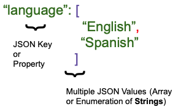
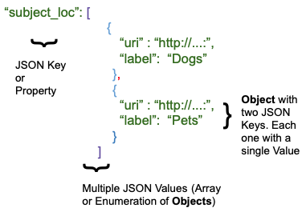

# Working with Twig in Archipelago

The following information can also be found in this Presentation from the "Twig Templates and Archipelago" Spring 2021 Workshop:

- [Twig Templates and Archipelago](https://tinyurl.com/archipelagoandtwig)

## Prerequisites (with food analogy)

1. Know your Data/Metadata. What do I have? :thinking:
    - What do I have in my Fridge? Do I have Tofu? Do I have Peppermint :candy:? One Bunch?
2. Know your final desired output Document: MODS, HTML, GEOJSON, etc. 
    - What are you going to cook :cook:? Do you have a picture of the Curry :curry:? Have you ever had Curry :stew:?
3. Know your Twig Basics
    - How to cut and dice :knife:, steam and sauté :bowl_with_spoon:
4. Do not be afraid
    - You can’t get burned :fire: here and Ingredients :strawberry: do not expire!
5. Ask for help. Slack/Google Groups/Postcards :email: :mailbox_with_mail:
    - Seeing others cook helps and also motivates. Others may share some spices. :hot_pepper:
6. Use and Share your findings!
    - Eat what you cook. :cookie: Share with friends and family. :cake:

!!! note

    _All examples shown below are using the following JSON snipped from [Laddie the dog running in the garden, Bronx, N.Y., undated [c. 1910-1918?]](https://archipelago.nyc/do/17355bdb-d784-4037-96fe-5c160296e639)._

??? info "Click to view image of the JSON snippet."

    

??? info "Click to view this snippet as JSON."

    ```json
    {
        "type": "Photograph",
        "label": "Laddie the dog running in the garden, Bronx, N.Y., undated [c. 1910-1918?]",
        "owner": "New-York Historical Society, 170 Central Park West, New York, NY 10024, 212-873-3400.",
        "rights": "This digital image may be used for educational or scholarly purposes without restriction. Commercial and other uses of the item are prohibited without prior written permission from the New-York Historical Society. For more information, please visit the New-York Historical Society's Rights and Reproductions Department web page at http:\/\/www.nyhistory.org\/about\/rights-reproductions",
        "language": [
            "English"
        ],
        "documents": [],
        "publisher": "",
        "ismemberof": "111",
        "creator_lod": [
            {
                "name_uri": "",
                "role_uri": "http:\/\/id.loc.gov\/vocabulary\/relators\/pht",
                "agent_type": "personal",
                "name_label": "Stonebridge, George Ehler",
                "role_label": "Photographer"
            }
        ],
        "description": "George Ehler Stonebridge (d. 1941) was an amateur photographer who lived and worked in the Bronx, New York.",
        "subject_loc": [
            {
                "uri": "http:\/\/id.loc.gov\/authorities\/subjects\/sh85038796",
                "label": "Dogs"
            }
        ],
        "date_created": "1910-01-01"
    }
    ```

## First: Know Your Data

Understanding the basic structure of your JSON data. 

1. Single JSON Value.

    

    - For `"type": "Photograph"`
        - "type" = JSON Key or Property
        - "Photograph" = Single JSON Value (string)

2. Multiple JSON Values (Array of Enumeration of **Strings**)

    
    - For `"language": ["English","Spanish"]`
        - "language" = JSON Key or Property
        - "["English","Spanish"]" = Multiple JSON Values (Array of Enumeration of **Strings**)

3. Multiple JSON Values	(Array of Enumeration of **Objects**)

    

    - For `"subject_loc":[{"uri":"http://..","label":"Dogs"},{"uri":"http://..","label":"Pets"}]`
        - "subject_loc" = JSON Key or Property
        - [{"uri":"http://..","label":"Dogs"},{"uri":"http://..","label":"Pets"}] =
            - **Object** with two JSON Keys. Each one with a single Value
            - Multiple JSON Values (Array of Enumeration of **Objects**)

## Getting Started with the Twig Language in Archipelago

- **Data** is known as **Context** in Twig Lingo.

- **All your** JSON Strawberryfield Metadata is accessible inside a Variable named _data_ in your twig template. 

- You can access the _values_ by using `data DOT Property (attribute) Name`.
    - In the Laddie the Dog example [shown above (originally)](https://github.com/esmero/archipelago-documentation/blob/1.0.0/docs/workingtwigs.md#note-about-the-examples):
        - `data.type` will contain "Photograph"
        - `data.language` will contain [ "English" ]
        - `data.language[0]` will contain "English" 
        	- 0 means first entry in an Array or Enumeration
        - `data.subject_loc` will contain [{ "uri":"http://..","label": "Dog" }]
        - `data.subject_loc.uri` will contain `"http://.."`
        - `data.subject_loc.label` will contain "Dog"

!!! note

    You also have access to other info in your **context** `node`: such as`node.id` is the Drupal ID of your Current ADO; Also `is_front`, `language`, `is_admin`, `logged_in`; and more!

### Twig Statements and Printing 

!!! info "Twig for Template Designers"

    <https://twig.symfony.com/doc/3.x/templates.html>

#### Simple examples using Printing Statements

!!! example "Single JSON Value Example"

    ```twig title="Twig template"
    Hello I am a {{ data.type }} and very happy to meet you
    ```

    ```twig title="Rendered output"
    Hello I am a Photograph and very happy to meet you
    ```

!!! example "Multiple JSON Values Example"

    ```twig title="Twig template"
    Hello I was classified as "{{ data.subject_loc[0].label }}" and very happy to meet you
    ```

    ```twig title="Rendered output"
    Hello I was classified as "Dogs" and very happy to meet you
    ```

### Twig Statements and Executing

!!! info "If in Twig"

    <https://twig.symfony.com/doc/3.x/tags/if.html>

#### Rendered Output based upon different Twig `conditionals`, `operators`, `tests`, `assignments`, and `filters`

!!! example "Conditionals, Operator, and Test Usage"

    ```twig title="Twig Template"
    
    Hey I have a Subject Key
    
    Ups no Subject Key
    
    ```

    ```twig title="Rendered Output"
    Hello I was classified as "Dogs" and very happy to meet you
    ```

    - **if/else** are conditionals
    - **is** is an operator
    - **defined** is a test	

!!! example "Loop Usage"

    ```twig title="Twig Template"
    
    * Subject {{ subject.label }} found at position {{ key }}
    
    ```

    ```twig title="Rendered Output"
    * Subject Dogs found at position 0
    ```

    - **for** is a loop
    - Inside the loop you have access to **key**, **subject**

!!! example "Assignment, Filter, and Loop Usage"

    ```twig title="Twig Template"
    
    
    My lower case Subject is {{ label_lowercase }}
    
    ```

    ```twig title="Rendered Output"
    `My lower case Subject is dogs`
    ```

    - **set** is an assignment 
    - | is a pipe, used after a value to apply a **filter**.
    - **lower** is a filter
    - Inside the loop you have have access to **subject** and **label_lowercase**


!!! example "Loop Scope"

    ```twig title="Twig Template"
    
      
    My lower case Subject is {{ label_lowercase }}
    
    {# 
     The below won’t display because it was assigned inside 
     The For Loop
    #}
    {{ label_lowercase }}
    ```

    ```twig title="Rendered Output"
    `My lower case Subject is dogs`
    ```

### Full Examples for Common Uses Cases:

!!! example "Use Case #1"

    I have multiple LoD Subjects and want to display them in my page as a clickable ordered list but I’m a safe/careful person.

    ```html+twig title="Twig Example for Use Case #1"
    
    <h2>My Subjects</h2>
    <ul>
       
       <li>
          <a href="{{ subject.uri }}" title="{{ subject.label|capitalize }}" target="_blank">
          {{ subject.label }}
          </a>
       </li> 
       
    </ul>
    
    ```

!!! example "Use Case #2"

    I have sometimes a publication date. I want to show it in beautiful human readable language.

    ```html+twig title="Twig Example for Use Case #2"
    
    <h2>Date {{ data.label }} was published:</h2>
    <p>
    {{ data.date_published|date("F jS \\o\\f Y \\a\\t g:ia") }}
    </p>
    
    ```

    !!! note "About `date`"

        - **date()** is a function
        - It uses a [“Date Format Pattern”](https://www.php.net/manual/en/datetime.formats.date.php) as argument.


!!! example "Use Case #3 (Full Curry)"

    {# May 4th 2021 @dpino: I have sometimes a user provided creation date. I want to show it in beautiful human readable language but fallback to automatic date if absent. I also want in the last case to show it was either “created” or “updated”. #}

    ```json
        "as:generator": {
            "type": "Update",
            "actor": {
                "url": "https:\/\/archipelago.nyc\/form\/descriptive-metadata",
                "name": "descriptive_metadata",
                "type": "Service"
            },
            "endTime": "2021-03-17T13:24:01-04:00",
            "summary": "Generator",
            "@context": "https:\/\/www.w3.org\/ns\/activitystreams"
        }
    ```

    ```html+twig title="Twig Example for Use Case #3"
    
    <h2>Date {{ data.label }} was created:</h2>
    <p>
      {{ data.date_created|date("F jS \\o\\f Y \\a\\t g:ia") }}
    </p>
    
    <h2>Date {{ data.label }} was {{ attribute(data, 'as:generator').type|lower }}d  in this repository:</h2>
    <p>
      {{  attribute(data, 'as:generator').endTime|date("F jS \\o\\f Y \\a\\t g:ia") }}
    </p>
    
    ```

### A Recommended Workflow

You want to create a New Metadata Display (HTML) or a new (XML) Schema based format?

1. Get yourself an example **document (Frame)**. If **HTML** copy the source. If **XML** copy the full XML. (++cmd+c++ or ++ctrl+c++)
2. Create a new **Metadata Display Entity**. Copy the content (text) of your Frame into the Edit window. (++cmd+v++ or ++ctrl+v++)
3. Select an existing (as complete as possible) ADO to use as preview, press Preview.
4. Put your nice glasses :nerd_face: on. What do you see? What data in your Frame do you have in your ADO (data)?
5. Start nimble. Select the `data.label` info and check where your **Frame** uses a _Title_ or a _Label_. Remove that text (++cmd+x++ or ++ctrl+x++) and replace with a ``{{ data.label }}``. Press Preview. Do you see your title?
6. Keep doing **5**, over and over. Leave complex values for the end. (e.g `data.subject_loc`)
7. Document your changes. `{# I added this because .. #}`
8. Save.

Once the Template is in place you can use it in a _Formatter_, as _Endpoint_, in your _Search Results_ or just keep it around until you and the world are ready!

## And now it's your turn!

We hope you found the information presented here to be helpful in getting started working with Twigs in Archipelago. Click here to return to the main [Twigs in Archipelago documentation](metadatatwigs.md). Happy Twigging!

___

Thank you for reading! Please contact us on our [Archipelago Commons Google Group](https://groups.google.com/forum/#!forum/archipelago-commons) with any questions or feedback.

Return to the [Archipelago Documentation main page](index.md).
